# GameNative / XRGame Native 系统设计

> 更新：2026-09-29。本文描述本仓库 **XRGame Native 的 picoXr 路径**，包含当前工作区已落地的异步呈现 UI；不是对上游 GameNative 全部功能的承诺，也不表示所有内容已提交或发布。
>
> 文档类型：当前实现说明。执行顺序以 [个人版 spec v2](../specs/xrgame-native-personal-v2.md) 为准；历史完整要求见 [原始 spec v1](../specs/xrgame-native-v1.md)。实测结论链接到各自验证记录。

## 阅读导航

| 想了解什么 | 对应章节 |
|---|---|
| 整个系统由什么组成 | [1. 系统定位](#1-系统定位)、[2. 组件职责](#2-组件职责) |
| Windows 游戏怎样运行在 Android 上 | [3. 进程与执行边界](#3-进程与执行边界) |
| 下载、启动、暂停、退出如何衔接 | [4. 安装流程](#4-steam-安装流程)、[5. 启动流程](#5-游戏启动流程)、[6. 会话状态](#6-整个系统的工作状态) |
| 帧怎样到屏幕，异步呈现改了什么 | [7. 图形与同步](#7-图形与呈现链路) |
| 输入、声音、视频与存档 | [8. 输入与音频](#8-输入与音频)、[9. 媒体](#9-媒体播放链路)、[10. 数据](#10-目录存档与修复边界) |
| 如何构建、调试、分析瓶颈 | [11. 构建](#11-源码构建与运行时交付)、[12. 可分析性](#12-调试与性能分析) |
| 哪些已做、哪些仍待做 | [13. 状态与演进](#13-当前状态与后续演进)、[14. 代码索引](#14-代码与证据索引) |

图例：流程图实线表示当前调用或数据流；虚线表示补充关联，或可选、实验性、规划路径，具体状态写在节点中。时序图虚线箭头表示返回或通知。状态图是根据多个类归纳的**系统行为模型**，并非代码里已经存在一个统一状态机类。Mermaid 图可在支持 Mermaid 的 Markdown 阅读器中直接显示。

## 1. 系统定位

XRGame Native 是 GameNative 的 fork：用 Android 应用管理 Steam 游戏和运行环境，在设备本地执行 Windows 游戏。当前主要验证 AYN Thor 的普通屏幕路径；Pico Swan 上的影院模式和 PCVR/OpenXR 是后续目标。

核心分工：**JavaSteam 负责 Steam 协议，Wine 负责 Windows API，FEX 负责 x86 指令翻译，DXVK/VKD3D 负责图形 API 转换，Turnip 负责 GPU 驱动，X server 和 Host renderer 负责窗口及最终呈现。**

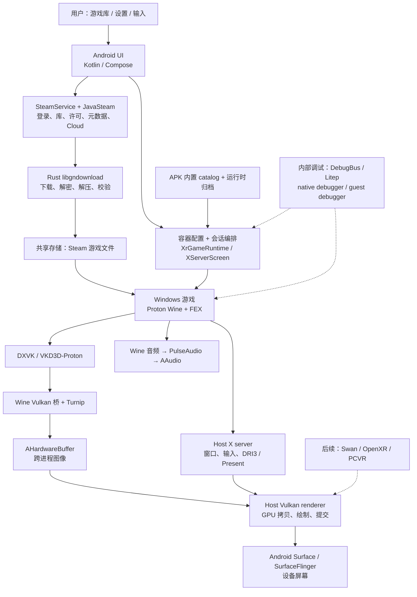
```mermaid
flowchart TB
    User["用户：游戏库 / 设置 / 输入"] --> UI["Android UI<br/>Kotlin / Compose"]
    UI --> Steam["SteamService + JavaSteam<br/>登录、库、许可、元数据、Cloud"]
    Steam --> DL["Rust libgndownload<br/>下载、解密、解压、校验"]
    DL --> Games["共享存储：Steam 游戏文件"]
    UI --> Session["容器配置 + 会话编排<br/>XrGameRuntime / XServerScreen"]
    Bundle["APK 内置 catalog + 运行时归档"] --> Session
    Games --> Guest["Windows 游戏<br/>Proton Wine + FEX"]
    Session --> Guest
    Guest --> D3D["DXVK / VKD3D-Proton"]
    D3D --> Driver["Wine Vulkan 桥 + Turnip"]
    Driver --> AHB["AHardwareBuffer<br/>跨进程图像"]
    Guest --> X["Host X server<br/>窗口、输入、DRI3 / Present"]
    AHB --> Host["Host Vulkan renderer<br/>GPU 拷贝、绘制、提交"]
    X --> Host
    Host --> Display["Android Surface / SurfaceFlinger<br/>设备屏幕"]
    Guest --> Audio["Wine 音频 → PulseAudio → AAudio"]
    Diag["内部调试：DebugBus / Litep<br/>native debugger / guest debugger"] -.-> Session
    Diag -.-> Guest
    XR["后续：Swan / OpenXR / PCVR"] -.-> Host
```

### 1.1 四个容易混淆的概念

| 概念 | 在本项目中的含义 |
|---|---|
| Host / Guest | Host 是 Android 原生进程、线程与服务；Guest 是 Wine 提供的 Windows 执行语义以及游戏的 x64 状态。Guest 代码仍处于 Android 管理的进程中，并非一台 Windows 虚拟机。 |
| 容器 | 游戏专属配置、Wine prefix、盘符、环境变量和会话资源的组合；不是 Docker 容器，也不是强隔离的安全沙箱。共享运行库仍可能影响多个容器。 |
| imagefs | 应用私有目录中的运行时文件树，包含 Unix 库、工具、字体、媒体依赖等；不是运行中的 Ubuntu 系统镜像。 |
| “内置 Steam” | Android 侧具有登录、库、下载和 Cloud 协议实现；Windows 游戏侧有随包的 Steam API 兼容客户端。不能据此推导运行了完整官方桌面 Steam，或所有在线功能均可用。 |

Android 自身使用 Linux 内核；这里“依赖 Linux 构建机”指构建工具和脚本的宿主依赖，与设备是否运行 Ubuntu 是两回事。当前 X server 已在 Android 应用内以 Java/C++ 实现，Bionic 是 C 库/ABI，不是 X server 的替代物。

### 1.2 关键术语

| 术语 | 在后文中的含义 |
|---|---|
| ARM64EC | 允许 ARM64 原生模块与 x64 代码协作的 Windows ABI；本项目仍需要 FEX 执行游戏的 x64 指令。 |
| AHB / AHardwareBuffer | Android 可跨进程共享的图像缓冲区；共享句柄不意味着没有 GPU copy 或同步等待。 |
| DRI3 / Present | X11 扩展：传递共享图像资源并请求呈现、接收完成/空闲事件。 |
| WSI / ICD | WSI 连接 Vulkan 与窗口系统；ICD 是 Vulkan 驱动实现。这里 guest 使用定制 Turnip 路径。 |
| fence | 完成同步对象；Host 等 fence 的时间可能含 GPU 排队时间，不能直接当作 GPU copy 耗时。 |
| KGSL | Android 上与 Qualcomm Adreno GPU 交互的内核驱动接口。 |
| prefix | Wine 的 Windows 用户环境，包括注册表、虚拟 C 盘与用户目录；不等于游戏安装文件本身。 |

## 2. 组件职责

### 2.1 应用与 Steam 层

| 组件 | 核心职责 | 边界 |
|---|---|---|
| Compose UI / ViewModel | 游戏库、下载进度、每游戏配置、运行画面和快捷菜单 | UI 显示“运行中”不能单独证明 guest 已正常出图。 |
| SteamService + JavaSteam | CM 会话、登录回调、库与许可、depot key、manifest request code、CDN 地址等 | JavaSteam 从子仓源码构建；不是 Windows Steam 客户端进程。 |
| GameDownloadService | 下载任务协调、进度/暂停通知、调用 native 引擎 | SteamService 保留业务元数据；传输不是由 UI 线程执行。 |
| NativeSteamDownload + libgndownload | JNI 到 Rust；下载 manifest/chunk，解密、解压、写文件、复验与续传 | 读取 `.DepotDownloader/` 相关元数据；下载完成仍需文件校验。 |
| SteamAutoCloud | 存档路径映射、远端文件比较、冲突处理、上传下载 | 已有游戏专项验证；完整 Cloud 一致性/所有游戏支持不能由局部结果推导。 |
| XrGameEgress | 应用 HTTP 出站限制；为合法组件和 CM 返回的 Cloud 请求提供受限路由 | 不是设备防火墙；raw socket、JavaSteam CM、Rust 下载路径不由同一 ProxySelector 覆盖，完整流量审计仍需独立证据。 |
| GBE fork / steamclient loader | 给 Windows 游戏提供 Steam API 兼容客户端；加载器负责引导与选定的兼容 Hook | 与 Android Steam 下载层分离。当前配置为离线模式，不代表 Steam 联机服务或 DRM 的普遍兼容性。 |

### 2.2 Windows 执行与运行时层

| 组件 | 核心职责 | 当前角色 |
|---|---|---|
| XrGameComponents / InstalledComponents | 读取 catalog，核对归档和已安装组件的身份 | 防止缺项、损坏或版本混用；校验通过不等于游戏兼容。 |
| XrGameRuntime / BaseImage / RuntimeFiles | 固定组件选择，升级基础库，校验/修复安装树和 prefix DLL | 活动 Wine 进程存在时拒绝替换共享运行库；不通过删存档修复。 |
| Container / ContainerUtils / ImageFs | 保存每游戏设置、Wine prefix、环境变量、盘符和运行文件树 | 游戏数据与共享运行时分开管理。 |
| XEnvironment | 聚合 X server、共享内存、音频、launcher 等组件，控制启动/暂停/停止 | 生命周期协调对象，不提供内核级容器隔离。 |
| BionicProgramLauncherComponent | 准备环境、FEX、Wine、evshim，启动并管理进程 | 当前 picoXr 的主要执行路径；上游其他 launcher 仍保留。 |
| Proton 11 ARM64EC / Wine | PE 加载、Windows API、文件/进程/线程/窗口等兼容实现 | 使用适配 Android/Bionic 的 Wine 配方；不是把桌面 Proton 的整个 Linux Steam 启动栈原样运行。 |
| FEX | 将游戏的 x86/x64 指令动态翻译为 ARM64，与 ARM64EC 模块交互 | 当前主要验 x64；不把完整 32 位支持视作已验收。 |
| wineserver + ntsync-android | Windows 对象/进程协调，以及所支持的同步对象等待/唤醒 | 每个启动会话有独立 NTSYNC_SHM；不是所有同步都经过单一 wineserver IPC。 |

### 2.3 图形、媒体与诊断层

| 组件 | 核心职责 | 说明 |
|---|---|---|
| DXVK | D3D8/9/10/11 相关实现到 Vulkan | D3D10/10.1 的入口 DLL 与编译器仍需匹配的 Proton 组件。 |
| VKD3D-Proton | D3D12 到 Vulkan | 与 DXVK 一起随默认包安装，不要求用户逐游戏补 DLL。 |
| winevulkan / win32u | Windows Vulkan、窗口与 Unix 侧实现之间的桥接 | ARM64EC 原生模块与 guest 代码在调用边界协作。 |
| Mesa Turnip | Guest 渲染所用的 Adreno Vulkan ICD；定制 X11 AHB WSI | 源自自有 fork，包含 XCB DRI3/Present 配套依赖。 |
| Host X server | X11 请求、窗口/输入、共享图像导入、Present Complete/Idle | 不负责翻译游戏 x64 指令。窗口查询延迟可能反过来阻塞游戏渲染线程。 |
| Host Vulkan renderer | 导入 AHB、GPU 拷贝、绘制窗口纹理、提交 Android Surface | 与 guest Turnip 的 Vulkan 上下文不同；Host 可通过 Android loader 使用系统驱动，不应把所有 Vulkan 工作都算成 Turnip。 |
| GStreamer / gst-libav / FFmpeg | Wine 媒体管线中的解析、解码与格式处理 | 插件缺失可能造成启动黑屏，即使 HUD 仍显示帧率。 |
| PulseAudio + AAudio sink | Wine 音频客户端到 Android 音频输出 | 当前沿用这一实现；Foundation 音频尚未接入。 |
| evshim + SDL / winebus | Android 手柄状态到 Wine 控制器设备和 XInput 等接口 | 当前沿用共享内存桥；Foundation 手柄模块尚未接入。 |
| Foundation DebugBus / profiler ring / Litep | 内部 debug 包的状态查询、可控 trace 和性能采集 | 不是通用 guest 调试服务器，也没有自动获得 shadPS4 前端的全部调试能力。 |

## 3. 进程与执行边界

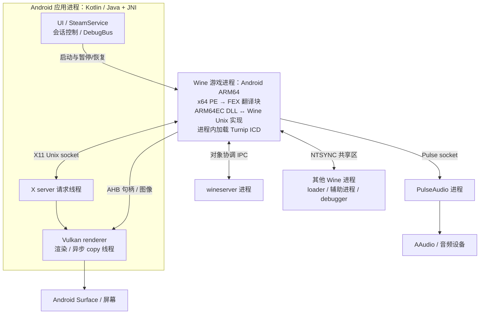
```mermaid
flowchart TB
    subgraph HostProc["Android 应用进程：Kotlin / Java + JNI"]
        UI["UI / SteamService<br/>会话控制 / DebugBus"]
        XS["X server 请求线程"]
        VR["Vulkan renderer<br/>渲染 / 异步 copy 线程"]
        XS --> VR
    end
    Game["Wine 游戏进程：Android ARM64<br/>x64 PE → FEX 翻译块<br/>ARM64EC DLL ↔ Wine Unix 实现<br/>进程内加载 Turnip ICD"]
    UI -->|"启动与暂停/恢复"| Game
    Game <-->|"X11 Unix socket"| XS
    Game -->|"AHB 句柄 / 图像"| VR
    Game <-->|"对象协调 IPC"| WS["wineserver 进程"]
    Game <-->|"NTSYNC 共享区"| Other["其他 Wine 进程<br/>loader / 辅助进程 / debugger"]
    Game -->|"Pulse socket"| PA["PulseAudio 进程"]
    VR --> Surface["Android Surface / 屏幕"]
    PA --> Audio["AAudio / 音频设备"]
```

进程图按逻辑职责归类，不承诺每次启动有相同 PID、进程数或父子树。Wine 自重启和辅助进程退出会改变拓扑，因此控制与诊断必须结合 **boot ID、UID、PID、start-time ticks**；Wine 内部 PID 与 Android PID 也不能混用。

FEX 的职责是 CPU 指令执行，Wine 的职责是 Windows 行为，X server 的职责是窗口协议。更换 X server 不会自动取代 Wine/FEX，也不会直接让全部 Windows API 变成 Android NDK API。

## 4. Steam 安装流程

### 4.1 控制信息和游戏字节分开流动

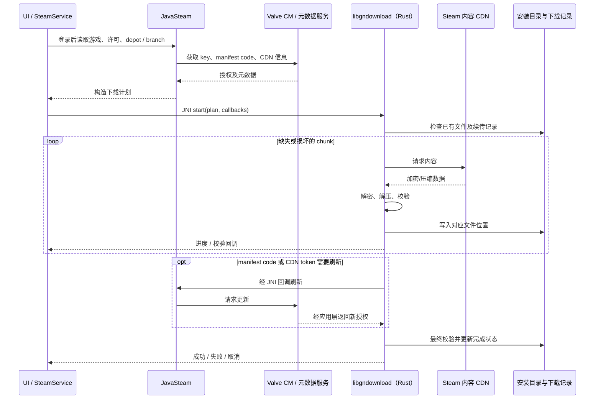
```mermaid
sequenceDiagram
    participant U as UI / SteamService
    participant J as JavaSteam
    participant V as Valve CM / 元数据服务
    participant R as libgndownload（Rust）
    participant C as Steam 内容 CDN
    participant F as 安装目录与下载记录
    U->>J: 登录后读取游戏、许可、depot / branch
    J->>V: 获取 key、manifest code、CDN 信息
    V-->>J: 授权及元数据
    J-->>U: 构造下载计划
    U->>R: JNI start(plan, callbacks)
    R->>F: 检查已有文件及续传记录
    loop 缺失或损坏的 chunk
        R->>C: 请求内容
        C-->>R: 加密/压缩数据
        R->>R: 解密、解压、校验
        R->>F: 写入对应文件位置
        R-->>U: 进度 / 校验回调
    end
    opt manifest code 或 CDN token 需要刷新
        R->>J: 经 JNI 回调刷新
        J->>V: 请求更新
        V-->>R: 经应用层返回新授权
    end
    R->>F: 最终校验并更新完成状态
    R-->>U: 成功 / 失败 / 取消
```

### 4.2 安装状态模型

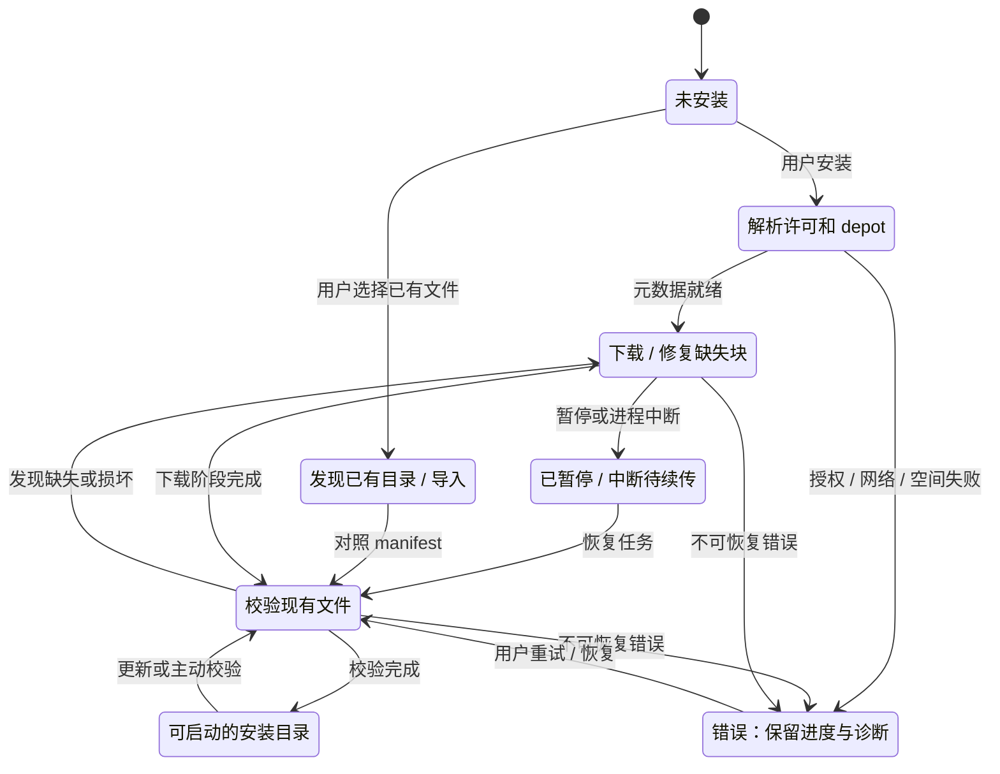
```mermaid
stateDiagram-v2
    [*] --> Absent
    state "未安装" as Absent
    state "解析许可和 depot" as Planning
    state "下载 / 修复缺失块" as Downloading
    state "已暂停 / 中断待续传" as Paused
    state "校验现有文件" as Verifying
    state "可启动的安装目录" as Installed
    state "错误：保留进度与诊断" as Failed
    state "发现已有目录 / 导入" as Imported
    Absent --> Planning: 用户安装
    Absent --> Imported: 用户选择已有文件
    Planning --> Downloading: 元数据就绪
    Planning --> Failed: 授权 / 网络 / 空间失败
    Downloading --> Paused: 暂停或进程中断
    Paused --> Verifying: 恢复任务
    Imported --> Verifying: 对照 manifest
    Downloading --> Verifying: 下载阶段完成
    Verifying --> Downloading: 发现缺失或损坏
    Verifying --> Installed: 校验完成
    Verifying --> Failed: 不可恢复错误
    Downloading --> Failed: 不可恢复错误
    Failed --> Verifying: 用户重试 / 恢复
    Installed --> Verifying: 更新或主动校验
```

目录可识别、manifest 校验通过、与独立 PC Steam 副本一致是三个不同结论。当前 Balatro 修复、AI Limit 中断续传及全文件校验已有证据；独立 PC Steam 来源导入、完整付费游戏的独立 DepotDownloader 对照仍未全部关闭，见 [P2 下载验证](../validation/personal-p2-downloads-20260927.md)。

## 5. 游戏启动流程

以下展示运行时启动主链，省略 UI 导航及 Cloud 冲突弹窗的具体交错顺序。

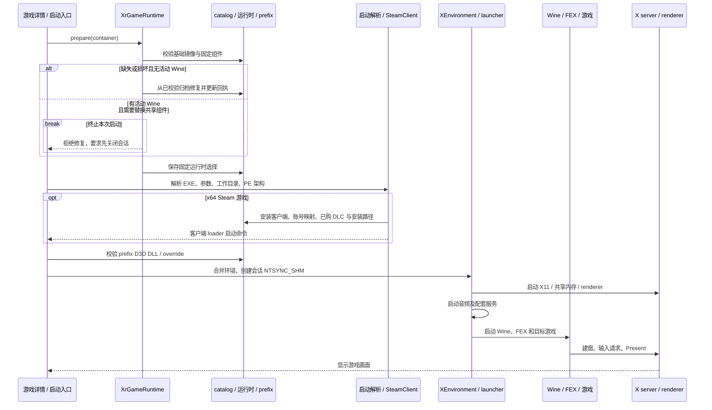
```mermaid
sequenceDiagram
    participant UI as 游戏详情 / 启动入口
    participant RT as XrGameRuntime
    participant Disk as catalog / 运行时 / prefix
    participant SC as 启动解析 / SteamClient
    participant Env as XEnvironment / launcher
    participant Game as Wine / FEX / 游戏
    participant X as X server / renderer
    UI->>RT: prepare(container)
    RT->>Disk: 校验基础镜像与固定组件
    alt 缺失或损坏且无活动 Wine
        RT->>Disk: 从已校验归档修复并更新回执
    else 有活动 Wine 且需要替换共享组件
        break 终止本次启动
            RT-->>UI: 拒绝修复，要求先关闭会话
        end
    end
    RT->>Disk: 保存固定运行时选择
    UI->>SC: 解析 EXE、参数、工作目录、PE 架构
    opt x64 Steam 游戏
        SC->>Disk: 安装客户端、账号映射、已购 DLC 与安装路径
        SC-->>UI: 客户端 loader 启动命令
    end
    UI->>Disk: 校验 prefix D3D DLL / override
    UI->>Env: 合并环境，创建会话 NTSYNC_SHM
    Env->>X: 启动 X11 / 共享内存 / renderer
    Env->>Env: 启动音频及配套服务
    Env->>Game: 启动 Wine、FEX 和目标游戏
    Game->>X: 建窗、输入请求、Present
    X-->>UI: 显示游戏画面
```

### 5.1 启动正确性的几个约束

- **运行库完整性**：归档 SHA、安装清单及文件内容一起检查；“安装回执相同”不足以证明插件仍在。
- **文件所有权**：imagefs 的媒体/字体等基础文件归 BaseImage；两项 XCB 扩展库由选定 Turnip 组件校验，避免互相覆盖。
- **路径正确性**：EXE 与工作目录必须落在游戏安装目录内。MHW 对盘符根目录敏感，专用 profile 改用 `C:\xrgame\games\<appId>\` 目录别名，不复制游戏数据，不放宽零尺寸 D3D buffer 检查。
- **默认客户端**：x64 Steam EXE 根据 PE machine 类型选用随包客户端；不能把 x64 loader 注入 32 位 EXE。
- **会话同步域**：创建新的 NTSYNC_SHM 前确认旧 Wine 已停止；guest debugger 必须继承目标会话的同步域。

### 5.2 Steam 启动兼容关系

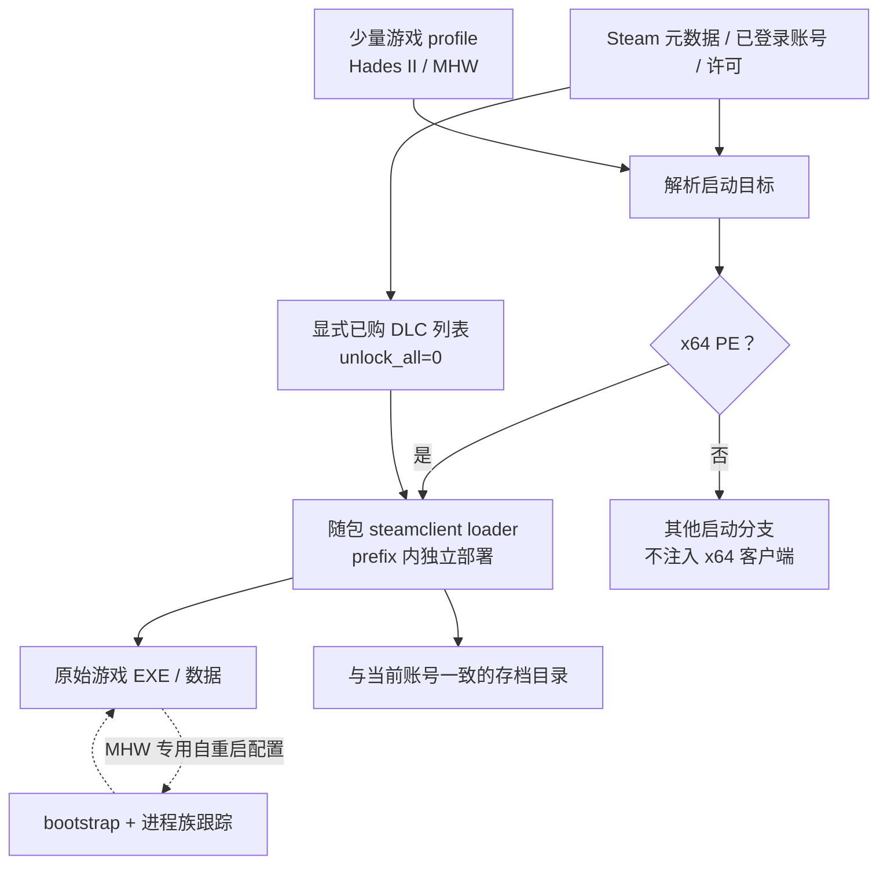
```mermaid
flowchart TB
    Meta["Steam 元数据 / 已登录账号 / 许可"] --> Resolve["解析启动目标"]
    Profile["少量游戏 profile<br/>Hades II / MHW"] --> Resolve
    Resolve --> Arch{"x64 PE？"}
    Arch -->|"是"| GBE["随包 steamclient loader<br/>prefix 内独立部署"]
    Arch -->|"否"| Other["其他启动分支<br/>不注入 x64 客户端"]
    Meta --> Owned["显式已购 DLC 列表<br/>unlock_all=0"]
    Owned --> GBE
    GBE --> Game["原始游戏 EXE / 数据"]
    GBE --> Saves["与当前账号一致的存档目录"]
    Game -.->|"MHW 专用自重启配置"| Restart["bootstrap + 进程族跟踪"]
    Restart -.-> Game
```

MHW 的 DX11 ↔ DX12 自重启已有受控验证，不能扩展成“所有游戏自重启已通用解决”。GBE 不负责 Steam 下载；JavaSteam 不替代 Wine 内的 `steamclient64.dll`。详见 [MHW 启动](../validation/mhw-startup-20260927.md) 与 [自重启](../validation/mhw-restart-20260927.md)。

## 6. 整个系统的工作状态

### 6.1 应用与游戏会话

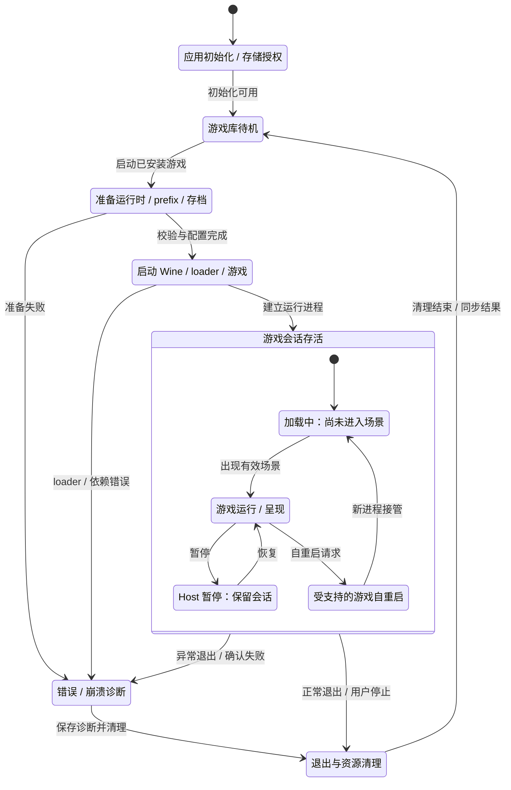
```mermaid
stateDiagram-v2
    [*] --> AppInit
    state "应用初始化 / 存储授权" as AppInit
    state "游戏库待机" as Library
    state "准备运行时 / prefix / 存档" as Preparing
    state "启动 Wine / loader / 游戏" as Starting
    state "游戏会话存活" as Active {
        [*] --> Loading
        state "加载中：尚未进入场景" as Loading
        state "游戏运行 / 呈现" as Running
        state "Host 暂停：保留会话" as Paused
        state "受支持的游戏自重启" as Restarting
        Loading --> Running: 出现有效场景
        Running --> Paused: 暂停
        Paused --> Running: 恢复
        Running --> Restarting: 自重启请求
        Restarting --> Loading: 新进程接管
    }
    state "退出与资源清理" as Stopping
    state "错误 / 崩溃诊断" as Failure
    AppInit --> Library: 初始化可用
    Library --> Preparing: 启动已安装游戏
    Preparing --> Starting: 校验与配置完成
    Preparing --> Failure: 准备失败
    Starting --> Active: 建立运行进程
    Starting --> Failure: loader / 依赖错误
    Active --> Failure: 异常退出 / 确认失败
    Active --> Stopping: 正常退出 / 用户停止
    Failure --> Stopping: 保存诊断并清理
    Stopping --> Library: 清理结束 / 同步结果
```

“加载中”可能包含媒体初始化、shader 编译、账号/网络等待、线程锁等待等多种情况。黑屏、低 CPU 或 60 FPS HUD 都不能单独决定状态；需要把画面、进程、线程栈、Present 和 GPU 数据关联起来。

### 6.2 暂停/恢复的资源顺序

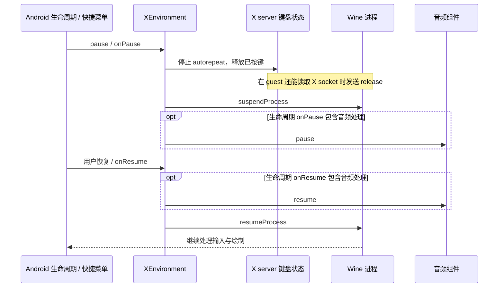
```mermaid
sequenceDiagram
    participant UI as Android 生命周期 / 快捷菜单
    participant Env as XEnvironment
    participant Input as X server 键盘状态
    participant Guest as Wine 进程
    participant Audio as 音频组件
    UI->>Env: pause / onPause
    Env->>Input: 停止 autorepeat，释放已按键
    Note over Input,Guest: 在 guest 还能读取 X socket 时发送 release
    Env->>Guest: suspendProcess
    opt 生命周期 onPause 包含音频处理
        Env->>Audio: pause
    end
    UI->>Env: 用户恢复 / onResume
    opt 生命周期 onResume 包含音频处理
        Env->>Audio: resume
    end
    Env->>Guest: resumeProcess
    Guest-->>UI: 继续处理输入与绘制
```

暂停不是退出：prefix、游戏内存和图形上下文仍保留。2026-09-29 修复过“guest 已暂停，但 Host 遗留按键重复继续写 X socket”的 ANR；因此不能把所有卡住都归因于 GPU。退出则需要回收进程、窗口、队列、音频与会话资源，并核验没有该会话残留。

## 7. 图形与呈现链路

### 7.1 从 Direct3D 到 Android 屏幕

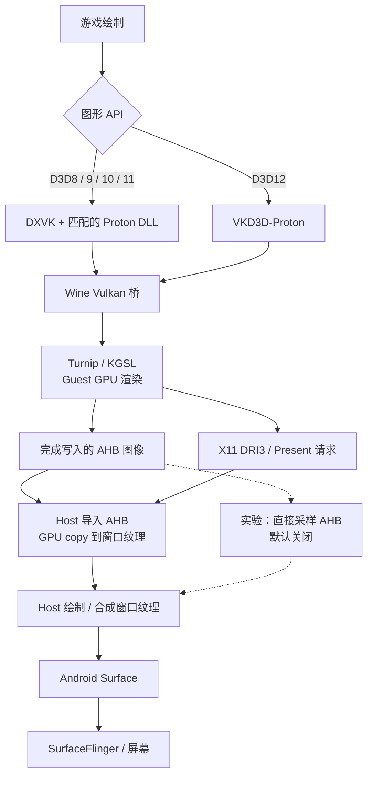
```mermaid
flowchart TB
    Game["游戏绘制"] --> API{"图形 API"}
    API -->|"D3D8 / 9 / 10 / 11"| DXVK["DXVK + 匹配的 Proton DLL"]
    API -->|"D3D12"| VKD["VKD3D-Proton"]
    DXVK --> WV["Wine Vulkan 桥"]
    VKD --> WV
    WV --> Turnip["Turnip / KGSL<br/>Guest GPU 渲染"]
    Turnip --> Buffer["完成写入的 AHB 图像"]
    Turnip --> X["X11 DRI3 / Present 请求"]
    Buffer --> Copy["Host 导入 AHB<br/>GPU copy 到窗口纹理"]
    X --> Copy
    Copy --> Compose["Host 绘制 / 合成窗口纹理"]
    Compose --> Surface["Android Surface"]
    Surface --> SF["SurfaceFlinger / 屏幕"]
    Buffer -.-> Direct["实验：直接采样 AHB<br/>默认关闭"]
    Direct -.-> Compose
```

当前默认 AHB 路径不进行 CPU 图像读回，但有一次中间 GPU copy。异步呈现改变**在哪里等待 copy fence**，没有消除这次 copy；直接采样才是尝试省去中间拷贝的另一项实验。

Host 与 guest 的 GPU 工作共享设备资源，却不等同于同一 Vulkan instance、device 或队列。一个线程看到的 fence elapsed 可能包括前序 GPU 排队，不能直接当作该次 copy 的 GPU 执行时间。

### 7.2 同步与异步路径的区别

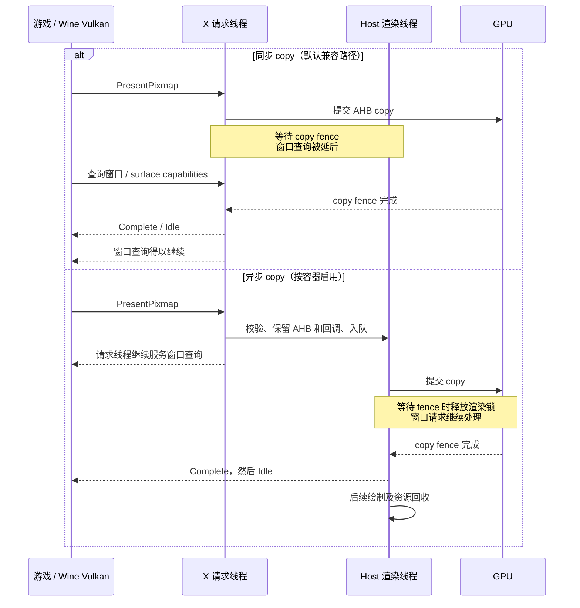
```mermaid
sequenceDiagram
    participant G as 游戏 / Wine Vulkan
    participant X as X 请求线程
    participant R as Host 渲染线程
    participant GPU as GPU
    alt 同步 copy（默认兼容路径）
        G->>X: PresentPixmap
        X->>GPU: 提交 AHB copy
        Note over X,R: 等待 copy fence<br/>窗口查询被延后
        G->>X: 查询窗口 / surface capabilities
        GPU-->>X: copy fence 完成
        X-->>G: Complete / Idle
        X-->>G: 窗口查询得以继续
    else 异步 copy（按容器启用）
        G->>X: PresentPixmap
        X->>R: 校验、保留 AHB 和回调、入队
        X-->>G: 请求线程继续服务窗口查询
        R->>GPU: 提交 copy
        Note over R,GPU: 等待 fence 时释放渲染锁<br/>窗口请求继续处理
        GPU-->>R: copy fence 完成
        R-->>G: Complete，然后 Idle
        R->>R: 后续绘制及资源回收
    end
```

异步路径等待 fence 时不持有 `frameMutex` / `renderMutex`，也不占用 X 请求线程及全局窗口锁。“请求线程返回”不是“图像已可复用”；缓冲区复用仍必须等 Host 不再读取它。

### 7.3 AHB copy 的资源生命周期

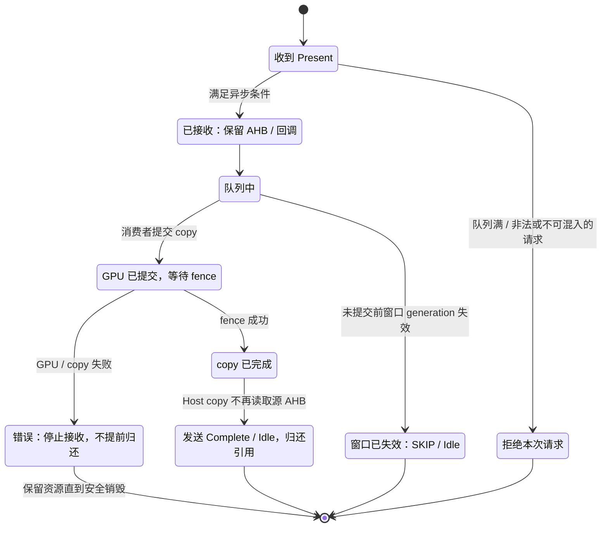
```mermaid
stateDiagram-v2
    [*] --> Received
    state "收到 Present" as Received
    state "已接收：保留 AHB / 回调" as Retained
    state "队列中" as Queued
    state "GPU 已提交，等待 fence" as InFlight
    state "copy 已完成" as Copied
    state "发送 Complete / Idle，归还引用" as Retired
    state "窗口已失效：SKIP / Idle" as Skipped
    state "错误：停止接收，不提前归还" as Failed
    state "拒绝本次请求" as Rejected
    Received --> Rejected: 队列满 / 非法或不可混入的请求
    Received --> Retained: 满足异步条件
    Retained --> Queued
    Queued --> Skipped: 未提交前窗口 generation 失效
    Queued --> InFlight: 消费者提交 copy
    InFlight --> Copied: fence 成功
    Copied --> Retired: Host copy 不再读取源 AHB
    InFlight --> Failed: GPU / copy 失败
    Failed --> [*]: 保留资源直到安全销毁
    Retired --> [*]
    Skipped --> [*]
    Rejected --> [*]
```

队列容量上限为 **8 个任务，包含正在执行的任务**。窗口销毁、取消映射或 resize 使旧任务失效；已提交 GPU 的任务仍要等实际读取结束。Complete 不等于屏幕已扫描显示；Idle 表示 Host 可以归还源图像。完整 MSC、region、非零 wait/idle fence 等协议覆盖仍待补齐。

### 7.4 用户配置与实测

入口：**游戏详情 → 编辑容器 → 图形 → 异步呈现（实验性）**。

| 项目 | 当前行为 |
|---|---|
| 保存位置 | 每容器环境变量 `XRGAME_PRESENT_ASYNC_COPY=0/1`；UI 与原有 opt-in 共用一份值 |
| 默认 | 关闭；保存后重启游戏应用 |
| 生效条件 | Vulkan、DRI3、普通 AHB GPU copy、无偏移/非零 X fence，应用层 FPS 限制器关闭 |
| 应用快捷菜单限帧 | 开启后待已接收 copy 归还再切同步；关闭后恢复用户的异步选择 |
| 游戏内限帧 / VSync | 与 Host 开关不同；游戏限帧可保留。关闭游戏 VSync 不会自动移除 Host X 线程的 fence 等待 |
| 直接采样 | 独立实验，默认关闭；不能把异步 copy 收益算到“零拷贝”上 |

| 固定场景、同包 A/B/A | 同步均值 | 异步 | 实际呈现提升 |
|---|---:|---:|---:|
| MHW 冰原据点 | 19.24 FPS | 26.65 FPS | 38.5% |
| MHR 曙光据点 | 28.76 FPS | 42.25 FPS | 46.9% |

这些是 AYN 单场景的 SurfaceFlinger 统计，未锁频，不能外推所有地图、游戏或设备。异步后 GPU busy 接近满载，下一步要用 GPU timestamps/capture 区分 guest 绘制、Host copy 和合成成本。完整身份、窗口查询等待、负载和失败边界见 [MHW 对照](../validation/mhw-present-async-20260928.md) 与 [MHR/UI 对照](../validation/mhr-present-async-20260929.md)。

## 8. 输入与音频

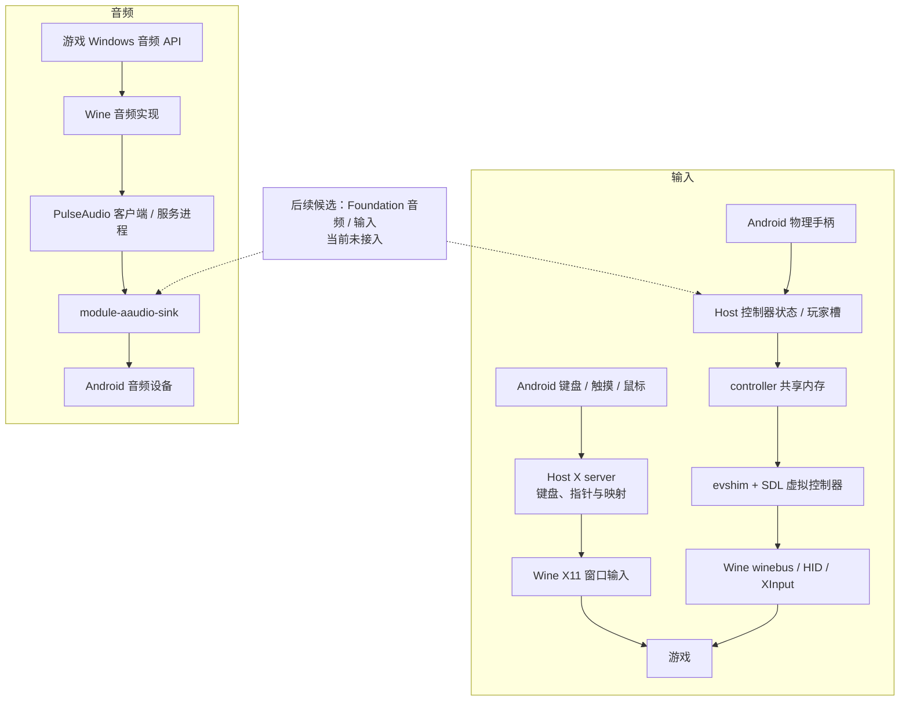
```mermaid
flowchart TB
    subgraph Input["输入"]
        KM["Android 键盘 / 触摸 / 鼠标"] --> XK["Host X server<br/>键盘、指针与映射"]
        XK --> WX["Wine X11 窗口输入"]
        WX --> Game["游戏"]
        Pad["Android 物理手柄"] --> HostPad["Host 控制器状态 / 玩家槽"]
        HostPad --> SHM["controller 共享内存"]
        SHM --> EV["evshim + SDL 虚拟控制器"]
        EV --> WB["Wine winebus / HID / XInput"]
        WB --> Game
    end
    subgraph Audio["音频"]
        GameAudio["游戏 Windows 音频 API"] --> WA["Wine 音频实现"]
        WA --> Pulse["PulseAudio 客户端 / 服务进程"]
        Pulse --> AA["module-aaudio-sink"]
        AA --> Out["Android 音频设备"]
    end
    Foundation["后续候选：Foundation 音频 / 输入<br/>当前未接入"] -.-> HostPad
    Foundation -.-> AA
```

上游也保留 ALSA 分支；表中 PulseAudio 是当前主要说明路径。声音代码接通不等于已完成扬声器实听、低延迟或所有前后台场景验收。

MHW 曾出现“Android 看见手柄、游戏却只有键盘”的问题：evshim 查找的 SDL SONAME 与 imagefs 中的名称不同，虚拟控制器没有创建。修复后独立 XInput 探针读到了物理按键和摇杆；完整按键、扳机、震动仍不能据此全部打勾。见 [控制器记录](../validation/mhw-controller-20260927.md)。

## 9. 媒体播放链路

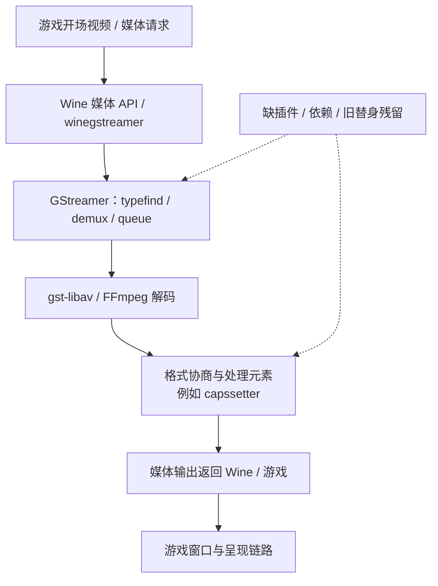
```mermaid
flowchart TB
    Video["游戏开场视频 / 媒体请求"] --> Wine["Wine 媒体 API / winegstreamer"]
    Wine --> GST["GStreamer：typefind / demux / queue"]
    GST --> Decode["gst-libav / FFmpeg 解码"]
    Decode --> Convert["格式协商与处理元素<br/>例如 capssetter"]
    Convert --> Output["媒体输出返回 Wine / 游戏"]
    Output --> Present["游戏窗口与呈现链路"]
    Missing["缺插件 / 依赖 / 旧替身残留"] -.-> GST
    Missing -.-> Convert
```

MHR 的历史开场黑屏与本次低帧率有不同根因：`capssetter` 所在插件缺失使视频输出链建立失败。修复依赖并增加逐文件检查后可进入标题及存档场景；这不是“继续等待 shader 编译”能解决的问题。详见 [MHR 媒体黑屏](../validation/mhr-black-screen-20260928.md)。

## 10. 目录、存档与修复边界

### 10.1 存储职责

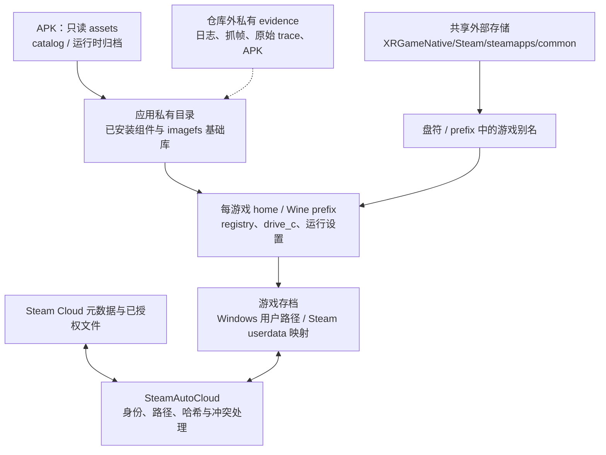
```mermaid
flowchart TB
    APK["APK：只读 assets<br/>catalog / 运行时归档"] --> Runtime["应用私有目录<br/>已安装组件与 imagefs 基础库"]
    Runtime --> Prefix["每游戏 home / Wine prefix<br/>registry、drive_c、运行设置"]
    External["共享外部存储<br/>XRGameNative/Steam/steamapps/common"] --> Alias["盘符 / prefix 中的游戏别名"]
    Alias --> Prefix
    Prefix --> Save["游戏存档<br/>Windows 用户路径 / Steam userdata 映射"]
    SteamCloud["Steam Cloud 元数据与已授权文件"] <--> Sync["SteamAutoCloud<br/>身份、路径、哈希与冲突处理"]
    Save <--> Sync
    Evidence["仓库外私有 evidence<br/>日志、抓帧、原始 trace、APK"] -.-> Runtime
```

| 数据 | 典型位置 / 归属 | 维护约束 |
|---|---|---|
| Steam 游戏安装 | `/sdcard/XRGameNative/Steam/steamapps/common/<game>` | 默认共享安装根可在应用重装后保留；不保证私有 prefix 同样保留。 |
| 基础运行库 | 应用 `files/imagefs/usr/...` | BaseImage 只更新允许的基础文件，不覆盖 home/prefix。 |
| Proton/FEX/D3D/Turnip 缓存 | 应用 `files/contents/...` 等组件目录 | 由 catalog/安装清单核验；活动游戏运行时不能随意替换。 |
| 每游戏配置 | `files/imagefs/home/xuser-<container-id>/.container` | 环境变量、显示选项等由容器保存；以代码实际计算路径为准。 |
| Wine prefix / 存档 | 对应 home 下 `.wine`；`drive_c` 内 Windows 路径与账号目录 | 覆盖更新保留数据与卸载应用是不同操作；私人存档不得提交仓库。 |
| 下载元数据 | 游戏安装目录附近的 `.DepotDownloader/` 与应用数据库 | 允许从现有文件重新校验，不能只凭 journal 声称完整。 |
| 诊断与身份记录 | 私有 evidence；公开文档只保留脱敏结论 | 记录 APK SHA、catalog SHA、Build ID、设备/进程世代与时长。 |

### 10.2 Cloud 与路径一致性

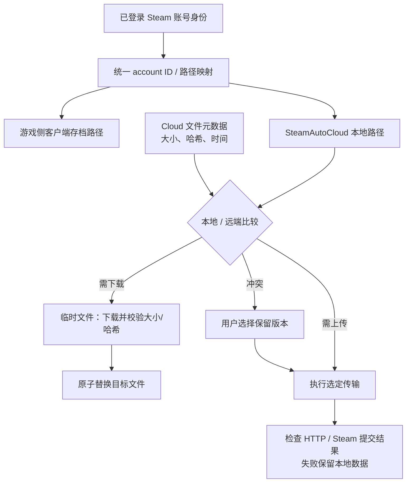
```mermaid
flowchart TB
    Account["已登录 Steam 账号身份"] --> Map["统一 account ID / 路径映射"]
    Map --> Client["游戏侧客户端存档路径"]
    Map --> Cloud["SteamAutoCloud 本地路径"]
    Remote["Cloud 文件元数据<br/>大小、哈希、时间"] --> Compare{"本地 / 远端比较"}
    Cloud --> Compare
    Compare -->|"需下载"| Stage["临时文件：下载并校验大小/哈希"]
    Stage --> Commit["原子替换目标文件"]
    Compare -->|"冲突"| Choice["用户选择保留版本"]
    Choice --> Transfer["执行选定传输"]
    Compare -->|"需上传"| Transfer
    Transfer --> Result["检查 HTTP / Steam 提交结果<br/>失败保留本地数据"]
```

MHW 的存档不可见曾涉及账号目录映射；Iceborne 识别涉及显式 DLC 授权列表。这些与图形初始化、路径别名、文件下载是不同问题。Cloud 的 CM 回复可能提供限定第三方存储端点：仅对该次合法 HTTPS 请求放行，禁止跨 origin 重定向，不把通用云厂商域名加入全局白名单。实现与验证分开看：[MHW 存档/DLC](../validation/mhw-saves-20260927.md)、[MHR Cloud 后续](../validation/mhr-black-screen-20260928.md)。

## 11. 源码构建与运行时交付

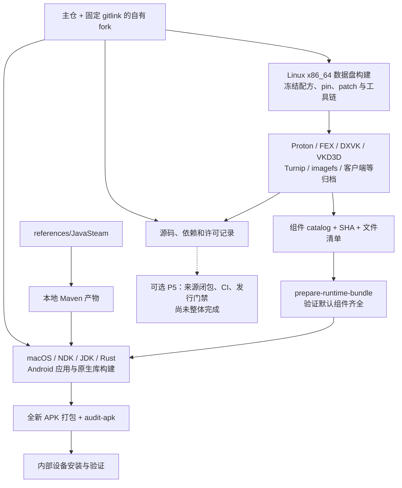
```mermaid
flowchart TB
    Sources["主仓 + 固定 gitlink 的自有 fork"] --> AppBuild["macOS / NDK / JDK / Rust<br/>Android 应用与原生库构建"]
    Sources --> Linux["Linux x86_64 数据盘构建<br/>冻结配方、pin、patch 与工具链"]
    JavaSteam["references/JavaSteam"] --> Maven["本地 Maven 产物"]
    Maven --> AppBuild
    Linux --> Packages["Proton / FEX / DXVK / VKD3D<br/>Turnip / imagefs / 客户端等归档"]
    Packages --> Catalog["组件 catalog + SHA + 文件清单"]
    Catalog --> Bundle["prepare-runtime-bundle<br/>验证默认组件齐全"]
    Bundle --> AppBuild
    AppBuild --> Audit["全新 APK 打包 + audit-apk"]
    Audit --> Device["内部设备安装与验证"]
    Sources --> SourceIndex["源码、依赖和许可记录"]
    Packages --> SourceIndex
    SourceIndex -.-> Release["可选 P5：来源闭包、CI、发行门禁<br/>尚未整体完成"]
```

构建与运行的两个“容器”不要混用：Linux 侧 Docker 用于构建；Android 侧游戏容器是 prefix/配置/进程编排。

| 层次 | 当前做法 |
|---|---|
| 主仓维护 | `tencentmalos/xrgame-native`，主干 `malos/main`；是否提交/推送由用户决定 |
| 直接引入的源码 | 自有 `tencentmalos` fork，父仓 gitlink 为准；嵌套第三方依赖保持固定，不顺手更新 |
| 运行时源码身份 | 配方的明确 base pin + patch + 依赖锁；维护分支较新，不意味着已安装二进制也随之变化 |
| Android 构建 | NDK 27、JDK 17、SDK 36；JavaSteam 先发布到本地 Maven；Rust 下载器从源码构建 |
| Linux 运行时构建 | `/data00/xrgame-native`，不使用系统盘；Linux/macOS 全迁移目前延后 |
| 内置运行时 | APK 默认组件必须齐全；生产公开 catalog 仍不能与私有验证 catalog 混同 |
| Foundation | 私有子仓只按授权用于内部 debug 诊断/profiler；修改需从固定提交切独立分支，不公开复制源码 |
| 发布边界 | 不向公开仓库上传 APK、游戏文件、账号或密钥；运行时发行仍需对应源码和许可门禁 |

当前应用默认选择如下，具体二进制必须再看 catalog SHA 与构建记录，不能只看名称：

| 组件 | `XrGameRuntimeVersions` 中的选择 |
|---|---|
| Wine | `proton-11.0-2-arm64ec` |
| FEX | `2608-3f1f30a-xrg5` |
| DXVK | `11.0-a676404-arm64ec-xrg2` |
| VKD3D-Proton | `11.0-212991f-arm64ec-xrg1` |
| Turnip | `turnip-d15b7c0-xrg5` |

完整配方见 [runtime 构建说明](../../tools/xrgame/README.md)，源码/维护关系见 [references](../../references/README.md)。Mac 独立构建仅完成评估和有限探针，见 [暂缓的构建 spec](../specs/xrgame-native-macos-build-v1.md)。

## 12. 调试与性能分析

### 12.1 三类观测通道

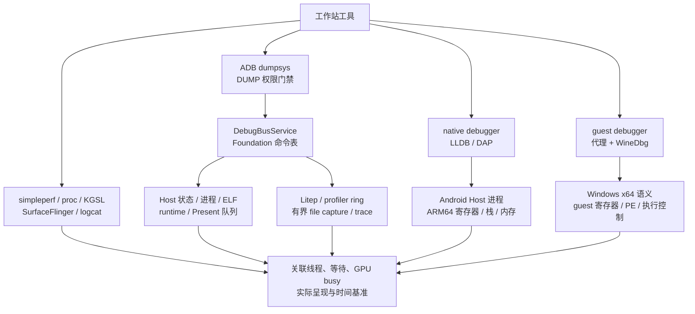
```mermaid
flowchart TB
    HostTool["工作站工具"] --> Dump["ADB dumpsys<br/>DUMP 权限门禁"]
    Dump --> DB["DebugBusService<br/>Foundation 命令表"]
    DB --> Snap["Host 状态 / 进程 / ELF<br/>runtime / Present 队列"]
    DB --> Prof["Litep / profiler ring<br/>有界 file capture / trace"]
    HostTool --> ND["native debugger<br/>LLDB / DAP"]
    ND --> Native["Android Host 进程<br/>ARM64 寄存器 / 栈 / 内存"]
    HostTool --> GD["guest debugger<br/>代理 + WineDbg"]
    GD --> Guest["Windows x64 语义<br/>guest 寄存器 / PE / 执行控制"]
    HostTool --> Perf["simpleperf / proc / KGSL<br/>SurfaceFlinger / logcat"]
    Perf --> Corr["关联线程、等待、GPU busy<br/>实际呈现与时间基准"]
    Snap --> Corr
    Prof --> Corr
    Native --> Corr
    Guest --> Corr
```

| 通道 | 能回答的问题 | 不能单独证明什么 |
|---|---|---|
| DebugBus | 当前 Host PID、已加载 ELF、catalog、Present 模式/队列、诊断计数 | 返回 catalog 不代表重新校验所有文件；Host 模块表不是 guest PE/FEX JIT 映射 |
| Litep / Present trace | 启动阶段时间、请求/队列/copy/Complete/Idle 的关联与顺序 | Host fence 等待不是 GPU pass 时间；Complete 不是实际扫描到屏幕 |
| native debugger | Android Host 栈、JNI/C++ 状态、原生线程 | FEX 所在进程的 ARM64 PC 不自动等于 Windows guest RIP |
| guest debugger | Wine 提供的 x64/ARM64EC context、PE 视图与有限执行控制 | 没有自动继承 shadPS4 的 Orbis frontend 调试能力 |
| simpleperf / proc | on-CPU、off-CPU、调度等待、热点栈 | 全机 CPU 未满不代表关键线程没有瓶颈；采样栈也有 unwind 边界 |
| KGSL / SurfaceFlinger | GPU busy/frequency、Host 实际呈现间隔 | 不能单独拆出 guest 渲染、copy、合成每一项 GPU 成本 |

Host attach/inspect/pause/resume/cleanup 与 guest 基础链路已有实测。FEX 软件断点恢复及自有 fixture 的 CALL/RET 单步已有进展，但任意程序断点、寄存器写入、观察点、并发线程控制和可信 mixed unwind 不应标为完整实现。软件断点仍 opt-in。

### 12.2 排障入口

| 表现 | 优先区分 | 证据入口 |
|---|---|---|
| 点击启动就退出 | 运行库完整性、PE/loader、Steam 客户端、路径、真实异常 | 启动日志、进程身份、DLL 清单、guest/native 栈 |
| 黑屏但有 FPS | 窗口/媒体链是否输出有效内容，是否只是在呈现空帧 | 截图、媒体插件探针、线程栈、Present trace |
| CPU/GPU 都不满但 FPS 低 | 热线程是否等待 X 查询、锁、fence；是否限帧 | simpleperf off-CPU + X/renderer trace + KGSL + SF |
| 暂停后应用 ANR | 输入重复是否继续写入已暂停 guest；Host 主线程是否阻塞 | ANR/dropbox、SIGSTOP 状态、X socket 栈 |
| 手柄只有键盘提示 | Android 检测、共享状态、SDL 虚拟设备、Wine/XInput 逐段检查 | evshim/winebus 日志、只读 XInput 探针 |
| 存档/DLC 不见 | 账号与路径一致性、许可集合、Cloud 传输是否真正成功 | 映射、文件哈希、明确的 owned DLC 列表 |

时钟也要区分：Android elapsed realtime 包含休眠，Present trace 使用 CLOCK_MONOTONIC；不同基准不能直接相减。完整接口与清理要求见 [DebugBus](../debugging/debugbus.md)、[Litep 桩点覆盖与层级](../debugging/litep.md) 和 [调试能力复核](../validation/spec-observability-review-20260926.md)。

## 13. 当前状态与后续演进

### 13.1 已实现不等于全部验收

| 方向 | 已有状态 | 仍有边界 |
|---|---|---|
| 安装与运行基线 | 固定运行时、默认 D3D/客户端、损坏修复、Steam 下载/续传；Hades II/MHW/MHR 有真实场景证据 | 不是任意游戏、全 32 位、在线服务或反作弊兼容保证 |
| 显示 | AHB GPU copy 为基线；异步呈现每容器可选，MHW/MHR 对照有收益 | 更多游戏/请求形态、设备丢失、长期稳定性待验 |
| 减少 copy | 直接采样已有 fixture/场景及部分生命周期证据 | 未证明稳定、可重复收益，默认关闭 |
| 输入/音频 | 现有桥接路径；MHW 物理 XInput 部分按键/摇杆通过 | 完整手柄、震动、实听和音频恢复仍按用例验证 |
| 调试分析 | Host/guest 基础调试、DebugBus、Litep、等待链采样 | 通用 mixed stack 和完整 guest 控制矩阵未完成 |
| Swan / XR | OpenXR payload、Android native XR 代码和构建产物存在 | 当前验收延后；AYN Android 13 结果不能代表 Swan Android 16 |
| 工程化 | 本地构建、catalog、文件校验、审核与证据已有 | 全量对应源码闭包、远端 CI 与公开发行仍是可选 P5 |

当前最近的 UI 包身份及证据入口见 [MHR 2026-09-29](../validation/mhr-present-async-20260929.md)。本系统文档不复制所有历史 SHA/PID，避免多个摘要在二进制更新后互相矛盾；新的设备结论应继续写独立验证记录。

### 13.2 XR 与普通游戏的 SBS 影院（2026-10-02 更新）

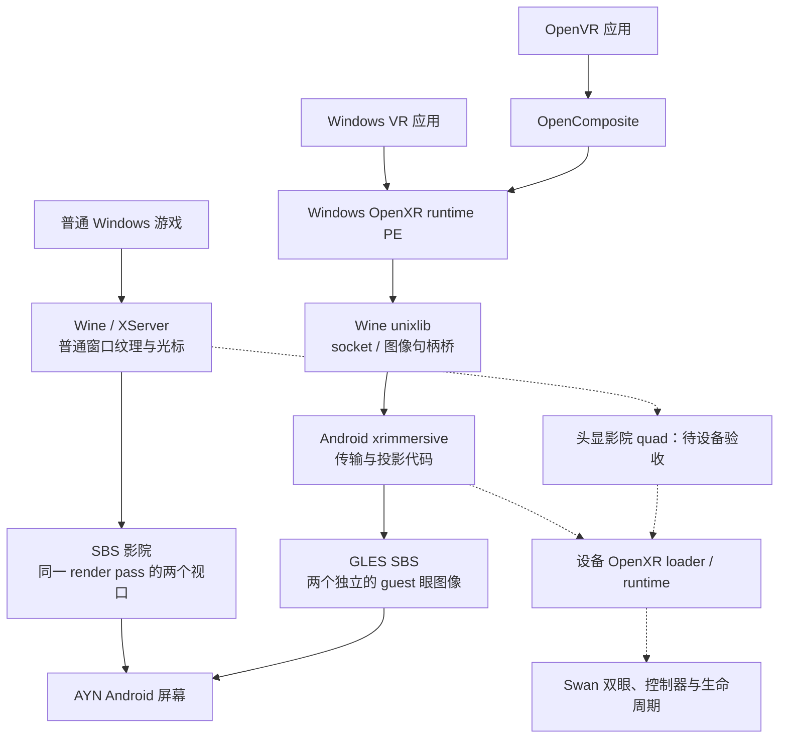
```mermaid
flowchart TB
    Flat["普通 Windows 游戏"] --> X["Wine / XServer<br/>普通窗口纹理与光标"]
    X --> Theater["SBS 影院<br/>同一 render pass 的两个视口"]
    Theater --> AYN["AYN Android 屏幕"]
    VR["Windows VR 应用"] --> WinXR["Windows OpenXR runtime PE"]
    OpenVR["OpenVR 应用"] --> OC["OpenComposite"]
    OC --> WinXR
    WinXR --> Unix["Wine unixlib<br/>socket / 图像句柄桥"]
    Unix --> HostXR["Android xrimmersive<br/>传输与投影代码"]
    HostXR --> SBS["GLES SBS<br/>两个独立的 guest 眼图像"]
    SBS --> AYN
    HostXR -.-> Loader["设备 OpenXR loader / runtime"]
    X -.-> Quad["头显影院 quad：待设备验收"]
    Quad -.-> Loader
    Loader -.-> Swan["Swan 双眼、控制器与生命周期"]
```

普通游戏从「编辑容器 → 图形 → 显示模式 → SBS 影院 — 非 VR 游戏」进入。
该模式仍走普通 XServerScreen、Wine、键盘/手柄和音频链路，不创建 Windows VR runtime。
宿主沿用现有大屏的尺寸/距离配置，以 64 mm 眼距、每眼 60° 水平视角模拟固定双眼；
窗口、光标按同一投影绘制，保留画面比例。右上角「影院设置」可调大小、距离、重置或临时预览平面。
此预览使用 Vulkan 合成器；GL/SurfaceFlinger 选择在本次会话临时覆盖，插帧停用，触屏使用相对触控板。

两个视口复用已准备好的窗口纹理和原有提交/fence，不增加 PixelCopy、CPU 读回或新的中间图像。
这只省掉影院自身可能引入的额外拷贝；原有 Present/AHB GPU copy 仍由容器设置决定。
普通游戏画面本身仍是单目内容，双眼视差只表示虚拟屏幕的距离。

AYN 普通影院证据见 [SBS 影院](../validation/sbs-theater-20261002.md)，真实 VR 的 Alyx 独立眼图像证据见
[VR SBS](../validation/vr-sbs-20261002.md)。Swan 的头部追踪、设备扩展、摘戴和完整输入仍待验证。
Foundation 音频/输入和 Mac 全构建迁移继续延后。

## 14. 代码与证据索引

### 14.1 按职责找代码

| 职责 | 主要入口 |
|---|---|
| Steam 业务与 Cloud | [SteamService](../../app/src/main/java/app/gamenative/service/SteamService.kt)、[SteamAutoCloud](../../app/src/main/java/app/gamenative/service/SteamAutoCloud.kt) |
| 下载 JNI / Rust | [NativeSteamDownload](../../app/src/main/java/app/gamenative/service/download/NativeSteamDownload.kt)、[Rust 源码](../../app/src/main/cpp/gn-download/rust) |
| 运行时完整性 | [XrGameRuntime](../../app/src/main/java/app/gamenative/xrgame/XrGameRuntime.kt)、[XrGameBaseImage](../../app/src/main/java/app/gamenative/xrgame/XrGameBaseImage.kt)、[RuntimeFiles](../../app/src/main/java/app/gamenative/xrgame/XrGameRuntimeFiles.kt) |
| 启动目标与客户端 | [SteamLaunch](../../app/src/main/java/app/gamenative/xrgame/XrGameSteamLaunch.kt)、[SteamClient](../../app/src/main/java/app/gamenative/xrgame/XrGameSteamClient.kt) |
| 会话 UI / 组件编排 | [XServerScreen](../../app/src/main/java/app/gamenative/ui/screen/xserver/XServerScreen.kt)、[XEnvironment](../../app/src/main/java/com/winlator/xenvironment/XEnvironment.java)、[Bionic launcher](../../app/src/main/java/com/winlator/xenvironment/components/BionicProgramLauncherComponent.java) |
| Present 协议与队列 | [PresentExtension](../../app/src/main/java/com/winlator/xserver/extensions/PresentExtension.java)、[PresentCopyQueue](../../app/src/main/cpp/winlator/PresentCopyQueue.h) |
| Host GPU 渲染 | [VulkanRenderer](../../app/src/main/java/com/winlator/renderer/VulkanRenderer.java)、[VulkanRendererContext](../../app/src/main/cpp/winlator/VulkanRendererContext.cpp) |
| 异步呈现 UI | [GraphicsTab](../../app/src/main/java/app/gamenative/ui/component/dialog/GraphicsTab.kt)、[PresentSettings](../../app/src/main/java/app/gamenative/xrgame/XrGamePresentSettings.kt) |
| 输入与音频 | [evshim](../../app/src/main/cpp/evshim/evshim.c)、[InputDeviceManager](../../app/src/main/java/com/winlator/xserver/InputDeviceManager.java)、[PulseAudioComponent](../../app/src/main/java/com/winlator/xenvironment/components/PulseAudioComponent.java) |
| 存储与受限出站 | [Storage](../../app/src/main/java/app/gamenative/xrgame/XrGameStorage.kt)、[Egress](../../app/src/main/java/app/gamenative/xrgame/XrGameEgress.kt)、[CloudFiles](../../app/src/main/java/app/gamenative/xrgame/XrGameCloudFiles.kt) |
| 诊断 | [DebugBusService](../../app/src/picoXrDebug/java/app/gamenative/xrgame/DebugBusService.kt)、[LitepProfiler](../../app/src/picoXrDebug/java/app/gamenative/xrgame/LitepProfiler.kt)、[调试工具](../../tools/xrgame) |
| XR 桥接 | [Windows runtime](../../app/src/main/windows/openxr_runtime)、[Android xrimmersive](../../app/src/main/cpp/xrimmersive) |

### 14.2 设计决策与对应证据

| 决策 | 原因与记录 |
|---|---|
| 默认组件随 APK，启动前验证 | [缺 DLL 与运行库损坏自动修复](../validation/bundled-runtime-20260927.md) |
| 基础镜像不能只信回执 | [MHR 媒体插件缺失](../validation/mhr-black-screen-20260928.md) |
| 游戏路径问题用限定 profile | [MHW 根目录配置与启动问题](../validation/mhw-startup-20260927.md) |
| 账号/许可/存档映射保持一致 | [MHW 存档与 Iceborne](../validation/mhw-saves-20260927.md) |
| 自重启不能只观察原 PID | [MHW 进程族与重启](../validation/mhw-restart-20260927.md) |
| 先测等待链，再决定换 Host 实现 | [MHW profiling](../validation/mhw-profiling-20260928.md)、[同步开销统计](../validation/mhw-sync-20260927.md) |
| 异步 copy 独立于零拷贝实验 | [MHW fence 改造](../validation/mhw-present-async-20260928.md)、[MHR/UI 验证](../validation/mhr-present-async-20260929.md) |
| 不把共享 FEX pin 当作 debugger 完整移植 | [原 spec / shadPS4 可分析性对照](../validation/spec-observability-review-20260926.md) |
| 维护源码与已验证配方分别记录 | [阶段版本与 gitlink](../validation/stage-20260928.md) |

维护本文时，先更新组件职责或状态图，再附对应代码/证据链接；性能数字保留设备、场景、版本与测量口径，不以“构建成功”替代设备验收。
