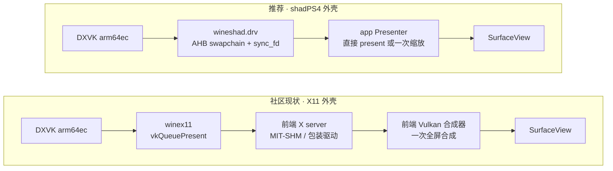
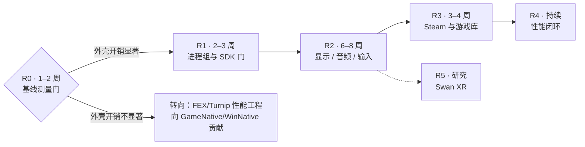

> 本文复制自 shadPS4 仓工作区 `docs/android-windows-games-reassessment-20260924.md`（该文件在 shadPS4 仓未提交）。文中指向 `docs/specs/`、`src/`、`scripts/` 等的相对链接指的是 shadPS4 仓，对应本仓的 `references/shadPS4/`。

# Android 运行 Windows / Steam 游戏：路线重评估与新规划

状态：**PLAN_DRAFT**，日期 2026-09-24。本文**取代** [android-x64-arm64ec-plan.md](android-x64-arm64ec-plan.md)（2026-09-10）的 §1.3 否决门、§6.1 构建机硬约束、§7 P0–P3 与 §8 风险排序；该文件的三路线对比（§2）、两个二进制世界（§4.2）仍然成立，保留作背景。

本文是路线评估与规划，不是实施 spec；除第 2 节标注的公开来源与本地源码核对外，没有在设备上跑过任何 Windows 程序。

---

## 1. 回捞：之前在哪两个会话里做过

| 会话 | 目录 | 时间 | 内容 |
|---|---|---|---|
| `54ba92d9` | `C:\workspace\proton11` | 2026-09-10 上午 | 拉取 Proton `proton_11.0` @ `5b89db94`；梳理 Android 跑 Steam 的路线（Winlator 系、GameNative、Mobox、AVF、串流）；确认 GameNative = Pluvia（GPL-3.0）前端 + Winlator（MIT）后端 |
| `7cd90463` | 本仓 | 2026-09-10 下午 | 评估"FEXCore in android + proton11 + WinNative/GameNative 能否做更简的 Steam 环境"；产出分享页与 `docs/android-x64-arm64ec-plan.md`（未提交） |

两个会话都是 CLI 会话，转录在 `~/.claude/projects/C--workspace-proton11/` 与 `C--workspace-emulations-shadps4/` 下。

当时的核心结论：

1. 选 **bionic Wine + ARM64EC**：翻译面只剩游戏 EXE，Wine PE 侧 / DXVK / VKD3D 全部 arm64ec 原生。
2. shadPS4 的 FEX 工作"基本带不过去"：`fex_context.cpp` 是纯 JIT + typed HLE gate，不透传 syscall，Windows 游戏要的是 Wine。
3. 唯一否决门：**bionic Wine × ARM64EC 没有公开证据**，P0 用 2–3 周 spike 回答。
4. 硬约束：ARM64 产物必须在 ARM64 构建机上出（proton11 `README.md:194`）。

---

## 2. 两周后外部状况：底座已经被社区做出来了

| 事实 | 证据 | 对原规划的影响 |
|---|---|---|
| bionic arm64ec Proton 11 已发布 | GameNative/proton-wine `proton_11.0-2`，最新 2026-09-18 构建："Proton 11.0-2 arm64ec (bionic) — stock Valve + runtime ntsync … SDK 28 + 16KB pages" | **原 P0 否决门已被回答：可行** |
| 构建在 x86_64 runner 上完成 | 其 `build-proton.yml`：`runs-on: ubuntu-24.04`，NDK r27d（`aarch64-linux-android28`），bylaws llvm-mingw `20250920`，termuxfs 作为依赖 sysroot | **"必须 ARM64 构建机"只是 Proton 自带构建系统的约束**，不是 bionic 路线的约束 |
| FEX 以 Wine 模块形式随发布 | FEX 2609 构建："Wine emulator DLLs cross-compiled with llvm-mingw, plus the native aarch64 .so unix libs"；unix libs 为 bionic `.so` | 本地 FEX fork 已含同一套源码：`Source/Windows/{ARM64EC,WOW64,UnixLib}` |
| 主流前端已提供 ARM64EC 容器 | Winlator-Bionic / Ludashi："Arm64EC containers which utilize FEXCore (for 64/32-bit) or an optional WowBox64"；WinNative 提供 ARM64EC Proton 与 FEX UnixLibs 开关 | 32 位（WoW64）也已被覆盖，不再是独立项目 |
| Steam 已接到 bionic Wine | proton-wine："Integrated lsteamclient built into Proton (supports GameNative bionic Steam)"；WinNative 自研 Steam 客户端 | 原 P3 的 DRM 握手已有现成实现 |
| targetSdk 36 已有变体 | GameNative `modern` flavor `targetSdk = 36`，预载 `libredirect-bionic-wx.so` 处理 W^X 下的 exec；`legacy` 仍为 28 | targetSdk 不再是我们的独有优势 |
| PCVR OpenXR 已桥到头显 | GameNative `modernXr`：PE 侧 `gamenative_openxr_runtime.c`（3564 行，unix call + socket）+ app 侧 `cpp/xrimmersive/xr_windows_{projection,transport}.cpp`，目标 Meta Quest | XR 方向有先行者，但只针对 Quest 运行时 |

**社区栈仍然薄弱的地方**（从 proton-wine 配置与前端源码可直接看到）：

- **显示走 X11**：`--enable-wineandroid_drv=no`，`X_LIBS="-landroid-sysvshm"`（MIT-SHM 仿真），前端内置 X server + 自己的 Vulkan 合成器（`com/winlator/renderer/VulkanRenderer.java`）。每帧多一次合成，Surface 生命周期、帧节奏都绑在 X server 上。
- **音频走 ALSA**：`--with-alsa`，经前端的音频服务组件转发，而不是直接 AAudio/Oboe。
- **性能工具几乎没有**：前端只有 HUD；没有 CPU/GPU 同窗采集、KGSL 归因、x64 函数级剖析。
- **Turnip 来源分散**：社区用各自拼的 A6xx/A7xx/A8xx 构建。

---

## 3. 原规划逐条复核

| 原断言（09-10） | 现状 | 处理 |
|---|---|---|
| bionic Wine × ARM64EC 无公开证据，P0 为否决门 | 已有多家公开发布 | 删除否决门；改为"测量门"（§6 R0） |
| 必须 ARM64 Linux 构建机，≥32 GB，自建 LLVM | x86_64 runner + 预编 llvm-mingw 即可 | 用 x86_64 CI；不再自编 LLVM |
| NDK r29 强制 | r29 是 FEXCore **bionic 嵌入**需要（`std::atomic_ref`）；Wine unix 侧用 r27d 即可，FEX 在 ARM64EC 下是 PE 构建 | Wine 子进程与 shadPS4 宿主可各用各的 NDK，二者不在同一进程 |
| 32 位另接 `libwow64fex.dll`，P4 之后 | 已随 FEX Wine 模块与 WowBox64 提供 | 并入主线，按前端现成方案 |
| P1 新写"win32u 直连 ANativeWindow" | 社区仍是 X11，无人做 | **这是仍然有价值的差异点**，见 §5 |
| shadPS4 guest_cpu 层对 Steam 价值为零 | Orbis HLE 语义层确实用不上；但 09-10 之后 shadPS4 长出了一整套 Android 宿主与工具链 | 重新估值，见 §4 |

---

## 4. shadPS4 现有资产重新估值

### 4.1 为什么不能把 Wine 塞进 shadPS4 的进程

直觉上最省事的做法是像 PS4 guest 一样，把 Wine 也跑在 app 进程里、复用内嵌的 FEXCore。这条路不通，理由是结构性的：

- **地址空间**：ART 的对象堆使用 32 位压缩引用，必须位于低 4 GiB。Windows ABI 需要固定地址的 `KUSER_SHARED_DATA`（`0x7ffe0000`），WoW64 需要整个低 4 GiB，Wine 的 preloader 必须在 libc 初始化之前抢占这些区间。shadPS4 能在进程内运行，是因为 PS4 guest 窗口（4 MiB–256 MiB、4 GiB–120 GiB）刻意绕开了 ART 占用的区间，Windows 进程做不到这一点。
- **进程模型**：Wine 天生多进程（wineserver、services、explorer、winedevice、游戏及其子进程），`CreateProcess` 需要独立地址空间。
- **翻译边界不同**：shadPS4 的 FEX 前端（`src/core/guest_cpu/fex/fex_context.cpp`）靠 typed HLE gate 与 host 交互；ARM64EC 下 x64 代码经 ARM64EC ABI 的 exit thunk 直接调用 arm64ec 原生 DLL，系统调用由 Wine 处理。两者是 FEXCore 的两个不同前端，各自对应不同的调用约定。

所以复用发生在**进程边界上**：app 进程负责显示、输入、音频、生命周期与诊断，Wine 子进程负责 Windows 语义。

### 4.2 资产表

| 资产 | 位置 | 对 Windows 路线的价值 |
|---|---|---|
| Session Service / generation / Stop 语义 | `android/shadps4-app/.../service/FexSessionService.kt` | **高**。改为监管 Wine 进程组：启动、前后台、Stop 回收、崩溃归因 |
| Presenter：ANativeWindow + Vulkan swapchain + StatusLayer | `src/video_core/renderer_vulkan/vk_presenter.h` | **高**。作为 AHB 帧的消费端，替代 X server 合成器 |
| 进程内 bionic Turnip 加载（adrenotools） | `src/video_core/renderer_vulkan/vk_driver_android.cpp`、`runtime/locks/turnip-bionic.json` | 中。Presenter 侧直接用；Wine 子进程另行加载同一驱动 |
| Turnip fork（KGSL zero-timeout poll、Mapper5 元数据等） | `tencentmalos/mesa-mirror` | **高**。DXVK/VKD3D 负载同样受益，且社区没有 |
| Foundation InputHub / 手柄映射 | Foundation `modules/input`，`src/core/host_runtime/orbis_pad_adapter.h` | 高。换一个适配器输出 XInput/DInput 状态 |
| Oboe 音频端点 | `src/core/libraries/audio/oboe_audio_out.cpp` | 高。替代 ALSA 转发链 |
| DebugBus / dumpsys / 状态面板 | `src/core/diagnostics/` | 中。统一的运行时开关与状态查询 |
| Litep PROF + KGSL/sched 同窗、RenderDoc、gpu_timing | 见 CLAUDE.md 各轮报告 | **高**。社区完全没有；Wine 子进程同样可采 |
| FEX fork 与团队对 FEXCore 的掌握 | `references/FEX`（`tencentmalos/FEX`） | 中。FEXCore 级修复（如 x87 FXRSTOR TOP 旋转）两个前端通用；**FEX 仓库禁止 AI 生成的贡献，上游化需要人工完成** |
| FEX IR probe / reverse_study / 函数入口 patch | `src/core/guest_cpu/fex/profile_pass.h` 等 | 中，偏研究。IR 层探针与前端无关，可移植到 ARM64EC 模块，做 x64 游戏函数级剖析 |
| ZAR/SAF 库、设置界面 | `android/shadps4-app` | 低到中。可做统一的 PS4 + PC 游戏库 |
| Orbis HLE、GNM/PM4 渲染、guest 同步快路径 | `src/core/host_runtime/`、`src/video_core/` | **无**。Windows 路线由 Wine + DXVK 承担 |

---

## 5. 推荐方案：消费社区底座，用 shadPS4 宿主替换 Winlator 外壳

一句话：**不再自建 bionic arm64ec Wine；把社区已跑通的底座当上游 pin，把工程投入集中在社区最薄弱、而我们已有现成实现的那一层。**

```text
图例  [上游] 直接 pin 社区/上游产物   [自研] 我们写   [复用] shadPS4 现有实现

APK（targetSdk 35/36）
├─ app 进程（ART + native）
│   [复用] Session Service：监管 Wine 进程组、前后台、Stop、崩溃归因
│   [复用] Presenter：ANativeWindow + Vulkan，消费 AHB 帧 + sync_fd
│   [复用] InputHub → 共享内存输入块
│   [复用] Oboe 端点 ← 共享内存 PCM 环
│   [复用] DebugBus / StatusLayer / Litep
│   [上游/自研] Steam 前端（登录、库、depot 下载）
└─ Wine 子进程组（从 nativeLibraryDir exec，或 linker64 方式）
    [上游] wine-preloader / wine / wineserver（bionic，Proton 11 arm64ec 系）
    [上游] Wine PE 侧 arm64ec + libarm64ecfex.dll + FEX unixlib
    [上游] DXVK / VKD3D-Proton arm64ec → winevulkan → Turnip（子进程内加载）
    [上游] lsteamclient（bionic）
    [自研] wineshad.drv：虚拟桌面模式的 win32u 用户驱动
             Vulkan swapchain = AHB 图像，经 unix socket 交给 app Presenter
             GDI 窗口面 = 共享内存位图，同样交给 Presenter 合成
    [自研] mmdevapi 音频驱动 → 共享内存 PCM 环
    [自研] 输入：共享内存 → XInput / DInput / 原始键鼠
```

一帧画面在两种外壳下的路径：



**图例：** 两边的游戏代码翻译完全相同（都是 FEX ARM64EC），差别只在"帧交出 Wine 之后"那一段。右侧少掉的是 X 协议往返与前端合成器；app 进程与子进程之间只传 AHB 句柄与 fence，不拷像素。

设计要点：

- **只做虚拟桌面**。一个 Android Surface = 一个 Wine 虚拟桌面；不为每个 Windows 窗口建 Android View。全屏游戏走 Vulkan 直通路径，启动器与对话框走 GDI 位图合成。窗口管理的工作量因此有上限。
- **跨进程只传句柄与 fence**：`AHardwareBuffer_sendHandleToUnixSocket` + `VK_ANDROID_external_memory_android_hardware_buffer` + sync_fd 信号量。这与 SurfaceFlinger 的做法一致，不需要 binder。
- **后台处理**：app 退到后台时 Surface 销毁，对 Wine 进程组发 `SIGSTOP`，回到前台发 `SIGCONT`。游戏状态得以保留，同时规避 Android 12+ phantom process killer 对后台高 CPU 子进程的查杀。
- **Wine 改动做成独立 DLL**（`wineshad.drv` + 音频驱动），不改 ntdll/win32u 主体，跟进上游 Proton 时 rebase 成本最低。

---

## 6. 分阶段



**图例：** 菱形是唯一的分支门。R0 的作用是先用数据确认"外壳"是否值得重写，因为 FEX 与 GPU 可能才是大头；R5 从 R2 的 AHB 桥接派生，不阻塞主线。

### R0 — 基线测量门（1–2 周）

在 AYN Thor（以及可能的话 Swan）上装 GameNative `modern` 或 WinNative，使用 Proton 11.0-2 arm64ec + FEX 2609 + Turnip，选 4–5 款游戏：轻量 D3D11、重量 D3D11、D3D12、32 位、启动器较重的各一款。用 Litep + KGSL/sched 同窗采集，simpleperf 看各进程分布。

**出口判据**

- 每款游戏都有 FPS、帧时间分布，以及按进程 / 线程拆分的 CPU on-CPU 时间：游戏翻译代码、Wine unix 侧、X server、合成器、音频服务
- GPU busy，以及合成器在 GPU 上的耗时
- 结论二选一：若 X server + 合成器 + 音频链合计小于帧时间约 5% 且帧节奏无明显问题，**跳过 R2 的显示驱动**，直接转向 FEX/Turnip 性能工程并向上游前端贡献；否则进入 R1
- Swan 内存余量评估（血源在 Swan 上已多次触发 LMK 与 launcher 被杀）

### R1 — 进程组与 SDK 门（2–3 周）

**出口判据**

- targetSdk 35 的 APK 能从 nativeLibraryDir（或 linker64 方式）拉起 wineserver + wine，在 Android 14（Thor）与 Android 16（Swan）上各跑通一个 x86-64 控制台程序与一个 GDI 窗口程序（此阶段不上屏，只验证进程与输出）
- Wine 进程组绑定 Session generation：Stop 在限定时间内回收全部子进程，连续 50 次启停无残留进程、无 fd 泄漏
- 记录 W^X 下 PE 文件映射（`PROT_EXEC` 文件 mmap）与 FEX JIT 的实际行为，与 GameNative 的 `libredirect-bionic-wx.so` 做法对照

### R2 — 显示 / 音频 / 输入（6–8 周）

**出口判据**

- 一款 D3D11 游戏经 `wineshad.drv` → Presenter 全屏出画面；同机同场景下帧时间不劣于 R0 基线，帧节奏方差更小（Litep 同窗数据）
- 启动器 / 对话框通过 GDI 合成可见并可操作
- 手柄、键鼠、触屏输入进入 XInput / DInput / 窗口消息
- 音频经 Oboe 播放；前后台切换时 Surface 销毁与重建均不杀游戏

### R3 — Steam 与游戏库（3–4 周）

**出口判据**

- 正版库中一款无反作弊游戏走通 登录 → 下载 → 安装 → 启动 → 存档
- **先定许可**：GameNative / Pluvia 为 GPL-3.0；采用其 Steam 代码意味着 app 整体按 GPL-3.0 发布，需要核对 Foundation 等依赖的许可是否兼容。替代方案是只用 JavaSteam（许可待核实）+ Proton 自带的 lsteamclient
- 游戏库界面与现有 ZAR 库合并（PS4 与 PC 同一入口）

### R4 — 性能闭环（持续）

- Litep 覆盖 Wine 子进程（线程命名、帧标记来自 Presenter 与 DXVK present）
- FEX 按游戏配置（TSO 相关开关、code cache；Qualcomm 没有硬件 TSO，FEX unixlib 的 `PR_SET_MEM_MODEL` 路径在 Adreno 设备上不生效）
- Turnip fork 针对 DXVK/VKD3D 负载的修复与回归
- 研究项：把 FEX IR probe 移植进 ARM64EC 模块，对 x64 游戏做函数级剖析

### R5 — Swan XR（研究，4–6 周）

GameNative 已在 Quest 上验证了"PE 侧 OpenXR runtime + unix call + socket + app 侧 XrSession"的桥接形态。我们的差异在 Pico/Swan 运行时，以及已有的 HMD、SBS、重投影经验。

**出口判据**

- 一款 OpenXR PCVR 游戏在 Swan 上完成 session 创建与双眼提交
- 平面游戏的 VR 影院模式

---

## 7. 风险

| 级别 | 风险 | 缓解 |
|---|---|---|
| 高 | R0 可能显示外壳不是瓶颈，R2 的收益有限 | R0 就是为此设的门；不成立则转向性能工程与上游贡献，沉没成本限于 1–2 周 |
| 高 | 上游是社区 fork（GameNative/proton-wine、The412Banner 等），变动快 | 固定 pin；自研部分做成独立 DLL，不碰主体 |
| 高 | W^X / targetSdk 35+ 的 exec 与文件映射限制 | R1 在两代 Android 上实测；有 GameNative `modern` 作参照 |
| 中 | phantom process killer、Pico `ResManagerKillPolicy` 在内存压力下杀进程 | 后台 SIGSTOP；前台服务；Swan 先做内存预算 |
| 中 | 许可（GPL-3.0 传染） | R3 之前定案 |
| 中 | FEX 仓库禁止 AI 生成的贡献 | FEXCore 级修复在 fork 中保留，上游化由人工完成 |
| 已知不做 | EAC / BattlEye 等反作弊 | 划出范围 |
| 延期 | 16 KiB 页 | 社区的 "16KB page support" 只做了 ELF 对齐（`max-page-size=16384`），PE 4 KiB 节保护在 16 KiB 内核上是否成立未验证；按用户要求继续延期 |

---

## 8. 与 shadPS4 主线的关系

- Windows 路线**不进**当前 `feature/malos/*` 的 PS4 性能工作分支；另开仓库或独立分支。
- 共享部分（Session、Presenter、InputHub、Oboe、诊断）应先在 shadPS4 内抽成不依赖 Orbis 的模块，再被两个运行时共同使用；不要为 Windows 路线复制一份。
- FEX：shadPS4 继续用 bionic 嵌入前端（fork pin）；Windows 路线直接用上游 FEX 发布的 Wine 模块。FEXCore 级修复在两边共享。

---

## 附：来源

- GameNative/proton-wine releases 与 `.github/workflows/build-proton.yml`、`build-scripts/build-step-arm64ec.sh`：<https://github.com/GameNative/proton-wine>
- GameNative 前端（flavor、OpenXR runtime、X server 渲染器）：<https://github.com/utkarshdalal/GameNative>
- WinNative releases：<https://github.com/WinNative-Emu/WinNative/releases>
- FEX 2609 unixlib 构建：<https://github.com/nicholasx417/WinNative-Components/releases/tag/fex-unix-2609-177542e67>
- 组件 nightly（FEX unixlib loader 要求 Proton 11.0-1+ 的 `MemoryWineLoadUnixLibByName`）：<https://github.com/The412Banner/Nightlies/releases/tag/nightly-20260923-220007>
- Winlator-Ludashi（ARM64EC 容器）：<https://github.com/StevenMXZ/Winlator-Ludashi>
- FEX ARM64EC wiki：<https://wiki.fex-emu.com/index.php/Development:ARM64EC>
- 本地：`references/FEX/Source/Windows/{ARM64EC,WOW64,UnixLib}`；`C:\workspace\proton11`（`5b89db94`，子模块未初始化）
