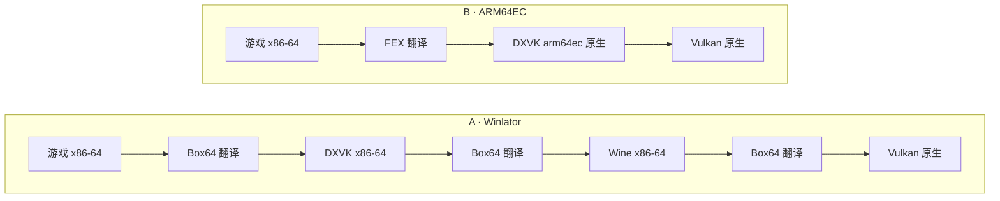
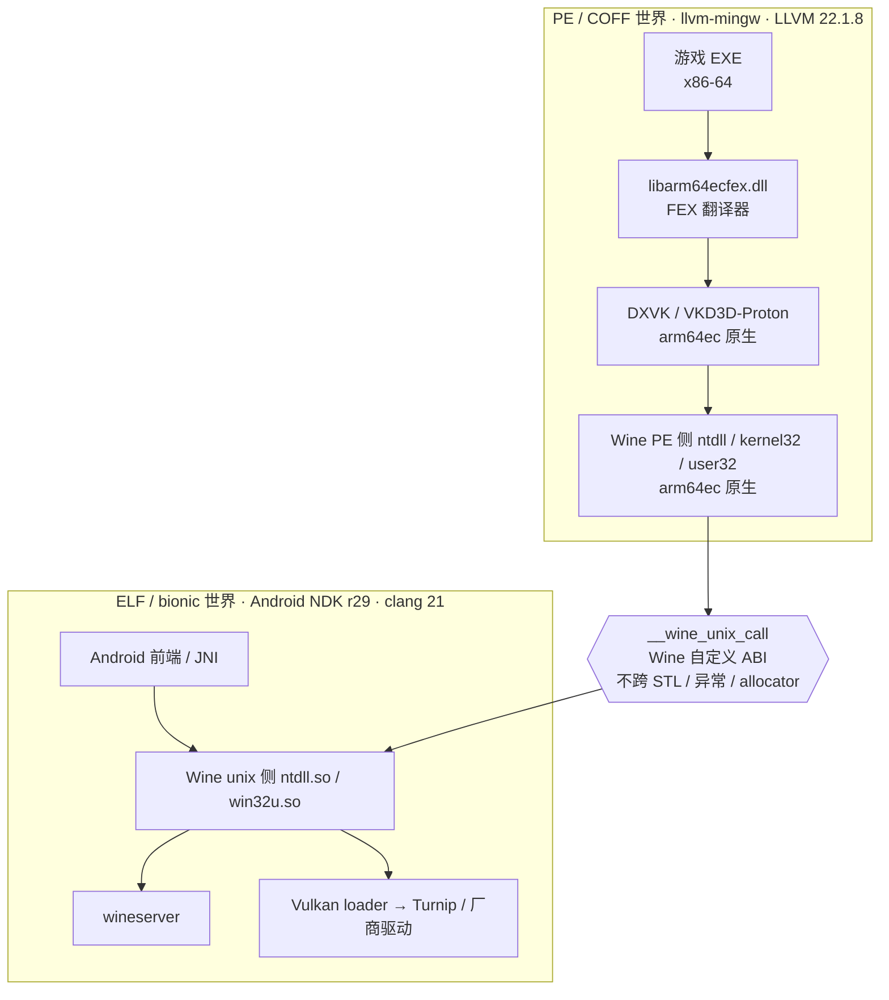
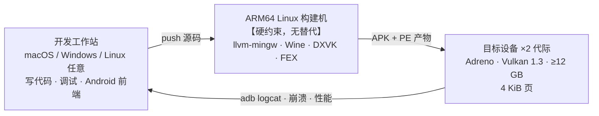
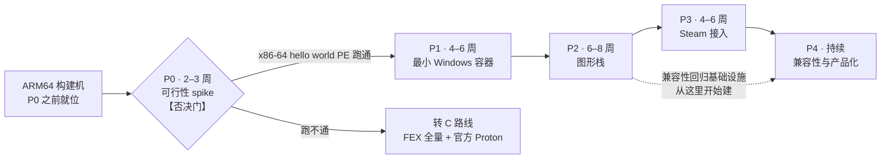

> 本文复制自 shadPS4 仓工作区 `docs/android-x64-arm64ec-plan.md`（该文件在 shadPS4 仓未提交）。文中指向 `docs/specs/`、`src/`、`scripts/` 等的相对链接指的是 shadPS4 仓，对应本仓的 `references/shadPS4/`。

# Android x86-64 运行时规划：bionic Wine + ARM64EC + FEX

状态：**PLAN_DRAFT / P0 未启动**。日期：2026-09-10。

> **2026-09-24 更新：** 本文的 P0 否决门（bionic Wine × ARM64EC 无公开证据）、ARM64 构建机硬约束与 P0–P3 已被 [重评估](android-windows-games-reassessment-20260924.md) 取代——社区已发布 bionic arm64ec Proton 11，并在 x86_64 runner 上构建。§2 路线对比与 §4.2 两个二进制世界仍然成立。

目标是在 Android ARM64 上运行 Steam 的 x86-64 Windows 游戏，把翻译面从"整个 Windows 用户态"缩到"仅游戏 EXE 本体"。

本文件是**路线评估与规划**，不是实施 spec。它明确**不属于** `codex/android-fex-round2`，理由见 §10。可分享页面：<https://claude.ai/code/artifact/15bc5756-2e88-47bd-a315-d4b8649a57de>

所有 pin、行号与构建参数取自 2026-09-10 的本地工作区：

| 工作区 | 位置 | 版本 |
|---|---|---|
| shadPS4 | `C:\workspace\emulations\shadps4` | `codex/android-fex-round2` @ `0e10defc` |
| Proton 11 | `C:\workspace\proton11` | `5b89db94` |
| FEX fork | `references/FEX` | `tencentmalos/FEX` `feature/malos/host-page-size` @ `385a0cc4d` |

---

## 1. 结论

### 1.1 可以做，而且"更简"是结构性的

ARM64EC 形态砍掉 proot、glibc rootfs、X11 server、Vortek 代理，以及 Box64 翻译一切这件事本身。剩下的翻译面只有游戏 EXE。proton11 已经把这套构建规则写完了——`arm64ec-windows` 是它的一等 ARCH（`Makefile.in:80`）。

### 1.2 shadPS4 那 68 个 commit 基本带不过来

`src/core/guest_cpu/fex/fex_context.cpp:302` 写得很清楚：

> An unregistered operation is a per-thread fault, never an implicit host syscall.

那是刻意做成**纯 JIT 核 + typed HLE gate** 的 Orbis 形态：不实现任何 Linux syscall，不透传 Android syscall，guest 只能调注册过的 Orbis 函数。这正好是 Windows 游戏最不需要的形态——它们要么需要完整 Win32 PE ABI（Wine），要么需要完整 Linux ABI（FEX rootfs 模式）。`api/`、`hle/`、async-stop、publication transaction 那约 4900 行，换到 Steam 场景基本清零。

能带走的只有 FEX fork 本身、fork 里的 host-page 修复，以及团队对 FEX 内部的掌握度。

### 1.3 整条路线押在一个未验证的组合上

bionic Wine 存在（Winlator-Bionic / WinNative），ARM64EC on Linux 存在（Wine 10.x + proton11）。**两者叠加没有公开证据。** P0 spike 的唯一任务就是回答它，两三周内出结论，不通过就退回 C 路线。

---

## 2. 三条路线，按翻译面排

同一个问题——x86-64 的游戏代码怎么在 ARM64 上跑——三种切法。区别不在性能调优，在有多少代码必须过翻译器。

下面三张栈图用同一套标记，缩进表示包含关系（外层承载内层）：

```text
图例
  [原生]  以原生 ARM64 指令执行，不过翻译器
  [翻译]  x86-64 代码，每条指令都要经过翻译器
  [开销]  纯兼容垫层，不承载游戏逻辑但要付出代价
```

### A. 现状：Winlator / Bachata runtime

```text
[原生] Android APK
[开销]   proot + glibc rootfs                    termux-pacman
[开销]     X11 server / Vortek 代理              sdl3-winlator
[翻译]       Wine（x86_64 构建）
[翻译]       Box64 —— 翻译它上下的所有东西        50c8b90b
[翻译]       DXVK / VKD3D（x86_64）
[原生]         Mesa Turnip / adrenotools
[翻译]       游戏 x86-64
```

**翻译面：整个 Windows 用户态。** 每次 draw call 都在被翻译。这是 `references/Bachata-S4-android/runtime/` 里现在跑的东西。

### B. 选定：bionic Wine + ARM64EC

```text
[原生] Android APK
[原生]   Wine unix 侧（bionic ARM64）            NDK r29
[原生]     Wine PE 侧（arm64ec）                 llvm-mingw
[原生]       DXVK / VKD3D-Proton（arm64ec）
[翻译]       libarm64ecfex.dll ◄── 唯一翻译边界
[翻译]         游戏 x86-64
[原生]     Vulkan 直连 ANativeWindow
```

**翻译面：仅游戏 EXE 本体。** 图形栈全程原生。这是 Windows on ARM 的同一套模型。

一次 D3D11 draw call 在 A 与 B 两条路线上的实际路径对比——差别不是快一点，是层数不同：



A 路线里 DXVK 自己也是 x86-64，所以游戏每调一次 D3D，Box64 要翻译的不只是游戏那一侧，还有 DXVK 内部整条实现。B 路线里 FEX 只在 `游戏 → DXVK` 这一个边界上工作，边界之后全是原生代码。

### C. 兜底：FEX 全量 + 官方 Proton

```text
[原生] Android APK
[原生]   FEXCore（bionic）                       已验证
[翻译]     x86-64 Linux rootfs
[翻译]       官方 Proton（未改动）
[翻译]         Wine + DXVK（x86_64）
[翻译]           游戏 x86-64
[原生]   Vulkan / Turnip
```

**翻译面：整个 Linux 用户态。** 但它是**唯一能用上官方 Proton 二进制**的路子，兼容性问题可以直接查 ProtonDB。

### 三条路线横向对比

| | A · Winlator | B · ARM64EC | C · FEX 全量 |
|---|---|---|---|
| 翻译面 | 整个 Windows 用户态 | **仅游戏 EXE** | 整个 Linux 用户态 |
| 图形栈 | 翻译 | **原生** | 翻译 |
| 需要 rootfs | glibc rootfs + proot | **不需要** | x86-64 rootfs |
| 显示路径 | X11 / Vortek 代理 | **ANativeWindow 直连** | X11 / Vortek 代理 |
| 兼容性数据 | 社区列表 | 无，要自己攒 | **直接查 ProtonDB** |
| 成熟度 | 高，生态最大 | 低，组合未验证 | 中 |
| 32 位游戏 | 支持 | 需另接 WoW64 | 支持 |

### 选型理由

如果目标是"尽快让某几个游戏跑起来演示"，C 更快；如果目标是"做一个能长期迭代的产品"，B 是正确答案。本规划按 B 写，C 保留为 P0 失败后的退路。

---

## 3. 工具链矩阵

B 路线同时存在两个二进制世界。搞清楚哪个产物属于哪个世界，是这套构建能不能立起来的前提。

| 产物 | 世界 | 工具链 | 来源 / 版本 | 状态 |
|---|---|---|---|---|
| Wine unix 侧<br>`ntdll.so` / `win32u.so` / `wineserver` | ELF · bionic | Android NDK clang | r29.0.14206865，native API 35 | 需新建 · **最大未知数** |
| Wine PE 侧<br>`ntdll.dll` / `kernel32` / `user32` | PE · arm64ec | llvm-mingw | `arm64ec-w64-mingw32`<br>proton11 `Makefile.in:624` | proton11 已有规则 |
| FEX 翻译器<br>`libarm64ecfex.dll` | PE · arm64ec | llvm-mingw | `Source/Windows/ARM64EC`<br>proton11 `Makefile.in:862` | 上游已有，本地已在树内 |
| DXVK / VKD3D-Proton | PE · arm64ec | llvm-mingw + meson | proton11 `Makefile.in:714` / `:834` | proton11 已有规则 |
| Android 前端 / JNI | ELF · bionic | Android NDK clang | GameNative / Pluvia | 可复用（GPL-3.0） |
| arm64ec 工具链本体 | — | 容器内自建 | LLVM `22.1.8` + mingw-w64 `13.0.0`<br>llvm-mingw `20260602` + `llvm-thunk-vararg.patch` | proton11 `docker/llvm-mingw.Dockerfile.in` |

---

## 4. arm64ec 工具链能 NDK 化吗

### 4.1 不能，也不需要

arm64ec 的产物是 **PE/COFF**，走 MSVC ABI，依赖 mingw-w64 的头文件和 CRT。NDK 给的是 ELF + bionic sysroot：没有 mingw 头、没有 PE CRT、没有 `dlltool` / `winebuild`。二者不是"版本不同"，是**目标世界不同**。

真正需要 NDK 的是另一半：Wine 的 `aarch64-unix` 侧。proton11 现在把它编到 steamrt 的 glibc 上，B 路线要把它编到 bionic 上。这才是要验证可行性的地方。

### 4.2 为什么两套工具链可以共存

PE 侧和 ELF 侧唯一的接触点是 Wine 自己的 unix call 边界（`__wine_unix_call` 一类），那是 **Wine 定义的 ABI，不是 C++ 或 libc 的 ABI**。跨这条线不传 STL 对象、不传异常、不共享 allocator。



**图例：** 上半为 PE 世界，全部由 llvm-mingw 产出；下半为 ELF 世界，全部由 NDK 产出。两个世界只在中间那道菱形边界接触，且该边界不传任何编译器相关的对象——这就是两套工具链版本可以错位而不出问题的原因。

所以 proton11 用 LLVM 22.1.8 出 PE 侧、NDK r29（clang 21）出 ELF 侧，版本错位是安全的。FEX 的 ARM64EC target 也印证了这一点——`Source/Windows/ARM64EC/CMakeLists.txt` 的链接选项是：

```
-static -nostdlib -nostartfiles -nodefaultlibs -lc++ -lc++abi -lunwind
```

自带一整套运行时，不依赖宿主的任何东西，最后还用 `patch_library_wine` 盖上 Wine builtin 标记。

### 4.3 要验证的三件事，按顺序

1. **NDK r29 能否编出 Wine 的 unix 侧。** Wine 的 `ntdll` unix 部分对 libc 的假设不少：`futex` 用法、TLS 模型、signal handler 的 `ucontext` 布局、`dlopen` 语义、`__thread` 与 bionic TLS slot 的冲突。Winlator-Bionic / WinNative 已经趟过一遍，但那是**他们的 Wine 配置**，不含 arm64ec 多架构。
2. **bionic 上的 Wine 能否加载 arm64ec 混合镜像。** PE 加载是 Wine 自己做的，宿主 libc 不参与，理论上无关。风险在 ARM64EC 的 hybrid 元数据处理和 BT 接口注册，见 `Source/Windows/ARM64EC/BTInterface.h`。
3. **`--enable-archs=arm64ec,aarch64` 在非 glibc 上是否还成立。** proton11 `Makefile.in:624` 就是这行，它在 steamrt 下验证过，在 bionic 下没有。

---

## 5. 已在手的资产

盘点是为了不重复造，也是为了不高估。下面每一项都核对过实际 pin。

| 资产 | 实际 pin / 位置 | 对 B 路线的价值 |
|---|---|---|
| FEX fork（含 ARM64EC + WOW64 源码） | `tencentmalos/FEX` `feature/malos/host-page-size` @ `385a0cc4d`，upstream base `50e6eee95` | **高。** `Source/Windows/{ARM64EC,WOW64}` 就在树里，与 proton11 同上游 |
| host page ≠ guest page 适配 | 同上 fork，PS-02 / PS-03 | 中。解的是 FEXCore 自己的分配，**不解 Wine PE loader 那一侧** |
| FEXCore bionic 构建配方 | `docs/fex-android-bionic-build.md`，NDK r29 + 5 处改动 | 低。arm64ec 是 mingw PE 构建，不碰 bionic；只对 C 路线有用 |
| proton11 arm64ec 构建规则 | `C:\workspace\proton11`，`Makefile.in:80` 三套 ARCH | **高。** arm64ec 的 wine / dxvk / vkd3d / fex 全套规则现成 |
| Winlator 运行时经验 | `Bachata-S4-android/runtime/`：8 个 box64 patch、Vortek、Mesa `6984e91b` | 中。图形栈与设备适配知识可迁移；Box64 与 X11 部分整体作废 |
| GameNative / Pluvia | GPL-3.0（Winlator 后端为 MIT） | **高。** Steam 协议客户端 + Steamworks DRM 处理 |
| shadPS4 `guest_cpu` 层 | `src/core/guest_cpu/`，约 4.9k 行 | **零。** 见 §1.2 |

---

## 6. 开发环境要求

一共要准备三类机器，职责不能互换：



**图例：** 箭头是产物与反馈的流向，不是人的工作流。关键是 **PE 侧产物只能从中间那台机器出**——工作站上编不出来，也不要试。

### 6.1 构建机（硬约束，最先解决）

proton11 `README.md:194`：**ARM64 产物必须在 ARM64 构建机上出。** 没有绕过办法，这台机器要在 P0 之前就位。

| 项 | 要求 | 说明 |
|---|---|---|
| 架构 | ARM64 Linux | x86-64 机器无法产出 arm64 Proton |
| 容器引擎 | Podman（推荐 rootless）或 Docker | `configure.sh:150` 自动探测；用 podman-docker 需先建 `/etc/containers/nodocker`，否则 `configure.sh:68` 直接拒绝 |
| SDK 镜像 | `make BUILD_ARCH=aarch64 proton-llvm` | 产出 `registry.gitlab.steamos.cloud/proton/steamrt4/sdk/arm64:latest`，用 `--proton-sdk-image=` 传给 `configure.sh` |
| 内存 | ≥32 GB（或限制并发） | 容器内从源码全量编 LLVM 22.1.8 |
| 磁盘 | ≥200 GB 可用 | LLVM + mingw-w64 源码树、构建中间产物、多 ARCH 输出 |
| 首次构建耗时 | 以小时计 | llvm-mingw 必须进 artifact 缓存，不要每次 CI 重编 |

工具链构成（`docker/Makefile`）：LLVM `22.1.8` + mingw-w64 `13.0.0` + llvm-mingw `20260602`，外加 `llvm-thunk-vararg.patch`。SteamRT `4.0.20260331.220802`。

### 6.2 Android 侧工具链

| 项 | 要求 | 说明 |
|---|---|---|
| NDK | **r29.0.14206865**（clang 21.0.0） | 强制。FEXCore 用 `std::atomic_ref`，r28c 及更早的 NDK libc++ **完全没有这个头文件**，加 `-fexperimental-library` 也无效 |
| native API | 35 | r29 的 `meta/platforms.json` max 仍是 35；不存在原生 API 36 sysroot |
| Java 侧 | compileSdk / targetSdk 36 | platform `android-36`、build-tools `36.0.0`（含 `zipalign`） |
| JDK | 17 | 实测 17.0.12 |
| CMake | ≥ 3.22 | 实测 4.4.0 |
| Ninja | ≥ 1.13 | 实测 1.13.2 |
| 其他 | Python 3、adb、meson（DXVK/VKD3D 需要） | |

> **注意一处现存不一致：** `scripts/android/README.md` 与 `scripts/android/check-v0-environment:17` 仍锁 NDK r28c，而 `scripts/android/build-fexcore-android:11` 强制 r29 并按 `atomic_ref.h` 是否**实际存在**来挑（不信目录名——本机就有目录名与 `Pkg.Revision` 不符的 NDK）。新项目直接锁 r29，不要继承 `docs/validation/v0/environment.lock.json` 的旧 lock。

### 6.3 目标设备

| 项 | 要求 | 说明 |
|---|---|---|
| 架构 | ARM64 | |
| Vulkan | 1.3 | DXVK 2.x 的硬要求 |
| GPU 驱动 | Adreno + Turnip（adrenotools 应用内加载）或厂商驱动 | 不需要 root；Turnip 的兼容性是**逐机型**的 |
| 内存 | ≥12 GB | 8 GB 是下限，AAA 实际要 12–16 GB |
| 存储 | ≥128 GB 可用 | Steam 游戏体积 |
| 页大小 | 4 KiB | 16 KiB 设备本轮不在范围内，见 §9 |
| 机型数量 | ≥2 款不同 Adreno 代际 | P2 起需要，驱动差异要进 vendor-override |

### 6.4 开发工作站

Android 前端、调试、文档可以在 macOS / Windows / Linux 任意平台做。**但 PE 侧构建不要在本地试**，一律走 §6.1 的 ARM64 builder。

Windows 工作站另有一个 git 层面的坑：`references/Bachata-S4` 曾有 5 个 `*:Zone.Identifier` 文件（NTFS 备用数据流被误提交），`:` 在 Windows 上非法，会让 `git submodule update --init --recursive` 直接 fatal 并连带留下一堆未检出的兄弟子模块。已在 `bd230a27` 修掉；在主仓 gitlink 升级之前，Windows 上 clone 需要 `git -c core.protectNTFS=false`。

### 6.5 CI

- ARM64 runner（同 §6.1）
- llvm-mingw 产物进 artifact 缓存，按工具链版本三元组做 key
- 产物验证沿用 `scripts/android/verify-native-artifacts` 的思路：ELF machine 正确、无 glibc `DT_NEEDED`、无 GNU symbol version、有 Build ID；APK 另查 zip 对齐
- PE 产物另需检查：hybrid 元数据存在、Wine builtin 标记已盖

---

## 7. 分阶段规划

编号是真实依赖链：每一阶段的出口判据没达成，下一阶段的工作量估计就是无效的。**P0 是否决门**——它不通过，整个规划作废并转 C 路线。



**图例：** 实线为阶段依赖，虚线为提前投入。菱形是唯一的否决门——它的判据只有一条（见下），失败即整体转向，沉没成本封在一个 spike 内。

### P0 — 工具链与可行性 spike（2–3 周）

唯一目的是把"bionic Wine × ARM64EC"这个未验证组合变成已知结论。不做任何产品化工作，不接图形，不接 Steam。允许一切脏手段——硬编码路径、跳过 wineserver、adb shell 直接跑。

**出口判据**

1. ARM64 构建机就位，容器内复现 llvm-mingw `20260602` + LLVM `22.1.8`，产出可用的 `arm64ec-w64-mingw32`
2. 用它构建出 `libarm64ecfex.dll`（FEX pin 若缺 Windows 侧改动，rebase 到含 ARM64EC 的上游；**不要**回退到 `f2b679f6`）
3. NDK r29 编出 Wine `aarch64-unix` 侧，在 Android 进程内起得来 wineserver
4. 跑通一个 arm64ec 的 hello world PE
5. **跑通一个 x86-64 的 hello world PE** —— 这一条是真正的判据，前四条都是它的前置

### P1 — 最小 Windows 容器（4–6 周）

把 spike 变成一个能重复构建、能装到手机上的最小容器。核心新工作是显示驱动：不要 X11，不要 Vortek 代理，Wine 的 win32u 直接对 ANativeWindow。

**出口判据**

- APK 内完成 prefix 创建、wineserver 生命周期、进程清理，重复 100 次不泄漏
- 一个 x86-64 GDI 程序在 ANativeWindow 上出画面
- 触摸 / 手柄输入进到 Windows 消息循环
- 构建可复现：全部 pin 入锁文件，产物带 Build ID

### P2 — 图形栈（6–8 周）

DXVK / VKD3D-Proton 的 arm64ec 构建接进来，Vulkan 走 Android loader。这里是 B 路线相对 A 路线拉开差距的地方，也是第一次能拿到有意义的性能数字。

**出口判据**

- 一个 D3D11 程序完整出画面，帧率与同机 Winlator 有可比数据
- 着色器缓存落盘并跨启动复用
- 至少两款 Adreno 机型验证；驱动差异记进 vendor-override
- 兼容性回归的基础设施在此阶段建立（不要等到 P4）

### P3 — Steam 接入（4–6 周）

**不跑 Steam 客户端。** 用 Pluvia / GameNative 的原生协议实现做登录、库、下载，再把游戏 EXE 直接拉进 prefix。`steam_api.dll` 的 DRM 握手用 GameNative 已有方案。跑 Steam 客户端本体会把前面所有简化红利吃回去。

**出口判据**

- 正版库里一款无反作弊游戏完成 下载 → 安装 → 启动 → 存档 全流程
- GPL-3.0 传染性范围确认并落到 license 文档
- 账号安全边界写清楚（第三方协议实现，非官方客户端）

### P4 — 兼容性与产品化（持续）

游戏兼容性列表、per-title override、崩溃收集、性能回归。B 路线没有 ProtonDB 可查，兼容性数据必须自己攒。

**出口判据**

- 兼容性矩阵覆盖目标机型 × 目标游戏，且可回归
- 崩溃 / ANR 能定位到 PE 侧、unix 侧还是 FEX 翻译

---

## 8. 风险登记

| 级别 | 风险 | 缓解 |
|---|---|---|
| **否决级** | bionic Wine × ARM64EC 未验证 | P0 就是为它设的，2–3 周出结论；失败即转 C 路线，沉没成本控制在一个 spike 内 |
| 高 | ARM64EC 在非 Windows 上仍然年轻 | 比"Box64 + Wine x86_64"少几年实战，会遇到独有的怪问题且社区能问的人少。预留调试预算 |
| 高 | 没有兼容性数据库 | C 路线能查 ProtonDB，B 路线每个游戏都得自己踩。P2 起建自动化兼容性回归 |
| 高 | ARM64 构建机 + 自建 llvm-mingw | CI 时间与维护成本都不低。P0 之前就位，产物入 artifact 缓存 |
| 已知不做 | 反作弊全灭 | EAC / BattlEye 在任何本地方案下都不可行。多人竞技类划出范围，不要在兼容性列表里留幻想 |
| 已知不做 | i386 32 位游戏本轮不覆盖 | ARM64EC 只覆盖 x86-64，32 位要另接 `libwow64fex.dll` |

---

## 9. 长期待办

明确排除在 P0–P4 之外，记在这里避免以后当成新发现重新讨论。

- **16 KiB host page**（按用户要求延期）。PE 加载器要 4 KiB 粒度的 section 保护，Android 16 设备正在铺开。FEX 侧的 host-page 工作已完成，**Wine PE loader 那一侧完全没动**——这两件事不要混为一谈。恢复此目标时单独立项。
- **i386 / WoW64**（P4 之后）。接 `libwow64fex.dll`。FEX 上游已有 `Source/Windows/WOW64`，工作量主要在 Wine 的三架构配置和测试面翻倍。
- **媒体栈**（按需）。proton11 的 `WINE_DEPENDS` 带着 gstreamer / ffmpeg / openfst / kaldi / vosk，对 Android 过重。P1 先全部裁掉，等到有游戏因为过场动画黑屏再按需接回。
- **C 路线并行验证**（观察）。FEX 全量 + 官方 Proton 的兼容性上限值得摸一次底，作为 B 路线兼容性问题的参照系。低优先级，但不要完全不做。

---

## 10. 与 shadPS4 round2 的边界

这条规划**不进** `codex/android-fex-round2`。

- [Round 2 spec](specs/android-fex-round2.md) §1 明确写了本轮不接 Winlator / Wine / Vortek。
- round2 自己的 24 项验收当前只走到 G1/G2——`android/` 目录都还不存在，G4 未实施。
- 两个目标混进同一分支会同时毁掉两件事。

**建议做法：** Steam 方向另开仓库，FEX 作为共同上游依赖，各自 pin 各自的 commit。host-page-size 一类的通用修复回流到 fork 主线，Orbis 专用和 Windows 专用的改动各留各的分支。

人力上也建议分开——round2 的停止语义、publication transaction 那套东西需要连续上下文，被 Wine 构建问题打断的代价很高。

---

## 附：引用位置索引

| 断言 | 位置 |
|---|---|
| FEX 不透传 host syscall | `src/core/guest_cpu/fex/fex_context.cpp:302` |
| proton11 三套 ARCH | `proton11/Makefile.in:80` |
| arm64ec 目标三元组 | `proton11/make/rules-common.mk:189` |
| Wine 多架构配置 | `proton11/Makefile.in:624` |
| FEX 编成 arm64ec | `proton11/Makefile.in:862` |
| DXVK / VKD3D arm64ec | `proton11/Makefile.in:714` / `:834` |
| 工具链版本 | `proton11/docker/Makefile:30-34` |
| ARM64 构建机硬约束 | `proton11/README.md:194` |
| ARM64 容器构建 | `proton11/docker/README.md`（ARM64 Containers 节） |
| FEX ARM64EC 链接选项 | `references/FEX/Source/Windows/ARM64EC/CMakeLists.txt` |
| NDK r29 强制原因 | `docs/fex-android-bionic-build.md` §2、`scripts/android/build-fexcore-android:11` |
| 旧 NDK lock（勿继承） | `scripts/android/check-v0-environment:17`、`docs/validation/v0/environment.lock.json` |
| Winlator 运行时组成 | `references/Bachata-S4-android/runtime/locks/components.lock.json` |
