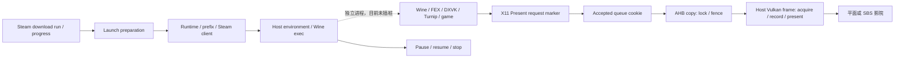

# Litep 桩点与采集

2026-10-02：内部 `picoXrDebug` 的 Android host 桩点分为 `coarse` 和 `detail`。
进程启动时 **不录制**；显式开始采集后默认 `coarse`。`instrumentation off` 可独立抑制
业务桩点。实现只链接 `libxrgame_debugbus.so` 中的一份 SDK；renderer 和 XR bridge 调用
它导出的薄接口，其他 flavor / release 的原生接口编译为空操作。Foundation gitlink 未变。

## 覆盖范围

此前主要覆盖启动准备、组件验证、云同步、Steam client 和 Wine 拉起，以及一个 X11
Present 请求 marker。此次补齐 host 呈现、异步 copy、运行环境生命周期及下载概览。

| 主流程 | 桩点 / 默认层级 | 能回答的问题与边界 |
| --- | --- | --- |
| Steam 原生下载 | `steam.download.run` region；complete / failed_or_cancelled / cancel.request bookmark；coarse | 单次 native run 的墙钟耗时；不覆盖 CM 登录、下载计划生成或每个 Rust chunk 的解压/写盘耗时 |
| 下载进度 | 每个 run 最多每秒一组 7 个 counter | depot/run 标识、当前 depot 字节、depot 数和 verifying；不是整个游戏累计字节；不记录文件路径、账号或票据 |
| 启动准备 | `launch.preparation`、`launch.dependencies`、`runtime.prepare`；coarse | 异步准备阶段耗时；父子 region 有重叠，不能相加 |
| runtime / prefix | `runtime.imagefs.*`、`runtime.verify.<component>`、`runtime.prefix.graphics`、新增 `runtime.driver.stage`；coarse | 解包/升级、组件校验、D3D DLL 配置、Turnip ICD/dependency staging |
| Steam 与 Wine | `steam.cloud.sync`、`steamclient.prepare`、`wine.launch`、exec.request / process.exit；coarse | host 发起/接收的边界；不是 Wine loader、FEX JIT 或游戏内部初始化 |
| 环境生命周期 | `host.environment.start/stop/pause/resume`、`host.xserver/audio/wine/helper.start`；coarse | 同步调用返回前的耗时；音频 start 不代表已经出声；进程恢复不代表游戏完成加载 |
| 首次 Present | `x11.server_to_first_present_request` region + `x11.first_present_request` bookmark；coarse | 从 X server 扩展建立到首次有效窗口/pixmap 的请求；不是首个游戏画面或实际显示时刻。提前关闭会记录 closed_without_present_request |
| Present 请求流 | 现有 FrameMark；coarse | 一个真实 X11 Present 请求 marker。SDK frame 是相邻 marker 的区间，不是 Android 刷新、guest 模拟帧或上屏帧 |
| 异步 copy | `host.present.queue_to_complete` cookie region；coarse | 从成功入队到 **调用 completion callback 前**，含排队、调度和 copy。不是纯队列等待，也不证明 X11 Complete/Idle 已发送；失败/跳过也配对，拒绝入队不建 region |
| AHB copy / sample | `host.present.copy`、`.copy.lock_wait`、`.sample`、`.sample_barriers`；coarse | copy 整体与取得 frame/render mutex 的等待；sample 是实验路径。没有新增 GPU 等待或 CPU readback |
| Vulkan host 呈现 | `host.render.frame/acquire/queue_present`、`host.vulkan.fence_wait/device_idle`；coarse | host 调用与阻塞耗时；frame 包含提前返回。fence 等待不是 GPU pass 时间 |
| Surface | `host.surface.attach/detach`；coarse | swapchain/surface 生命周期，含现有资源等待 |
| 命令录制与提交 | `host.render.record`、`host.vulkan.submit`、`host.present.complete`；**detail** | CPU 侧录制/提交/callback 耗时；普通游戏的平面/SBS 影院均在 render.frame/record 中，不对每眼、每窗口、每 draw 打点 |
| Windows VR → SBS | `host.vr.sbs.initialize/shutdown/consume_stereo`；coarse | 新 stereo pair 导入/合成；与普通游戏 Vulkan 影院是不同路径。AYN MHW 不能验证这一路 |
| Windows VR 细节 | `host.vr.sbs.render_attempt/acquire_fence/release_fence`；**detail**；CPU texture upload 为 coarse | render_attempt 也包含重复显示缓存纹理；EGL server wait 可能非阻塞，不等于 CPU 等 GPU。没有添加刷新帧 marker |



`XrProfileScope` 是同一物理线程的 CPU elapsed scope，含阻塞和被调度出去的时间。
Java/coroutine 阶段与 Present 队列使用 cookie region 跨线程配对，带 recording generation，
过期 token 不向新一轮采集写结束事件。region cookie 不是 guest frame ID。

## 控制与开销

```sh
# 应用先正常打开；只在内部 debug 包可用。
python3 tools/xrgame/debugbus.py --serial <device> --start instrumentation
python3 tools/xrgame/debugbus.py --serial <device> instrumentation coarse
python3 tools/xrgame/debugbus.py --serial <device> profiler_ring start
# 执行待观察流程，然后冻结；dump 0 保留当前可用数据，允许零帧启动。
python3 tools/xrgame/debugbus.py --serial <device> profiler_ring stop
python3 tools/xrgame/debugbus.py --serial <device> profiler_ring dump 0
python3 tools/xrgame/debugbus.py --serial <device> profiler_ring status

# 启动、跨线程退出或较长流程优先使用有界 file capture。
python3 tools/xrgame/debugbus.py --serial <device> instrumentation detail
python3 tools/xrgame/debugbus.py --serial <device> profiler_capture file 64 120
python3 tools/xrgame/debugbus.py --serial <device> profiler_capture status
python3 tools/xrgame/debugbus.py --serial <device> profiler_capture stop
# 按准确 capture_id 拉取 PROF + sidecar 后，恢复常规设置。
python3 tools/xrgame/debugbus.py --serial <device> instrumentation coarse
python3 tools/xrgame/debugbus.py --serial <device> profiler_ring stop
python3 tools/xrgame/debugbus.py --serial <device> --stop
```

`file 64 120` 限制为 64 MiB / 120 秒。file 完成恢复先前 ring 状态，因此不要假设完成后
一定停止录制。ring 是每个参与线程 1 MiB，不保证能保留多少秒。当前 SDK 的 ring 快照
不保留已经退出线程的 buffer；Streaming 在线程退出时 flush，启动/退出分析优先选它。

- 关闭采集时，Java region 返回共享空对象，避免原来的 AtomicBoolean/闭包分配；JNI 门控仍存在。
- 原生热路径用静态名称、栈对象和原子开关；首次 TLS/名称注册仍可能分配，不能宣称全部零分配。
- 异步队列只在已有 Job 中放两个整数，不增加 callback 包装或堆分配；release 不增加此字段。
- 下载 counter 由 CAS 限流，每个 run 每秒最多一组；多个 run 可以并行，按物理 TID、run_sequence、
  depot_id 解释样本，不跨 depot 求字节差。每文件/每 chunk/每次输入/音频包/系统调用默认不打点。
- coarse 保留主要等待，detail 增加 CPU 子阶段。详细模式不是逐函数 tracing。

AYN 的空原生 scope 微基准约 74–90 ns/对；固定 MHW SBS 离线提示画面 20 秒的压缩 PROF，
coarse 为 158,914 bytes，detail 为 254,073 bytes。两次均有 1197 个完整 Present 区间。
这些结果验证门控和数据量，不证明无帧率损失；CPU 频率未固定，场景也受约 60 Hz 呈现节奏限制。
详见 [实测与完整身份](../validation/litep-coverage-20261002.md)。

## 解释与未覆盖部分

停止录制可截断正在等待的 scope 或仍在队列内的 region；保留未配对端点和丢失诊断。
不要补造结束时间，或把新 generation 的事件嵌到旧 generation 的未闭合 scope 下计算 self time。
模式切换最好放在两次采集之间；每次保存实际 mode、APK SHA、Build ID、catalog、PID、boot id、
原始 PROF/sidecar SHA 和采集状态。app_info 的 default_detail 是默认值，实际值查 instrumentation。

仍未覆盖 Wine/FEX/DXVK/VKD3D/guest Turnip 内部、guest 文件/着色器编译、GPU timestamp、
调度 on-CPU/runnable/sleep、所有 X request/全局锁、音频/手柄包延迟和 OpenXR 设备合成器。
这次没有接入 Foundation 音频/手柄，也没有更新 Foundation。需要更细分析时，先由这些主阶段
定位，再针对候选增加有限的 scope 或结合 debugger/独立调度与 GPU 证据；不能由未标注空白
推断 CPU/GPU 空闲，也不能把不同线程重叠耗时相加当作一帧耗时。

实际应用见 [AI LIMIT 非 SBS 场景 profiling](../validation/ai-limit-profiling-20261002.md)：
host copy 等待移出 X 请求线程后，帧率仍约 15 FPS。
[进一步按等待时间和对象复核](../validation/ai-limit-sync-fastpath-20261002.md) 表明，
主线程 91.17% 的 sleep 由 `dxvk-frame` 唤醒结束；高频 wineserver 并非主要长等待来源。
下一层优先补 DXVK present id → Turnip X serial → host Complete → frame-latency release，
连同实际 present mode、最大帧延迟和队列深度，每帧少量记录；Wine 生命周期用每秒聚合。
避免将每次系统调用都变成默认 trace 事件。采集前同时核对
`asyncCopyRequested`、`asyncCopyActive` 与 `frameRateLimit`，不能仅凭 UI 勾选判断执行路径。

## 回归入口

- JVM：`ProfileProgressGateTest`，并发进度预算、无补发突发、共享空 region。
- `tools/xrgame/tests/present_copy_queue_test.cpp`：分别带/不带 `-DXRGAME_PROFILE` 编译；
  检查在阻塞、失败、失效、关闭下每个成功入队的 region 恰好关闭，拒绝入队不记录。
- `tools/xrgame/tests/profiler/`：NDK CMake standalone probe；`fixture` 验证过滤、异常/返回路径、
  close 幂等与跨线程 cookie；`fixture_stale` 故意留下旧 generation 开放端点；`bench` 为合成微基准。
  probe 是独立进程，不能注入应用形成第二份 SDK。仅链接用户授权的本地 Foundation 子仓。
