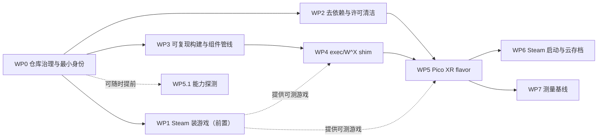

# xrgame-native v1 规格

状态：**SPEC_DRAFT v1.2**，2026-09-24。本文是需求与验收，不是实现记录。

v1.1 相对 v1 的变更：把 **Steam 装游戏**前置为 WP1，后续各工作包都依赖它提供可测的游戏；并加入 Android 上 Steam 的开源实现作为 references。

v1.2 相对 v1.1 的变更：§9 待决策项已由用户确认（2026-09-24），结论同步到 C1、C4、WP0、WP1、WP3 与 §6。

| 项 | 值 |
|---|---|
| 仓库 | `tencentmalos/xrgame-native`（GitHub fork，parent `utkarshdalal/GameNative`，GPL-3.0） |
| fork 基线 | upstream `master` @ `ebde76e9`（2026-09-23） |
| 集成分支 | `malos/main` |
| references | 见 [references/README.md](../../references/README.md) |
| 前置评估 | [docs/background/android-windows-games-reassessment-20260924.md](../background/android-windows-games-reassessment-20260924.md)、[docs/background/android-x64-arm64ec-plan.md](../background/android-x64-arm64ec-plan.md)（均复制自 shadPS4 工作区；结论已并入本文 §1） |

本文中所有 `file:line` 均指 fork 基线 `ebde76e9` 的源码。§2 描述的是**读源码得到的现状**，没有在设备上实测；设备行为以各 WP 的实测为准。

---

## 1. 为什么是这个仓库

### 1.1 背景结论

- 在 Android 上跑 x86-64 Windows 游戏，结构上最优的形态是 **bionic Wine + ARM64EC**：Wine PE 侧、DXVK、VKD3D-Proton 都以 arm64ec 原生运行，FEX 只翻译游戏自己的 x86-64 代码。
- 到 2026-09，这一形态已经有社区成品在发布：
  - GameNative/proton-wine 的 bionic arm64ec Proton 11.0-2，在 x86_64 GitHub runner 上用 NDK r27d + llvm-mingw 构建；
  - FEX 的 Wine 模块与 bionic unixlib。
- GameNative 还做了一个大部分厂商无关的 XR 构建：2D 游戏的影院模式，以及 PCVR 游戏的 OpenXR 双眼桥接。目标设备是 Meta Quest，但已经带了 Pico 控制器绑定。
- Android 上的 Steam 客户端已有多个开源实现，见 §2.4 与 references：JavaSteam、Pluvia、GameNative 自身、WinNative 的 Rust 客户端。

因此本仓不重造底座，而是**在 GameNative 之上做一个面向 Pico 头显的 XR 发行版**，再逐步带入 shadPS4 Android 移植中积累的 Turnip、诊断与宿主组件。

### 1.2 v1 目标（按实施顺序）

在 Pico 头显（内部设备 Swan）上，以**独立身份**运行 Windows/Steam 游戏。独立身份指自己的 applicationId、签名和组件源。

1. **Steam 装游戏（前置）**：登录 → 游戏库 → depot 下载 → 校验 → 安装到外部存储，另支持导入 PC 上已安装的游戏目录。这一步不依赖 Wine 和 XR，最先完成，为后续所有工作包提供可测的游戏。
2. **影院模式**：2D Windows 游戏以大屏 quad 呈现，头显控制器可玩。
3. **PCVR 模式**：
   - OpenXR 原生游戏经 Windows 侧 OpenXR runtime 桥接到 Pico 的 OpenXR runtime，以双眼投影提交；
   - OpenVR 游戏先经 OpenComposite 转为 OpenXR，再走同一条桥。
4. **可复现**：v1 路径上用到的每个原生库和运行时组件都满足二选一：能从本仓或 references 的源码构建，或者是带明确许可与 SHA 的上游产物。**不依赖**上游 GameNative 的服务器，也不依赖任何只在 `app.gamenative` 包名下工作的闭源二进制。
5. **Steam 启动闭环**：以 Steam 模拟模式启动，存档与云同步可用。

### 1.3 v1 非目标

- 替换 X server 与宿主合成器（即接入 shadPS4 Presenter）。取决于 WP7 的测量结论，归 v2。
- 反作弊游戏（EAC/BattlEye 等）。
- 商店上架，包括 Pico 商店、Play 和 Meta。
- Meta Quest 发行。上游 `legacyXr`/`modernXr` 保持可编译，但不验收。
- Epic / GOG / Amazon / EA / Rockstar 集成。代码保留不删，但不在 v1 路径上，不验收。
- 16 KiB 页设备、32 位游戏验收、Mali / Xclipse 等非 Adreno GPU。

---

## 2. 基线现状（fork @ `ebde76e9`）

### 2.1 运行链路

| 环节 | 现状 | 位置 |
|---|---|---|
| 默认运行时 | bionic、Proton 10.0 arm64ec（`proton-10.0-arm64ec-2`），模拟器 FEXCore 2605；2607/2608/2609 只在 manifest 中 | `ContainerUtils.kt:48-96`，`Container.java:44`，`PrefManager.kt:287-308` |
| 组件来源 | `.wcp`（tar.xz/zst + `profile.json`）与 `.tzst`；modern 系 flavor 运行时下载；manifest 从**上游 master** 拉取 | `ContentsManager.java:166-310`，`ManifestRepository.kt:14`，`SteamService.kt:2158-2180` |
| 进程模型 | 无 proot；`BionicProgramLauncherComponent` 拉起 `wine explorer /desktop=shell,WxH winhandler.exe <exe>`；modern flavor 用 `/system/bin/linker64` 前缀 exec | `XServerScreen.kt:3896-4310`，`BionicProgramLauncherComponent.java:438-450`，`ProcessHelper.java:303-336` |
| LD_PRELOAD | sysvshm、evshim、dns_v4mapped、**libredirect-bionic(-wx)**；XR flavor 还在最前面加 **libkgslshim** | `BionicProgramLauncherComponent.java:324-341, 383-389` |
| 显示 | Java 实现的 X server（MIT-SHM、DRI3、Present、XInput2）。DRI3 路径以 AHB 传帧，交给宿主 Vulkan 合成器（`libvulkan_renderer.so`，走系统 `libvulkan.so`）；可选零拷贝 SurfaceControl 直出 | `XServer.java:306-315`，`DRI3Extension.java:124-164`，`VulkanRendererContext.cpp`，`VulkanRenderer.java:709-767` |
| Guest Vulkan | `libvulkan_wrapper.so`（下载获得，无源码）或 freedreno ICD；**XR flavor 强制 `adrenotoolsTurnip=0`，直接用 freedreno ICD** | `XServerScreen.kt:6027-6031`，`ContainerUtils.kt:958-962` |
| 音频 | PulseAudio 13 daemon + `module-aaudio-sink`（默认）；ALSA server + AudioTrack 为备选 | `PulseAudioComponent.java:153-201`，`ALSAClient.java:120-136` |
| 输入 | WinHandler（UDP 7947↔7946）；手柄经共享内存 + futex，由 `libevshim` 生成 SDL 虚拟手柄 | `WinHandler.java:62-63, 725-754`，`evshim.c:409-434` |
| 后台 | `onPause` 时对 Wine 进程 SIGSTOP，默认手动恢复；游戏会话本身没有前台服务 | `XEnvironment.java:87-96`，`ProcessHelper.java:98-140` |
| 回收 | Stop 时 SIGKILL 同 UID 的**所有**其他进程，再执行 `wineserver -k` | `BionicProgramLauncherComponent.java:130-143`，`ProcessHelper.java:359-414` |

### 2.2 XR

**app 侧：`libxrimmersive.so`**（`app/src/main/cpp/xrimmersive/`）

- 独立的 EGL ES3 上下文、Khronos loader、一个 OpenXR 会话、一条专用线程。
- 每帧二选一：
  - Windows 双眼投影层（2-layer array swapchain）；
  - 影院 quad 层，帧来自 X server 视图的 PixelCopy 或共享 AHB。
- 扩展：
  - 必需：`XR_KHR_android_create_instance`、`XR_KHR_opengl_es_enable`；
  - 可选：`XR_FB_passthrough`、`XR_EXT_performance_settings`、`XR_KHR_android_thread_settings`、`XR_FB_display_refresh_rate`、`XR_EXT_local_floor`，以及 Pico 的 `XR_BD_controller_interaction`（`xr_immersive.cpp:323-351`）。

**Windows 侧**

- `gamenative_openxr_runtime.c`：freestanding 的 x64/x86 PE runtime，用 NDK clang 的 windows-gnu target 构建，**不是** ARM64EC。
- `gamenative_xr_unixbridge`：ARM64X 构建的 Wine builtin，必须在 GameNative/proton-wine 源码树内编译。
- `gamenative_openxr_unix.c`：bionic unixlib。
- 图形 API：支持 D3D11（DXVK interop）、D3D12（vkd3d-proton interop）和 Vulkan，不支持 OpenGL。

**IPC 三条通道**

- 控制面：TCP `127.0.0.1:38476` 上的行协议，传位姿、帧同步、输入和触觉；
- 帧面：抽象 unix socket `@gamenative-xr`，传 AHB/dma-buf 与 sync_fd；
- PE→unix 调用。

**限制**

- 只转发 projection 层；不支持深度 swapchain，不支持 OpenGL。
- 系统名写死为 Meta Quest，交互 profile 写死为 Touch（`gamenative_openxr_runtime.c:1768, 3264`）。

**其他**

- OpenComposite：替换游戏自带的 x64 `openvr_api.dll`。产物来自 `GameNative/opencomposite` v2，已 pin SHA。
- 构建：原生 XR 库依赖 Windows-only 的 Gradle 任务与 `tools/*.ps1`（NDK 29 + VS2022）。产物直接提交在 `app/src/{legacyXr,modernXr}`；CI 只构建 `legacyXr`。
- Meta 专有部分：`com.oculus.*` manifest 条目、Horizon SDK 依赖（调用代码被 gitignore，公开仓里没有）、`XR_FB_*` 扩展、`libkgslshim`。
- 已为 Pico 准备的部分：`isHeadset()` 认 Pico 厂商名（`MainActivity.kt:86-90`）、`pvr.app.type=vr`、`XR_BD_controller_interaction` 绑定。

### 2.3 构建与分发

- Gradle 8.12.1、AGP 8.8.0、Kotlin 2.1.21、JDK 17、compileSdk 36、NDK 27.3。
- **所有 `externalNativeBuild` 都被注释掉**，原生库全部以预编译 `.so` 提交在 `jniLibs`；部分 CMake 引用的源文件缺失。
- `.git` 约 1.5 GB；`app/src/legacy/assets` 里有 427 MB 的 tzst/zip。

### 2.4 Steam 链路（装游戏部分）

| 环节 | 现状 | 位置 |
|---|---|---|
| 协议库 | JavaSteam fork `io.github.joshuatam:javasteam` / `javasteam-depotdownloader` `1.8.0.1-26-SNAPSHOT`，来自 Sonatype snapshots，**不可复现**。对应源码为 `joshuatam/JavaSteam` `gamenative-latest` @ `433f2ad1`（已作为 `references/JavaSteam`）。gradle 里留有本地构建开关 `localBuild`，默认路径 `../../JavaSteam` | `gradle/libs.versions.toml:15, 80-81`，`app/build.gradle.kts:422-435` |
| 客户端服务 | `SteamService`，5403 行前台服务：CM 连接、密码 / QR 登录、license、PICS、DLC / depot 解析、安装、成就、云存档。源自 Pluvia | `SteamService.kt`（登录 `3251-3490`，depot `1398-1716`，安装 `1718-2042`） |
| depot 下载 | Rust crate `gn-download` → `libgndownload.so`，**源码在仓内**（GPL-3.0-or-later），由 `tools/build-gn-download.sh` 手工构建：AES-256 解密、VZip/LZMA 等解压、按大小 + Steam Adler32 校验 chunk（SHA-1 只用于拼 CDN URL；此处 v1.2 之前误写为"SHA-1 校验"，见 WP1 验收记录）、断点续传。JavaSteam 的 DepotDownloader 只用于 Workshop | `app/src/main/cpp/gn-download/rust/`，`service/download/NativeSteamDownload.kt` |
| 安装位置 | 内部：`<app data>/Steam/steamapps/common`（改 applicationId 或卸载后丢失）；外部：`<externalStoragePath>/Steam/steamapps/common`，外加所有挂载卷 | `SteamService.kt:555-620` |
| 导入 | 支持导入本地目录（`isImported` / `customInstallPath`），并可按 Steam 游戏识别（`importCustomGameAsSteamGame`） | `SteamService.kt:1748-1756`，`LibraryViewModel.kt:692`，`PrefManager.kt:1386` |
| 存储权限 | `legacy` 系声明 `MANAGE_EXTERNAL_STORAGE`；`modern` / `modernXr` 移除了旧存储权限 | `app/src/legacy/AndroidManifest.xml:5-14`，`app/src/modernXr/AndroidManifest.xml:8-9` |

**可参考的开源 Steam 实现**（都在 `references/`）：

| 实现 | 平台 / 语言 | 许可 | 用途 |
|---|---|---|---|
| JavaSteam（joshuatam fork） | JVM | MIT | 本仓实际依赖的协议库，源码构建去 SNAPSHOT |
| Pluvia | Android / Kotlin | GPL-3.0 | GameNative Steam 部分的前身；最小化的 Android Steam 客户端对照 |
| WinNative `wnsteam` | Android / Rust（JNI） | GPL-3.0 | 不依赖 JVM 的 CM 客户端、认证与 depot 下载；JavaSteam 出问题时的备选 |
| SteamKit2 | .NET | LGPL-2.1 | 协议的原始实现，JavaSteam 是它的移植 |
| DepotDownloader | .NET | GPL-2.0 | depot 下载语义的基准：manifest、depot key、chunk 校验，用于交叉验证下载结果 |
| gbe_fork | Windows DLL | LGPL-3.0 | Wine 内的 Steam API 模拟，属于启动环节（WP6） |

---

## 3. 硬约束

以下约束在任何功能工作之前生效。违反任何一条的产物都不得作为 v1 验收证据。

### C1 独立身份

- applicationId、应用名、图标和签名都与上游不同，不得以 "GameNative" 名义发布。
- applicationId `com.tencentmalos.xrgamenative`，应用名 "XRGame Native"（§9-1，已确认）。
- 仓库根目录提交了一个 `keystore`（PKCS#12，用途不明），不使用。签名配置只从 gitignored 的本地 `keystore.properties` 读取。
- 游戏安装根目录放在外部存储，不随 applicationId、卸载或重装丢失。见 WP1。

### C2 不依赖包名锁定或无源码的二进制

上游 `THIRD_PARTY_NOTICES` 明确说明，下列组件只在 `app.gamenative` 包名下工作，或属于维护者私有、不开源。它们**不得出现在 v1 路径上**，须替换或移出：

| 组件 | 上游作用 | v1 处理 |
|---|---|---|
| `libredirect-bionic{,-wx,-wx-minimal}.so`、`libredirect.so` | 以下均依据符号推断（`THIRD_PARTY_NOTICES:40-101`）：targetSdk 36 下子进程 exec 经 linker64 转发；修正 `/proc/self/exe`；W^X 相关的 mprotect/SIGSEGV 处理；改写硬编码路径；屏蔽 evdev/hidraw | **WP4 自研替代** |
| `libkgslshim.so` | Quest 3 的 KGSL 修正（`THIRD_PARTY_NOTICES:193-237`） | 移除；Swan 用 Turnip fork |
| steamhost / eahost / rgschost stub | headless Steam、EA、Rockstar | 关闭对应模式 |
| `libsteambootstrap.so` + Valve Android `libsteamclient.so` | bionic Steam 实验模式 | 关闭 |
| `libvulkan_wrapper.so`（下载获得）、`libvortekrenderer.so` | guest Vulkan 包装、glibc 下的 Vortek | 不使用；guest 直接用 freedreno ICD |
| `libwinlator.so` / `libwinlator_11.so` 中无源码的部分 | X server 的原生 epoll 与流处理 | WP3 核对源码覆盖，缺失部分列入清单 |
| 预编译 `libgndownload.so` | depot 下载 | WP1 改为从仓内 Rust 源码构建 |

### C3 不依赖上游服务

v1 flavor 中，以下访问必须改指我们的地址或关闭：

- `ManifestRepository.kt:14`：上游 master 的 manifest；
- `SteamService.fetchFileWithFallback`：`downloads.gamenative.app` 与 R2 桶；
- `GameNativeApi.BASE_URL`；
- `UpdateInstaller`：APK 自更新；
- Play Integrity 与 key attestation：`api.gamenative.app`；
- `DebugReportApi`：`relay.gamenative.app`；
- PostHog 遥测：v1 flavor 默认关闭，且 key 为空。

**Steam 本身**（Valve 的 CM 服务器与 CDN）不在此列：登录与下载直接连 Valve。

### C4 许可清洁

- 不分发 Qualcomm 专有驱动（`app/src/legacy/assets/SD8Elite_*`、`Adreno_*_adpkg.zip`，其 `meta.json` 写明 "extracted from Gamehub"）。v1 flavor 也不下载它们。
- 不启用 Steamless（许可疑为 CC BY-NC-ND，待核实）。
- 不链接 Samsung perfsdk 和 Meta Horizon SDK。
- 本仓**不分发** Valve 的任何二进制，包括 Windows Steam 客户端和 Android `libsteamclient.so`。
- 补全 `THIRD_PARTY_NOTICES`，包括：
  - 已使用但未登记的：JavaSteam（MIT）、gbe_fork（LGPL-3.0）、OpenComposite（GPL-3.0）、Winlator 派生代码、Pluvia 来源；
  - 本仓新引入的：Turnip（MIT）、FEX（MIT）、Wine（LGPL）、DXVK（zlib）、VKD3D-Proton（LGPL）。
- 从 shadPS4 移植的代码保留其 `GPL-2.0-or-later` SPDX 头（与 GPL-3.0 兼容）。shadPS4 依赖的私有 Foundation 库**不得**进入本仓产物。
- **分发范围（§9-2）**：APK 仅在内部设备上分发，不公开发布。本仓是 public 仓库，因此：
  - CI 不上传 APK，既不作为 Actions artifact（public 仓的 artifact 任何登录用户都能下载），也不作为 Release 资产；
  - WP3 的运行时组件发布在本仓的公开 GitHub Releases（§9-3），这本身就是对这些组件的公开再分发。每个组件须随附许可文本，并指明对应源码（references 的 gitlink 与构建配方）；LGPL / GPL 组件（Wine、Proton 等）按其源码提供义务处理。

### C5 证据规则

沿用 shadPS4 仓的做法：

- 每次验收记录：APK SHA-256、各 `.so` 的 Build ID、组件 manifest SHA、设备身份（型号 / build / boot id）、PID 与运行时长。
- 失败与中途放弃的采集同样保留。
- 不写没有测到的数字。
- 不提交游戏数据、APK、keystore 与凭据，包括 Steam 令牌和账号信息。

---

## 4. v1 架构

```text
图例  [上游] 沿用 GameNative 现有实现    [替换] v1 自研或改造    [新] v1 新增

APK（flavor: picoXr，targetSdk 36，arm64-v8a）
├─ app 进程
│   [替换] SteamService + JavaSteam（从 references/JavaSteam 源码构建）
│   [替换]   libgndownload（从仓内 Rust 源码构建）；外部存储安装根；目录导入
│   [上游] ImmersiveXrActivity + libxrimmersive（OpenXR 会话，EGL ES3）
│   [替换]   loader / manifest / 扩展 / 控制器 profile 适配 Pico
│   [上游] Java X server + libvulkan_renderer 合成器（v1 不动，v2 视 WP7 结论）
│   [上游] PulseAudio + module-aaudio-sink
│   [上游] WinHandler + evshim 手柄共享内存
│   [上游] WindowsVrControlServer（TCP 38476）/ 帧面 @gamenative-xr
│   [新]   组件索引：本仓 manifest.json + tencentmalos GitHub Releases
└─ Wine 子进程组（linker64 exec）
    [替换] exec/W^X shim（替代 libredirect，WP4）
    [新]   Proton 11 arm64ec bionic 自建（沿 references/proton-wine 配方，含 XR unix bridge）
    [新]   FEX ARM64EC + WoW64 模块 + unixlib，从 references/FEX 构建
    [新]   DXVK / VKD3D-Proton arm64ec 自建
    [替换] Turnip：references/mesa-turnip 构建的 bionic freedreno ICD（替代 wrapper 与 kgslshim）
    [上游] gamenative_openxr_runtime{64,32}.dll + unixlib（去掉 Meta 字样）
    [上游] OpenComposite（pin SHA，补许可声明）
    [上游] gbe_fork steam_api（模拟模式）
```

**有意保留**：X server 与宿主合成器、PulseAudio、WinHandler。v1 的风险集中在"独立身份 + 可复现 + Pico 适配"，显示栈的重写放到有测量数据之后。

---

## 5. 工作包

编号即推荐顺序。依赖关系：

- WP1 只依赖 WP0，是后续所有设备验收的游戏来源。
- WP2 与 WP3 可以和 WP1 并行。
- WP4 依赖 WP3 的 Proton 构建。
- WP5.1 设备能力探测可以随时提前做。



**图例：** 实线是必须先完成的依赖；虚线表示"提供输入"或"可以提前"。

### WP0 — 仓库治理与最小身份

- **分支**：`malos/main` 为集成分支，功能分支用 `feature/malos/<topic>`。定期把 `upstream/master` merge 进 `malos/main`，冲突热点记录在 `docs/upstream-sync.md`。
- **flavor**：新增 `picoXr`，初始为 `modern` 的副本加上新身份，XR 相关改动留到 WP5。上游四个 flavor 的语义不改，以降低合并冲突。
- **最小身份（C1）**：先改 applicationId、应用名和签名。这一步必须在 WP1 装游戏之前完成，避免之后再迁移数据。
- **CI**：在本 fork 上运行 `picoXr` debug 的 assemble 与单元测试，不需要任何 secret，也不上传 APK（C4 分发范围）。上游的 release workflow 在本 fork 中禁用：其 Discord 链接写死上游，`adhoc` 限定上游作者；本 fork 的 Actions 已启用，`app-release-signed.yml` 会在 push 到 `master` 时触发。
- 保持 `AGENTS.md`、`CLAUDE.md`、`references/README.md` 与实际一致。

**出口判据**

- `./gradlew :app:assemblePicoXrDebug` 在干净 checkout、无 secret 的条件下成功，本 fork 的 CI 通过
- 可与上游 GameNative 同时安装，应用名和图标可区分
- `upstream/master` 首次同步演练完成并记录冲突点

### WP1 — Steam 装游戏（前置）

**目的**：尽早在 Swan（以及 AYN Thor）上拿到可重复安装、可校验的游戏文件，供 WP4–WP7 使用。本 WP 不涉及 Wine、FEX 和 XR。

**要求**

1. **JavaSteam 去 SNAPSHOT**
   - 从 `references/JavaSteam`（`gamenative-latest` @ `433f2ad1`）源码构建 `javasteam` 与 `javasteam-depotdownloader`，产物版本号带固定后缀。
   - 把 `app/build.gradle.kts:422-435` 的本地构建开关改指 `references/JavaSteam`，`picoXr` 默认走本地构建，不再访问 Sonatype snapshots。
   - 构建脚本放在 `tools/`，Windows 与 Linux 都能跑。
2. **`libgndownload.so` 从源码构建**
   - 用 cargo-ndk 从 `app/src/main/cpp/gn-download/rust` 构建，替换预编译产物，并记录 Build ID。
3. **安装根目录**
   - `picoXr` 声明 `MANAGE_EXTERNAL_STORAGE`（APK 仅内部分发、不上架，见 §9-2；沿用 `legacy` flavor 的授权流程）。
   - 默认安装根为外部存储上的固定目录，例如 `/sdcard/XRGameNative`，其下为 `Steam/steamapps/common`；用户可改。
   - 卸载、重装、更换签名后，已装游戏能重新被识别。
4. **流程**
   - 登录：QR 优先；密码 + Steam Guard 作为备选。令牌只存于 app 私有加密存储。
   - 游戏库：license 列表与 PICS。
   - 下载：选择 Windows depot 与语言；支持断点续传；提供"校验文件"。
   - 卸载。
   - DLC 下载可用，但不作为出口判据。
5. **导入已有游戏**
   - 支持把 PC 上 Steam 安装好的 `steamapps/common/<游戏>` 目录（经 adb push 或 SAF 放到安装根）导入为 Steam 游戏。复用上游 `importCustomGameAsSteamGame`。
   - 这条路径用于大体积游戏与离线场景。
6. **装游戏路径上无上游服务依赖**
   - 盘点登录、库、下载、安装全过程中对 `*.gamenative.app`、SteamGridDB、`CommunityConfigService` 等的调用，在 `picoXr` 中关闭或改指。
   - 封面等非关键资源缺失时，UI 要能正常降级。
7. **下载正确性交叉验证**
   - 对同一 app / depot / manifest，在 PC 上用 `references/DepotDownloader` 下载一份。
   - 与设备上的结果比较文件列表与逐文件 SHA-256，至少覆盖一款游戏。
8. **备选实现**
   - 记录 WinNative `wnsteam`（Rust）与 Pluvia 在登录、下载流程上与本仓的差异，写入 `docs/steam-clients.md`。
   - 如果 JavaSteam 在 Swan 上出现无法修复的登录或下载问题，按该文档评估切换方案。v1 不预先切换。
9. **账号安全**
   - 首次登录前向用户说明：这是非官方客户端，请使用测试账号。
   - 测试一律使用用户提供的专用测试账号（§9-4），不用个人主账号。账号名、密码、令牌与 Steam Guard 信息都不进仓库和验收记录，登录时由用户在设备上输入。

**出口判据**（Swan 必做，AYN Thor 冒烟）

- QR 登录成功，游戏库完整显示
- 下载两款游戏到外部安装根，一款小于 2 GB、一款大于等于 10 GB；大的那款在下载途中杀进程，重启后续传完成
- 两款游戏的"校验文件"都通过，且不触发重新下载
- 与 DepotDownloader 的逐文件 SHA-256 比对一致，至少一款
- 从 PC adb push 的一款已安装游戏被导入并识别为 Steam 游戏
- 卸载重装 APK 后，已装游戏仍被识别，无需重新下载
- 全流程抓取 DNS / 连接记录：除 Valve（Steam CM、CDN）之外，没有其他远端，尤其没有 `*.gamenative.app`
- 按 C5 记录 APK SHA、JavaSteam 与 `libgndownload.so` 的构建身份，以及下载吞吐与耗时

### WP2 — 去依赖与许可清洁

- 按 C3 替换或关闭 WP1 未覆盖的其余服务访问。实现方式是**构建期开关**加 `picoXr` 源集覆盖，不在 main 源集里删上游代码。
- 按 C2，在 `picoXr` 中去掉 `libkgslshim` 前置，关闭 headless / bionic Steam 与 EA / Rockstar 模式。
- 按 C4 清理 `picoXr` 的 assets 与 jniLibs，并补全 `THIRD_PARTY_NOTICES`。
- 新增 `tools/audit-apk`：列出 APK 内每个 `.so` 与 asset 的 SHA、来源（本仓源码 / reference 构建 / 上游预编译）和许可。有未登记项即失败。

**出口判据**

- `tools/audit-apk` 对 `picoXr` debug APK 通过；"上游预编译、无源码"一栏只剩显式豁免项，每项写明原因与退出计划
- Swan 上从冷启动到进入一次游戏会话，全程没有连接 `*.gamenative.app` 与该 R2 桶，有 DNS / 连接日志留证

### WP3 — 可复现构建与组件管线

**原生库**：恢复本仓原生库的源码构建。至少覆盖 v1 路径上的：

- `xrimmersive`、`evshim`、`winlator` 核心、`vulkan_renderer`、`extras` / adrenotools；
- XR 的 Windows runtime 与 unixlib；
- `gamenative_dns_v4mapped`；
- WP4 的 shim；
- WP1 已完成的 `libgndownload`。

缺失的源文件（如 `winlator/drawable.c`、`steambootstrap/steam_bootstrap.c`）逐一查明：找回、重写，或确认 v1 不需要。

**运行时组件**：在 x86_64 Linux runner（GitHub Actions）上构建，发布到 `tencentmalos/xrgame-native` 的 GitHub Releases（公开，§9-3；许可随附要求见 C4），并生成本仓 `manifest.json` 条目（URL、SHA-256、版本、许可）。Release 中只放运行时组件，不放 APK。

| 组件 | 来源 | 说明 |
|---|---|---|
| Proton 11 arm64ec（bionic） | `references/proton-wine` 的 `build-proton.yml` 配方 | 含 ntsync-android 用户态回退与 sysvshm。把 `gamenative_xr_unixbridge` builtin 并入 Wine 构建（上游在 proton-wine `77eed550` 上构建，见 `tools/provision-build-arm64x-wine-bridge.sh`） |
| FEX ARM64EC / WoW64 / unixlib | `references/FEX`，与 shadPS4 同一 pin（FEX-2608 之后 241 个提交） | llvm-mingw 构建 `Source/Windows/{ARM64EC,WOW64}`，NDK 构建 `UnixLib`，打成 `.wcp` |
| DXVK、VKD3D-Proton（arm64ec） | Proton 11 子模块版本（`references/proton` 的 gitlink） | meson 交叉编译，参照 `references/proton/Makefile.in:701-834` |
| Turnip | `references/mesa-turnip`（`codex/turnip-xr-fdm2`） | bionic 构建的 `libvulkan_freedreno.so` + ICD json，打成 adrenotools 驱动包格式（带 `meta.json`） |
| OpenComposite | `GameNative/opencomposite` v2 或其上游 | 源码构建，或 pin 发布物 SHA；补许可 |

**出口判据**

- 在干净机器上用脚本产出全部原生库与上述组件，产物 SHA 写入构建记录
- `picoXr` 只从本仓 manifest 安装组件，安装时校验 SHA；缺失或不符时显式失败，不回退到上游
- APK 与组件版本之间可追溯（`payload.version` 或同类记录）

### WP4 — exec / W^X shim（替代 libredirect）

**要求**

1. **clean-room 实现**：只依据本节需求、Android 公开行为与开源先例（如 Termux 的 linker64 exec 方案）编写。**不得**对上游闭源 `libredirect*.so` 做反汇编移植。
2. **先测后做**：在 Swan（Android 16，targetSdk 36）上，用 WP3 的 Proton 构建逐项记录以下行为的允许 / 拒绝与 errno，再决定 shim 需要做什么：
   - app 数据目录下 ELF 的 `execve`，分别经 linker64 与直接执行；
   - 对 app 数据目录文件做 `PROT_EXEC` mmap（Wine 映射 PE 与 `.so`）；
   - 匿名内存 `mprotect(PROT_EXEC)`（FEX JIT）；
   - Wine 对 `/proc/self/exe` 的依赖。
3. **最小功能集**（按第 2 步的结果取舍）：
   - 子进程 exec 经 `/system/bin/linker64` 转发，保持 argv / envp 语义；
   - 修正 `/proc/self/exe` 的读取；
   - PE 文件映射若被拒，回退为匿名内存 + 读入 + mprotect。
4. **路径改写优先在构建期解决**：用本仓的安装前缀构建 Wine。只有第三方预编译产物才允许运行期改写，且逐条登记。
5. **evdev / hidraw 屏蔽**：先确认不屏蔽会有什么实际后果，再决定是否需要。
6. **可测性**：路径改写、argv 重写与 exec 决策做成纯函数，并有主机上的单元测试。shim 有日志开关，默认关闭。

**出口判据**

- 在 Swan 上用自研 shim、不带任何上游 redirect 库，依次跑通：
  - Proton 11 arm64ec 的 prefix 创建；
  - x64 控制台程序；
  - GDI 窗口程序；
  - 一个 DXVK D3D11 程序（在影院模式下出画面）；
  - WP1 安装的一款游戏进入主菜单。
- 第 2 步的行为矩阵归档在 `docs/validation/`
- Stop 后没有残留的 Wine 进程

### WP5 — Pico XR flavor

#### WP5.1 能力探测（可随时提前）

给 `libxrimmersive` 加一个探测模式，或做一个独立的探测 APK，在 Swan 上记录：

- loader 如何发现 runtime：Khronos runtime broker，还是 Pico 自带的 loader；
- `xrEnumerateInstanceExtensionProperties` 的完整列表；
- system properties、view configuration 与推荐分辨率；
- 支持的 blend mode 与刷新率；
- 各控制器 interaction profile 的绑定结果。

结果归档，作为 WP5.2 的依据。本文对 Pico 的能力不作任何假设。

#### WP5.2 适配

- **flavor**：`picoXr` 打开 `XR_BUILD`，保持 `MODERN_XR=false`，不带 Horizon SDK 和 Meta 字段。`LaunchReadiness` 用空实现，v1 不做商店授权。
- **loader**：按 WP5.1 的结果选定。同时消除上游 AAR loader 与 `main/jniLibs` 自带 loader 被重复打包的问题。
- **manifest**：
  - `ImmersiveXrActivity` 增加 `org.khronos.openxr.intent.category.IMMERSIVE_HMD`；
  - 保留 `pvr.app.type=vr`，按 Pico 的实际要求放在 activity 或 application 上；
  - 移除 `com.oculus.*`；
  - 如需要，加上 Khronos broker 的 `<queries>`。
- **扩展降级**：
  - passthrough 不可用时，快捷菜单隐藏该开关，而不是开关存在但静默无效；
  - 刷新率选项取自 runtime 的实际枚举结果，不再写死 72/90/120（`GraphicsTab.kt:175-210`）。
- **控制器**：
  - 补充 WP5.1 实测到的 Pico profile，并加上 `khr/simple_controller` 兜底；
  - 在 Swan 上重新验证摇杆 Y 轴取反（`xr_immersive.cpp:1411-1417`、`jni_bridge.cpp:204`）。
- **GPU**：
  - 去掉 `libkgslshim` 前置，guest 使用 WP3 的 Turnip；
  - 验证 app 侧合成器（系统 Vulkan / GLES）与 guest Turnip 能在同一 KGSL 设备上共存。
- **Windows runtime**：
  - 系统名和 vendor 字符串不再写死为 Meta Quest；
  - 交互 profile 按 OpenComposite 与目标游戏的兼容性决定，可保留 Touch 布局；
  - 行为改动需要单元测试或录制回放。

**出口判据**（游戏均来自 WP1）

- **影院模式**：一款 D3D11 2D 游戏在 Swan 上以 quad 呈现，头显控制器映射为手柄可玩，指针模式能操作启动器
- **PCVR / OpenXR**：一款 OpenXR 原生 PC 游戏，或 Khronos `hello_xr` 的 Windows D3D11 构建，完成会话创建、双眼提交、recenter 与触觉
- **PCVR / OpenVR**：一款 OpenVR 游戏经 OpenComposite 双眼出画面
- 以上三项都记录帧率与帧时间分布，并与 Pico runtime 的刷新率对照
- 至少连续 10 分钟无崩溃；前后台切换和摘戴头显后，游戏能恢复或正确暂停

### WP6 — Steam 启动与云存档

- **DRM**：v1 只支持 gbe_fork 模拟模式（LGPL-3.0，源码见 `references/gbe_fork`），并补许可声明。
- **真 Steam GUI 模式**需要 Valve 的 Windows Steam 客户端。本仓不分发 Valve 二进制；如果要支持，只能在设备上从 Valve 官方来源获取。v1 不验收此模式。
- **首次运行依赖**：游戏的 redist（VC++、DirectX 等）与 installscript 在首次启动时执行，失败要能看到原因。
- **云存档**：沿用 `SteamAutoCloud`。

**出口判据**

- WP1 安装的一款无反作弊游戏，以模拟模式在影院或 PCVR 模式下启动
- 在游戏内存档 → 退出 → 云同步 → 删除本地存档 → 重启后从云端读回

### WP7 — 测量基线（决定 v2 是否替换显示栈）

在 Swan 上，对 WP5 的影院模式与 PCVR 模式各选 2 款游戏，同窗采集：

- 各进程 / 线程的 on-CPU 时间：游戏翻译代码、Wine unix 侧、app 进程内的 X server、宿主合成器、PulseAudio、OpenXR 线程；
- GPU busy，以及合成器与 XR 合成在 GPU 上的耗时；
- 帧时间分布，以及 XR runtime 的丢帧 / 重投影统计；
- 内存：PSS 与 LMK 事件（Swan 在 shadPS4 的血源负载下已多次触发 LMK）。

采集工具复用 shadPS4 的 Litep 与 KGSL/sched 方法（`references/shadPS4` 中的对应文档）。

**出口判据**

- 报告给出"X server + 宿主合成器 + 音频链"在帧时间和 GPU 时间中的占比
- 从以下两个方向中选定一个：
  - v2 替换显示栈：以 shadPS4 Presenter 为消费端做 AHB 直通，去掉 X server 合成；
  - 不替换，把 v2 的投入转到 FEX / Turnip / XR 合成性能

---

## 6. 设备与环境

| 类别 | 要求 |
|---|---|
| 主验收设备 | Swan：Pico 头显，Android 16，ARM64，**4 KiB 页**，Adreno 840v2（KGSL），可 adb root。可用存储需容纳 WP1 的两款测试游戏 |
| 辅助设备 | AYN Thor（Android 手持，Adreno）：做 WP1 冒烟与非 XR 的 `modern` flavor 冒烟 |
| 工作站 | Windows 11（当前开发机）。上游 XR 构建脚本为 PowerShell，需要 NDK 29.0.14206865 + VS2022；Gradle 需 JDK 17；WP1 需 Rust + cargo-ndk；DepotDownloader 需 .NET |
| 构建 runner | x86_64 Ubuntu（GitHub Actions）：Wine/Proton（NDK r27d + llvm-mingw）、FEX ARM64EC、DXVK/VKD3D、Turnip |
| 构建产物托管 | 运行时组件：`tencentmalos/xrgame-native` 的 GitHub Releases（公开）。APK：只在内部设备间传递，不上传到 GitHub |
| Steam 账号 | 用户提供的专用测试账号，库内至少有两款无反作弊、可在 Proton 下运行的游戏，其中一款 ≥10 GB。游戏清单待用户告知 |

---

## 7. 风险

| 级别 | 风险 | 缓解 |
|---|---|---|
| 高 | Pico OpenXR runtime 的能力与 Quest 不同：GLES binding、passthrough、刷新率扩展、loader 发现方式 | WP5.1 先探测再适配。若 GLES binding 不可用，app 侧合成器需要移植到 Vulkan，另立项 |
| 高 | 自研 shim 覆盖不到 Android 16 的某项 W^X 限制 | WP4 先测行为矩阵；GameNative 的 `modern` flavor 可作参照 |
| 高 | 上游 GameNative 变动很快（日更），fork 的合并成本上升 | 改动集中在 `picoXr` 源集与构建开关；定期同步 |
| 中 | JavaSteam fork 跟不上 Valve 协议变化，或由单人维护 | 源码 pin 在 references；WinNative `wnsteam` 作为已评估过的备选（WP1-8） |
| 中 | 第三方 Steam 客户端存在账号风险：风控、Steam Guard、频率限制 | 使用专用测试账号；QR 登录优先；令牌只放私有加密存储 |
| 中 | Swan 内存压力大：Wine、游戏、X server、XR 合成同时驻留 | WP7 记录 PSS / LMK；必要时降低默认分辨率 |
| 中 | 上游预编译库的源码缺口比预期多 | 在 WP2 审计表中显式豁免，附退出计划，不隐瞒 |
| 中 | gbe_fork、OpenComposite、JavaSteam fork 的许可或来源不清 | 在 WP2、WP6 核实后，才发布任何构建 |
| 已知不做 | 反作弊、商店上架、16 KiB 页、32 位游戏验收 | — |

---

## 8. v2 预告（不在 v1 范围）

- 根据 WP7 的结论，用 shadPS4 的 Presenter / Session 语义替换 X server + 宿主合成器，以 AHB + sync_fd 直通 XR 合成层。
- 从 shadPS4 移植 Oboe 音频端点与输入层。输入层要剥离私有 Foundation，改写为本仓的 GPL 代码。
- 把 FEX IR probe / 函数级剖析移植到 ARM64EC 模块。
- Turnip fork 针对 DXVK / VKD3D 负载做调优，包括用 FDM2 做 XR 注视点渲染。
- Pico 商店授权（`LaunchReadiness.Check` 的 Pico 实现）。

---

## 9. 决策记录

1 到 4 项由用户于 2026-09-24 确认。

| # | 事项 | 结论 | 影响 |
|---|---|---|---|
| 1 | applicationId 与应用名 | `com.tencentmalos.xrgamenative` / "XRGame Native" | C1；WP0 实施，须在 WP1 装游戏之前完成 |
| 2 | 分发范围 | **仅内部设备**。APK 不公开发布 | 保留 `MANAGE_EXTERNAL_STORAGE`（WP1-3）；CI 不上传 APK（C4、WP0）；WP2 / WP6 的许可工作以"内部使用 + 公开源码仓 + 公开组件 Release"为准 |
| 3 | 组件托管位置 | 本仓 GitHub Releases（公开） | WP3；组件须随附许可与源码指引（C4） |
| 4 | Steam 测试账号 | 由用户提供专用测试账号；测试游戏清单稍后告知 | WP1 设备验收的前提；账号信息不入仓（WP1-9、C5） |
| 5 | Steam 真客户端模式 | **未单独答复**。答复之前按 WP6 处理：v1 不做、不验收，v1 之后再议 | WP6 |

---

## 附：关键源码位置索引（fork @ `ebde76e9`）

| 主题 | 位置 |
|---|---|
| flavor 定义 | `app/build.gradle.kts:123-162`，源集 `:248-284`，XR 任务 `:290-357` |
| JavaSteam 依赖 / 本地构建开关 | `gradle/libs.versions.toml:15, 80-81`，`app/build.gradle.kts:422-435`，`settings.gradle.kts:19` |
| Steam 服务 | `app/src/main/java/app/gamenative/service/SteamService.kt`（安装路径 `555-620`，`getAppDirPath` `1748`） |
| depot 下载引擎 | `app/src/main/cpp/gn-download/rust/`（README 为全局说明），`tools/build-gn-download.sh`，`service/download/` |
| 导入游戏 | `app/src/main/java/app/gamenative/ui/model/LibraryViewModel.kt:692`，`PrefManager.kt:1386, 1478` |
| 默认运行时 | `app/src/main/java/app/gamenative/utils/ContainerUtils.kt:40-96` |
| 组件安装 | `app/src/main/java/com/winlator/contents/ContentsManager.java:166-334`，`ManifestInstaller.kt:62-160` |
| 上游 manifest / 下载 | `ManifestRepository.kt:14`，`SteamService.kt:2158-2180` |
| 启动 / 环境 | `app/src/main/java/app/gamenative/ui/screen/xserver/XServerScreen.kt:3896-4310` |
| Wine 进程 / preload | `app/src/main/java/com/winlator/xenvironment/components/BionicProgramLauncherComponent.java:236-450` |
| exec / 回收 | `app/src/main/java/com/winlator/core/ProcessHelper.java:69-140, 303-414` |
| X server 传帧 | `app/src/main/java/com/winlator/xserver/extensions/DRI3Extension.java:124-164`，`PresentExtension.java:291-353` |
| 宿主合成器 | `app/src/main/cpp/winlator/VulkanRendererContext.cpp`，`app/src/main/java/com/winlator/renderer/VulkanRenderer.java` |
| XR 会话 | `app/src/main/cpp/xrimmersive/xr_immersive.cpp`，`xr_windows_projection.cpp`，`xr_windows_transport.cpp` |
| Windows OpenXR runtime | `app/src/main/windows/openxr_runtime/`；构建脚本 `tools/build-windows-xr-runtime.ps1`、`tools/build-xr-native.ps1` |
| Windows VR 编排 | `app/src/main/java/app/gamenative/ui/screen/xr/windows/WindowsVr*.kt` |
| XR activity | `app/src/main/java/app/gamenative/ui/screen/xr/ImmersiveXrActivity.kt`，`app/src/modernXr/AndroidManifest.xml` |
| 闭源组件声明 | `THIRD_PARTY_NOTICES:40-300` |
