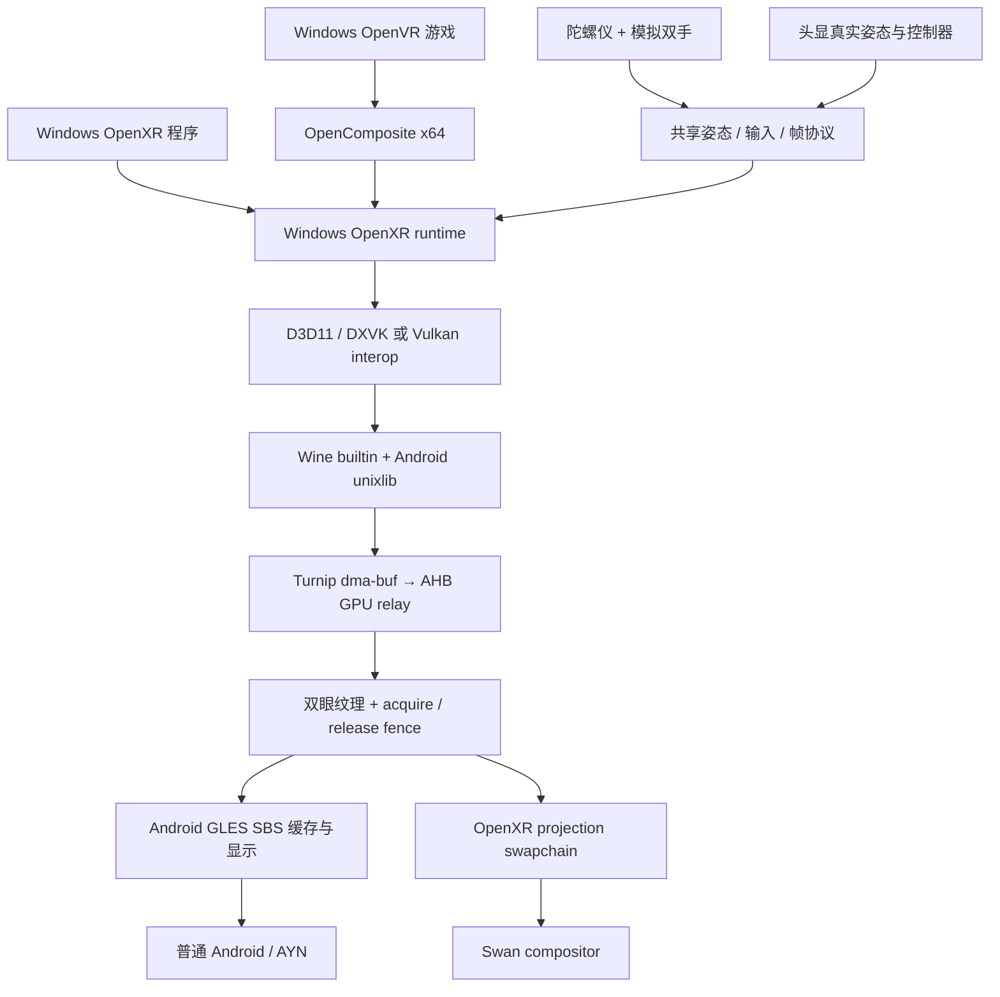

# Android SBS 与 Swan VR 接线规划 v1

2026-10-02；用户要求普通 Android 先以 SBS 模拟 VR，结构兼容 Swan。
这是个人版 v2 的当前增量任务，不改变 Swan 尚未进行设备验收的事实。
实现与实测以 [验证记录](../validation/vr-sbs-20261002.md) 为准。

## 目标与边界

Windows VR 程序分别提交左右眼；AYN 把这两张图显示在屏幕两侧，使用陀螺仪模拟
头部旋转、固定身高与 IPD、两个固定 pose 的虚拟控制器；手柄/触屏派发按键、扳机、抓取和摇杆。它没有真实头部位置、控制器空间追踪
或房间边界安全系统，不能当作真实 6DoF 设备。Swan 复用 guest 侧链路，换成其真实
OpenXR 帧时钟、姿态、控制器、swapchain 和 compositor。

普通 2D 游戏的复制显示不等于 PCVR 支持；SBS 验收必须证明双眼是两个独立提交。
影院 quad 是原 v1 的独立要求，本任务不会以 SBS 结果宣称它已通过。

## 参考 shadPS4 的范围

参考本机 shadPS4 `85a39824d9c7062233032a1edc370ad38eb42d20`：
`guest_vr_sensor.cpp` 的姿态积分、异常时间戳处理；`VrGyroAxes.kt` 的显示坐标及
翻盖设备重力中立坐标；双眼提交与单眼复制的验收区分。移植文件保留
`GPL-2.0-or-later` 头。没有接入私有 Foundation XR、音频或输入模块。
PSVR/Orbis HLE 不是 Windows OpenVR/OpenXR ABI，不能直接替换 Wine 桥接。

## 接通项与验证顺序

| 阶段 | 接通内容 | 验证门槛 |
|---|---|---|
| S1 | 每游戏 VR 模式、SBS Activity、共享帧源接口 | 非 VR 启动保持原路；模式持久化；错误明确终止 |
| S2 | 独立双眼纹理、同帧配对、fence、宿主缓存 | Windows D3D11 OpenXR 探针左右不同颜色，正常结束 |
| S3 | 陀螺仪、recenter、固定双手 pose、手柄轴/按钮、触屏扳机 | 姿态/输入协议及实际设备方向测试；菜单释放所有按键 |
| S4 | OpenComposite 与 Alyx | build22 已到 SBS 主菜单/背景场景；关卡操作、重启、暂停/恢复仍分别留证 |
| S5 | Swan OpenXR capability probe | loader、GLES binding、扩展、stage、Pico profile、真实双眼投影 |

SBS 用 Android display tick 推进帧时钟；菜单/手动暂停置 VISIBLE、清空输入。
宿主帧时钟继续推进，guest 是否暂停遵循容器原有策略；手动恢复按钮必须位于 SBS 画面之上。
后台暂停清理 EGL/transport 并暂停 guest，恢复需重建连接；必须单独实测，不能由冷启动推断。
宿主缓存保留已完成的 SBS 帧，避免 release fence 之后继续采样 guest 可复写的图像。
跨进程图像不会传回 x86/FEX 做 CPU 合成。GPU relay 是否启用、是否退回 CPU 必须查日志。

## 依赖与打包

- 默认 Proton 包已含自编 Wine XR builtin；启动时从已验证 runtime 安装 prefix 入口。
- PE OpenXR runtime、Android unixlib、SBS host 从仓库源码编译。
- OpenComposite 维护仓库：`tencentmalos/opencomposite`，gitlink
  `96a2388c5f9911273321dc731cd5bcc54232d751`（原配方基线 `7fd3276`）。这是构建配方仓库，完整上游源码固定为
  `znixian/OpenOVR a27e7e6a64bdcd1eff6b7fba1ea2ea34bcf1273d`，另加其记录的补丁。
  当前已在 Windows/MSVC 重建新版 ABI；源码补丁、DLL 和工具链绑定见
  `tools/xrgame/opencomposite-pin.json`，picoXr 从本地构建目录打包。换 DLL 前保留原件，退出/下次启动恢复；
  若游戏更新过 DLL，保留备份并拒绝覆盖新文件。
- 同时设置 `XR_RUNTIME_JSON` 和游戏 prefix 内的 32/64 位 `ActiveRuntime`：Wine 默认高完整性令牌会使 Khronos loader 忽略环境变量。只更新这两个值，不再整份回滚注册表；runtime 入口随 prefix 保留，避免覆盖游戏新设置。
- VR 启动使用 `DXVK_NO_VR=1` 关闭 DXVK 的 SteamVR 扩展发现，避免在 OpenComposite 初始化临时 D3D11 设备时重入；双眼仍由我们的 OpenXR interop 提交。
- 不发布 APK，不修改/替换游戏可执行文件，不启用 Steamless。

## 对照原 v1 WP5 尚不能省略的项

Swan 的 GLES binding、loader 发现、真实输入 profile、stage/recenter、刷新率及 Android 16
行为都需要原设备。若系统只支持 Vulkan binding，须新增 Vulkan host presenter。
OpenXR D3D11 探针通过只证明该 API 路径；D3D12、Vulkan、OpenVR 游戏各自要实测。
模拟触屏手不是完整物理双手交互，Alyx 的抓取、双手持物与位移需要专门操作验收。
原 v1 的触觉、影院控制、10 分钟稳定运行、摘戴/前后台及帧时间分布保持未验收。

## 固定双手修订（2026-10-02）

按用户补充，SBS 的 grip/aim 使用固定参考空间 pose：左右 X 为 ±0.22 m，
Y=1.35 m，Z=−0.40 m，朝向单位四元数。头部旋转及触屏不会改变控制器 pose。
这只固定姿态，不冻结动作：左摇杆→左手，右摇杆→右手，X/Y→左手两键、A/B→右手两键，
L2/R2→左右扳机，L1/R1→左右抓取，L3/R3→摇杆按压，Select→左手菜单。
Start 保留 Android 快捷菜单；触屏左右区分别按下对应扳机。失焦/暂停清空所有动作。

## 2026-10-02 增量结果与下一步

- S2/S3：Windows D3D11 探针独立双眼与固定双手输入通过，不能替代物理手柄验证。
- S4：MSVC 重建 OpenComposite 后已覆盖 Alyx 新接口；GBE 离线本地 IPC 修复后，
  Alyx 完成本地 server/client signon 并显示 SBS 主菜单、城市背景和双手。
- 下一步：菜单选取与实际关卡中的移动/抓取/双手组合；固定姿态可能限制射线指向，
  需要按用户要求继续保留固定 pose，并单独明确可操作范围。不能把“action API 收到值”
  写成“全部游戏交互已通过”。
- Windows runtime 当前只传输 projection layer；独立 OpenXR quad/其他 layer 尚未合成。
  此缺口要用专门探针复现，不应仅凭某一游戏画面推断已支持所有 overlay。
