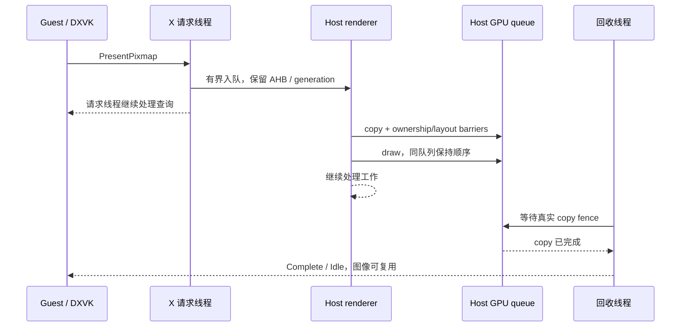
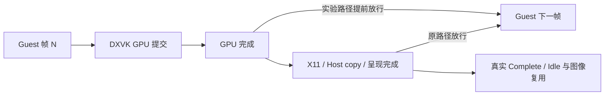

# AI LIMIT：拆分呈现提交与 GPU 回收

2026-10-02～03，延续 [同步等待分析](ai-limit-sync-fastpath-20261002.md)。
**单独移走 Host fence 等待没有稳定提速；随后改变 DXVK 下一帧放行时点，
AI LIMIT 管道场景由约 15.7 提升至 22.1～22.3 次呈现/秒，GPU busy 由约 73% 提升至 99.9%。**
设备、APK、Build ID、catalog、PID/start ticks、捕获 hash 和统计见
[JSON](ai-limit-present-pipeline-20261002.json)。原始失败及成功记录保留在仓库外
`xrgame-native-evidence/ai-limit/20261002-pipeline/`。

## 实现和边界

`PresentCopyQueue` 增加提交/回收两段接口。renderer 在同一 graphics queue 上依次
提交 copy 和 draw，沿用 transfer→fragment 与 foreign ownership 屏障。
独立回收线程只等待 copy fence，成功后才发送 X11 Complete/Idle。
等待线程不访问 Vulkan command pool、纹理 map 或 renderer 全局锁。

- 最多 8 个未完成工作，包含已提交且尚未回调的工作；出队不释放容量。
- drawable 删除/重用不会让旧 generation 重新生效。已提交工作即使失效仍等 fence。
- GPU wait 失败不伪造完成，AHB/command/fence 保留到设备清理。
- 关闭时先停止 renderer 提交，再等待回收线程，最后销毁 Vulkan/JNI 状态。
- `present copy_pipeline 0|1` 仅内部 DebugBus 会话有效，默认关闭；需原 async copy
  开启且 host limiter 关闭。模式在 outstanding copies 清空后切换。

## 同一场景 A/B/A

AYN Thor，AI LIMIT 平面模式，1280×720，中画质，同一管道场景静止角色；游戏
VSync 开启、游戏限帧关闭，host limiter 关闭。未替换或手工编辑游戏文件、存档或 shader cache。
三个 profiler 关闭的观察窗口各约 20 秒；scheduler 首末样本间约 19 秒。

| 模式 | SurfaceFlinger 提交率 /s | GPU busy 样本均值 |
| --- | ---: | ---: |
| A：原 async copy | 14.942 | 71.52% |
| B：提交/回收分离 | 15.268 | 73.32% |
| A2：切回原路径 | 15.838 | 73.46% |

**B 位于两个 A 窗口之间，不能报告提速。** 这些是窗口呈现记录，不保证每次都是新的
游戏帧。GPU 频率/温度没有锁定；另有 trace=120 的 smoke 窗口，未用于这张对照表。

独立 Litep + KGSL/sched 捕获中，完整 CPU scope 的均值：

| CPU scope /ms | A1 | B1 | A2 |
| --- | ---: | ---: | ---: |
| host.present.copy | 23.994 | **0.565** | 22.698 |
| renderer 上的 fence_wait | 23.270 | 无此 scope | 21.983 |
| 独立 retire_wait | 无 | 22.292 | 无 |

这是等待位置的改变，**不是 GPU copy 从 24 ms 加速到 0.6 ms**。完整
queue_to_complete 仍需约 23 ms。各线程 scope 不能相加成一帧的成本。
捕获无 dropped chunk/trace buffer overrun；边界未闭合 scope、零时间戳 KGSL
记录等诊断保留在 JSON。A1 附近有加载 simpleperf 文件传输，A2 是补充控制。

## 验证及未完成部分

- C++ 队列测试（普通、profiler 开启、UBSan）通过，覆盖容量、延迟完成、AHB
  保持、删除/重用、失败后已提交工作仍等待、shutdown drain 和 profile 配对。
- ASan/TSan 在本机 sanitizer/dyld 初始化阶段失败，没有得到测试结论，日志保留。
- fresh APK 打包和 audit 通过，124 files / 0 errors。
- pipeline 开启后切 Home、返回、点击继续，完成数由 20163 增至 21100，失败/跳过
  保持 0，画面恢复。未把这一次观察扩展为完整 resize/生命周期或长玩验收。
- 首轮加载出现两次 LOW_MEMORY 杀进程、一次保留 PID 的黑屏，均在 pipeline 未开启
  时发生；后续使用 host 60 limiter 加载成功一次，不构成“限帧修复低内存”的证明。

## DXVK 帧延迟复核

带有有界日志的 ARM64EC DXVK 验证件记录：waitable swapchain flags=2114，
BufferCount=2；构造默认值 1，游戏随后 **SetFrameLatency(2)，实际生效为 2**，
implicit cap 也是 2。因此排除“仍固定一帧，把它改成两帧即可”的猜测。
此次随后在加载场景时再次被 Android LOW_MEMORY 杀死，已保留退出原因和日志。

## DXVK 下一帧提前放行：实际收益

`XRGAME_DXVK_FRAME_COMPLETION=gpu` 选择 DXVK 已有的 no-present-wait fallback：
由 GPU 完成路径 signalFrame，取消本轮 frame-latency 对呈现完成的额外等待。
此参数不修改 Vulkan 的实际呈现、X11 Complete/Idle 或 image acquire/reuse 规则。
正常模式仍走原 present-wait 线程；游戏请求的 latency 2 保持不变。

同一 xrg4 APK、同一存档位置、1280×720 中画质、非 SBS、VSync 开、游戏/Host
限帧关闭、同一 3072 MiB allocator soft budget。以下 20 秒窗口关闭 PROF，
只保留低频进程负载与 SurfaceFlinger 观察：

| 顺序 | DXVK 放行时点 | Host copy pipeline | 呈现 /s | GPU busy | Guest 主线程单核 CPU |
| --- | --- | --- | ---: | ---: | ---: |
| G1 | GPU 完成 | 关 | 22.333 | 99.90% | 63.94% |
| G2 | GPU 完成 | 开 | 22.223 | 99.89% | 63.20% |
| C1 | 原呈现完成 | 关 | 15.667 | 73.30% | 42.80% |
| G3 | 再次 GPU 完成 | 关 | 22.076 | 99.90% | 66.04% |

C1 的相机在加载/界面操作后偏移，先恢复至管道朝向再采样，仍有小幅俯仰差异；
因此是相近固定视角的有界对照，不是像素完全一致的 replay。G1/G3 保持加载默认
视角。G2 的开关在 outstanding copy 清空后才生效，首几帧可能跨模式。GPU频率和
温度由系统决定，没有锁频或改温控；G3 截图 CPU/GPU 温度约 90/88°C。
SurfaceFlinger 记录不是独立的 Guest 帧号，不能保证每条都是独立游戏帧。
在这些限制下，收益可重复且主要来自 DXVK 放行时点，不能归因于 Host copy pipeline。

独立 PROF+KGSL/sched 捕获进一步支持这个解释：原路径 C 的主线程 on-CPU
7.555/17.957 秒（42.07%），sleep 9.928 秒；GPU 完成路径 G 的主线程 on-CPU
11.466/17.578 秒（65.23%），sleep 5.270 秒。两次捕获均无 trace overrun/dropped。
G 有捕获边界未闭合 scope，详见 JSON；没有将其补成完整帧。Guest 分析复用 Litep
已验证的 KGSL parser，保留原 Host PROF 的 SHA、时钟和保留区间；Guest PID/start
在邻近观察窗口绑定，未宣称 PROF 首尾各有独立 Guest 身份快照。

## 加载内存与额外修复

- 原/新 DXVK 模式均出现 Android `LOW_MEMORY` 杀进程，Host pipeline 关闭时也发生。
  保留全部失败日志；不能把低内存退出归为 fence 逻辑 crash。
- Turnip 的 UMA heap 与 CPU 共享系统 RAM。为本机 AI LIMIT 实验单独设置
  `DXVK_CONFIG=dxvk.maxMemoryBudget=3072`，促使 DXVK allocator 更早回收空 chunk。
  它是软预算，不是硬上限，也不改变游戏看到的 VRAM。设置后 G/C/G 与最终包共四次
  加载成功，包括 G3 不限帧加载；样本仍不足以宣布低内存问题已修复，未设全局默认。
- 修正 picoXr 生成的 `DXVK_CONFIG`：execve 传原始值，应为分号分隔，不应包裹
  shell 双引号和换行。此前 UI 中多个 DXVK 配置可能未被正确解析；upstream flavor
  保留原格式。独立手工 memory-budget 环境变量此前不受此格式问题影响。
- Present CPU pacer 的空队列改为 park/enqueue-unpark，保留 timed wait 的 deadline
  行为和 close interrupt。此前 C 捕获空队列线程约 30,488 次唤醒/17.957 秒、
  419.572 ms on-CPU；此处优化的是空转，未宣称它带来上述帧率收益。
- 最终包开启限帧以创建 pacer、再关闭后，19 秒线程采样中该线程 on-CPU 与
  runqueue 增量均为 0，20 次 wchan 都是 futex wait；旧包相同空队列观察约占单核
  2.0～2.1%。重新开启限帧后线程 CPU 时间继续增长、画面继续呈现，未丢唤醒。
  最终包另一个 20 秒呈现窗口为 22.483 /s、GPU busy 均值 98.75%，无 PROF 常驻采集。
- 新增每游戏 Graphics → **提前渲染（实验性）**，与“异步呈现”独立，默认关闭，
  重启生效，仅 D3D9–11。可能增加输入延迟；尚无输入到画面延迟测量。
- 15 项 JVM 测试通过，覆盖开关持久化、队列排空切换、pacer 唤醒/关闭和原始
  DXVK inline 配置。fresh APK audit：124 files / 0 errors。
- 实机 UI 关闭并保存后，重新进入显示关闭；再开启保存，仅 envVars 对应值变化，
  原 async-copy 设置保留。G3 已通过场景返回标题、游戏菜单退出，`guest_terminated`
  后按外部启动器路径结束 Activity；未出现新的崩溃文件。
- 同时修复旧崩溃记录中的 Steam 断线竞态：`notifyRunningProcesses` 在连接状态变化
  中读取 `userSteamId!!` 导致 NPE。改为从已捕获的 service 取得账号快照，无账号时
  跳过通知。已编译；未人为复现断线与通知的精确竞态。UI 中“最近崩溃”对应旧的
  2026-10-02 23:09:48 记录，不是 G3 正常退出。

提交前复核（2026-10-03）：将 SBS 设置、下载进度节流与上述配置/队列测试一起执行，
21 项 JVM 测试通过（0 failures/errors/skipped）；原生 PresentCopyQueue 普通版和插桩版、
SBS 投影测试均通过。记录的实现文件 SHA 与当前源码一致；子仓指针未改。

提交前收尾（2026-10-03）：ADB 已无在线设备，不能继续最终包正常退出与配置还原。
最后已知状态为游戏暂停、Host 限帧 60（用于验证 pacer 重新唤醒），提前渲染开启，
Host copy pipeline 关闭；限帧期间 async-copy 请求保留但不生效。DXVK 诊断日志配置
尚未还原，PROF recording/capture 已确认关闭。设备重新连接后需再确认实际状态；
不要将 G3 的正常退出记录当作最终包的退出验证。

剩余重点：更长时间和更多场景的稳定性、输入延迟、严格固定相机/温度的重复试验、
加载内存峰值策略，以及已接近饱和后的 GPU workload 分析。不要据此开启所有游戏
默认值，不要将 AYN 结果扩展为 Swan 验收。
