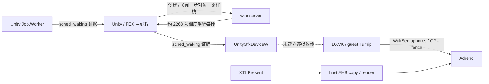

# AI LIMIT：AYN 普通平面场景 profiling

2026-10-02。按用户要求使用非 SBS 模式，从已有存档进入下水道场景，保持人物和镜头不动。
本次是瓶颈定位，**尚未修复低帧率**。完整数值及文件哈希见
[机器可读记录](ai-limit-profiling-20261002.json)。

后续 [等待对象与 fast path 复核](ai-limit-sync-fastpath-20261002.md) 已将优化重点调整到
DXVK / Turnip / X11 帧完成链：同一 B2 调度窗口的主线程 sleep 中，91.17% 由
`dxvk-frame` 唤醒结束；wineserver 次数多但对应 sleep 仅 7.19%。本记录保留原始
调查过程，以下“后续优化顺序”由新复核替代；尚无 FPS 修复结论。

## 结论

- 1280×720、中画质，实际 host SurfaceFlinger 呈现约 **15–16 次/秒**；GPU busy 约 **70%**。
  当前不是某个线程持续占满一个核，也不能据此认为游戏可以任意增加并行度。
- 容器已经请求异步呈现，但快捷菜单默认启用的 **60 FPS 限制会使异步 copy 不生效**。
  关闭宿主限帧后，DebugBus 确认 `asyncCopyActive=true`，fence 等待移到渲染线程；
  本场景仍约 15 FPS。没有复现 MHW 的大幅收益，不能直接套用其根因。
- 游戏主线程在 17.706 秒调度窗口内：**44.95% on-CPU、52.20% sleep、2.85% runnable**。
  wineserver 对它发出 **40,158 次唤醒，约 2,268 次/秒**；这些是调度唤醒次数，不是 API 调用次数。
- 独立 8.020 秒 simpleperf 窗口中，主线程 `NtWaitForMultipleObjects` off-CPU **3.694 秒**；
  `NtCreateSemaphore` 与 `NtClose` 的 wineserver 往返分别 **0.353 / 0.251 秒**。
  同步对象生命周期和 Unity job/渲染等待是后续优先调查对象。
  等待可能包含必要的生产者工作，不能把全部等待时间直接当作可消除的开销。
- 游戏内关闭垂直同步的额外探针没有明显提速；它同时使游戏的锁帧选项变为 60，
  因而不是严格的单变量 VSync 实验。测试后已恢复游戏 VSync 开、游戏锁帧关、宿主限帧 60。

## 测量与对照

使用相同 APK、游戏 PID 和镜头，不重启、不清 shader cache、不修改游戏文件、画质或频率策略。
顺序为探索基线 A → 异步 B2 → 恢复限帧 A2 → 游戏 VSync 关闭探针 C2。
中途打开快捷菜单会暂停 guest，退出后必须点击中央恢复按钮；暂停捕获单独保留并排除。

| 指标 | B2：宿主不限帧、异步 active | A2：恢复宿主 60、同步 copy |
| --- | ---: | ---: |
| 18 秒 PROF 的 X11 Present 请求速率 /s | 15.30 | 15.08 |
| 相邻独立 20 秒观察的 SurfaceFlinger 呈现速率 /s | 15.67 | 15.31 |
| SF 间隔 p95 /ms | 117.01 | 117.05 |
| 同窗 KGSL pwrstats busy | 70.07% | 70.10% |
| 调度与 PROF 的安全交集 /s | 17.706 | 12.080 |
| copy fence elapsed / 请求区间均值 /ms | 22.28，render TID 19301 | 23.07，X 请求 TID 19304 |
| host render.frame elapsed / 请求区间均值 /ms | 0.509 | 未列入 X 请求线程预算 |

SF 与 PROF 是相邻的独立窗口，不能逐帧拼接；SF 只证明 host surface 呈现，不证明每次
都是唯一的游戏模拟帧。PROF marker 是真实 X11 请求，不是 Android vsync 或 guest frame ID。
两种模式没有明显收益差异；小幅差值不足以证明提速。未锁频，设备温度、governor 和背景负载
随时间变化，本记录不作固定频率或严格采集开销的性能结论。

C2 的独立 20 秒观察：SF **14.58/s**，KGSL sysfs gpubusy 样本均值 **70.40%**，
总 CPU busy **30.86%**；主线程 on-CPU **44.77%**。A2/B2 相邻观察的总 CPU busy 为
40.05% / 37.02%，这些是全系统数据，不能全部归给游戏。C2 没有另开 PROF/ftrace。

## 等待证据与可分析性边界

- 主线程 45,526 次唤醒中，40,158 来自 wineserver，3,600 来自 Job.Worker 1，1,076 来自
  Job.Worker 2。不能按唤醒次数占比推导等待耗时占比。
- `UnityGfxDeviceW` 的同窗 on-CPU 为 1.761 秒，sleep 为 15.695 秒，runnable 为 0.250 秒；
  采样显示主要处于 `NtWaitForSingleObject`。目前没有 guest 调用点/对象 ID，尚不能判定每个
  等待是在等主线程、job、DXVK，还是其他资源。
- 8.020 秒 perf 中，`dxvk-queue` 的 `vkWaitSemaphores`/KGSL 等待为约 5.372 秒；
  WSI swapchain queue 的 GPU fence 等待约 5.422 秒。两者并行且会重叠，不可相加成帧时间。
- 主线程活跃采样主要落在 `FEXMemJIT`；现有 native FP 栈无法还原全部 Unity guest 函数。
  此轮没有证据说明主要问题是 FEX 指令执行成本，也没有证明高频锁本身占满 CPU。
- GPU context 17 的提交者是 guest PID 19457；context 20 属于 host renderer，context 14
  属于 Android RenderThread。Litep 默认 host target 的 GPU-bound 判定不能代替 guest 判定。
  guest 调度视图复用同一套 Litep sidecar 解析器，以记录中的 TGID 和独立 PID/start ticks
  选线程，保留原始 host PROF 绑定，不伪造 guest PROF。
- GPU busy 来自 `kgsl_pwrstats` busy/total，不由 submit→retire 推算。未采集 GPU pass timestamp；
  不能拆出游戏渲染、带宽、host copy 的 GPU 成本。GPU 上限仍为 680 MHz，快照 throttling=0；
  这不证明整个运行期间绝无温控影响。

## 后续优化顺序

1. 在 Wine 同步层增加默认关闭的聚合计数：`NtCreateSemaphore`/`NtClose`、等待类型、对象类别、
   命中进程内路径还是 server 往返；每秒汇总，避免每次系统调用写 trace。
2. 对主线程长等待做有界采样，并与 Unity job、DXVK completion 的实际对象/通知关系连接。
   只有显式对象 ID、guest 返回地址或对应堆栈才能证明依赖，不按时间相邻补边。
3. 确认语义后再评估同步对象复用/进程内快路径，或 job worker 数的受控实验。
   不删除必要等待、不无条件缓存跨进程/命名对象，不把整段 sleep 当作预计收益。
4. host 可单独优化 PresentPacer 的空队列 0.5 ms 轮询。本次异步时仍有约 1,574 次唤醒/秒，
   但仅约 4.88% 的一个 CPU 核，优先级低于 guest 等待，不能承诺其带来明显 FPS 收益。
   异步选项与宿主限帧互斥的 UI 状态也应明确显示，避免“已勾选”等同于“已生效”。

本次只新增分析记录，未修改 Wine、Foundation 或呈现实现；未构建/安装新 APK。

## 身份、完整性和清理

- AYN Thor，Android 13 / API 33；指纹
  `qti/kalama/kalama:13/TKQ1.231222.001/eng.Thor.20260206.163241:user/release-keys`；
  boot id `8bb14501-5800-4b9b-a9ab-7173603812f7`。
- host PID **11333**，AI LIMIT PID **19457**，wineserver PID **19344**；整个对照没有换进程。
- APK SHA-256：`9d8ef4e89a14d7b97e263a2859828b8e8ca71525489817086a19adab925e4222`。
  catalog SHA-256：`dbf85e43cfb5e1f604507a5cb466cd4ffb71e57560a4830b33f02a6fadb8935f`。
- Build IDs：renderer `2151525d5ac80b73f293814fba05741c15c618b9`；
  debugbus `8870cb9946e98ee7bace9c44359943c57660e37c`；
  xrimmersive `67ce8e84096bc52e98dc583441bd10c8780981b2`。其余 APK 库 ID 在 JSON 中。
- Foundation `c1d339c3a9b231ad23d02e4fd982e3e7120f7ef5`；SDK
  `0b467a861569345a64fd88cb2e5daa8ff542c14f`。B2/A2 PROF 均 0 skipped chunk、未截断；
  B2 在停止边界有 2 个未闭合 span、1 个未配对 region，保留警告。
  两份有效 KGSL 均 0 overrun / 0 dropped，时钟不确定度约 1.13 µs；仅使用全部 CPU 留存交集。
  zero-timestamp batch 观测 B2 395 条 / A2 389 条被排除，不作为完整 batch。
- perf：99 Hz `cpu-clock:u`、FP 栈与 off-CPU，记录 187,331 samples、0 lost；部分库无符号，
  kernel symbol 受限，未更改系统限制。样本时间戳跨度 8.059 秒与 record 的 8.020 秒分别保留。
- 首轮 KGSL 因温度轮询拖长、host 74 秒超时；设备随后完成，已恢复并校验原始压缩 trace，
  不纳入配对调度比较。暂停和菜单过渡捕获全部保留，不以成功生成文件代替场景有效性。
- 原始 PROF、KGSL、perf、截图和脚本保留于仓库外
  `xrgame-native-evidence/ai-limit/20261002-profile/`；不提交游戏数据或 APK。
- Root 仅使用已有 `PServerBinder/pservice`，上下文 `uid=0 context=u:r:pservice:s0`。
  本次独立 tracefs instances 已删除，全局 trace 状态核对未变；失败采集设备临时目录在
  本地校验后清理。profiler recording/capture 均关闭，DebugBusService 已停止。
  已回到原场景；宿主限帧恢复等效默认值（UI 将 true/60 显式写入容器）。
