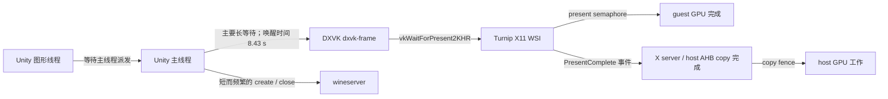

# AI LIMIT：等待对象、完成通知与 shadPS4 fast path 复核

2026-10-02。延续 [平面场景 profiling](ai-limit-profiling-20261002.md)。
**低 FPS 尚未修复；本轮把主要等待收窄到 DXVK / Turnip / X11 帧完成链。**
不是“wineserver 唤醒次数最多，所以 wineserver 是主要耗时”。
数据和源码身份见 [JSON](ai-limit-sync-fastpath-20261002.json)。

## 1. 按等待时间重新排序

重新分析原 B2 的同一份 KGSL/scheduler trace，沿用 Litep 的解析器、时钟标定和
全部 CPU 安全留存交集：**17.706366843 秒**。按 `sched_switch` → 首次
`sched_wakeup` 计算 sleep，按唤醒线程聚合；没有用调用次数乘以假定单价。
边界只裁剪已观测区间，runnable 单独保留，不混入 sleep。

| 被唤醒线程 | 唤醒来源 | sleep /ms | 其中单次 ≥5 ms 的 sleep /ms |
| --- | --- | ---: | ---: |
| 主线程 19457 | `dxvk-frame` 19573 | **8425.891** | **8423.619，136 次** |
| 主线程 | wineserver 19344 | 664.254 | 0 |
| 主线程 | Job.Worker 1 / 2 | 39.406 / 29.101 | 0 / 0 |
| UnityGfxDeviceW 19530 | 主线程 | 15596.290 | 12201.050 |
| dxvk-frame | WSI event 19572 | 6519.706 | 6268.899 |
| dxvk-frame | kgsl-events 867 | 5975.942 | 5936.600 |
| dxvk-frame | dxvk-submit 19526 | 5016.934 | 5016.376 |
| WSI event | host renderer 19301 | 6448.618 | 6176.029 |

主线程总 sleep 9242.426 ms 中，**91.17% 由 dxvk-frame 唤醒结束**，仅 7.19%
由 wineserver 唤醒结束。前者只有 154 段 sleep，却包含全部 ≥5 ms 的长睡眠；
最长一段 76.646 ms。原报告的高频 wineserver 往返仍然成立，但优化优先级下降。
完整唤醒次数与“有完整 switch-out/wakeup 端点的 sleep 段数”不是同一计数。

这些是不同线程的并行等待，**表中时间不能相加成帧耗时**。唤醒者证明调度通知来源，
不自动证明对象、帧号或等待全是多余开销。GPU 完成可能是必要条件。

## 2. 原生栈与只读对象采样

原 A2 simpleperf 窗口 8.02004 秒中，`dxvk-frame` 栈进一步区分：

- 约 2924.292 ms：`vkWaitForPresent2KHR` → `x11_wait_for_present` → condition wait。
- 约 2660.391 ms：同一个 Present wait → `wsi_swapchain_wait_for_present_semaphore`
  → `vkWaitSemaphores` → KGSL；这是最大一条栈，其他同族短栈另保留。
- 有 `NtReleaseSemaphore` → `ntsync_sem_release` → `wake_object` 栈。
- 主线程 ntsync region mutex 直接 off-CPU 的已采样栈仅 **1.459 ms**，
  远小于 `NtWaitForMultipleObjects` 的 3694.350 ms。该值不覆盖锁的所有 on-CPU 成本。

新增 `tools/xrgame/sample-ntsync-waits.c`，在 app UID 下读取 `/proc/PID/syscall`
及只读 `/proc/PID/mem`，按实际 futex 地址查 ntsync v9 waiter/slot。
没有 ptrace、改目标内存、开 NTSYNC_DEBUG、暂停线程或换 APK。

15 秒、每线程 100 Hz、4 个线程的窗口中：

- 主线程 1500 个观察点，**708 个通过重复读检查的 ntsync wait** 都指向同一组：
  slot 3662（semaphore，count=0/max=16）、3663 和 2347（manual event，未置位）。
  另有 5 个 ntsync 快照因竞争被排除；其余包括运行、server read 和其他 futex。
- 图形线程的 1267 个稳定观察都指向 slot 3062（semaphore，count=0/max=2147483647）。
  这与 scheduler 中其主要由主线程唤醒相符。
- 同世代 ntdll handle cache 读取得到：`0x82c` 和重复句柄 `0x830` 均指向 3662；
  `0x85c` 指向 3663，`0x42c` 指向 3062。
- DXVK 固定源码 `D3D11SwapChain::CreateFrameLatencyEvent()` 只在 waitable swapchain
  上创建 max=`DXGI_MAX_SWAP_CHAIN_BUFFERS`（16）的 semaphore；
  `GetFrameLatencyEvent()` 正是 DuplicateHandle。`SyncFrameLatency()` 的完成 callback
  ReleaseSemaphore。对象特征、release 栈和调度来源共同支持它是帧延迟等待对象。
  **尚未直接读取 swapchain 实例字段，不能声称已测得当前 MaximumFrameLatency。**

采样点比例是瞬时占用观察，不是 API 调用数、精确等待时长或帧率。
并发重复读只能排除已发现的竞争，不能提供原子快照或永不复用的对象身份。
所有 slot/handle/address 只属于本次 PID/start-time/boot，不可跨启动复用。

另一个 20.000868 秒计数窗口中，ntsync wait 1270.29/s、初始 fast-path 成功 7.11%、
futex 尝试 1091.60/s、region lock 获取 3309.31/s。fast-path 补数不等于真正阻塞率，
`lock_contended=0` 也不证明无争用；计数器定义沿用 [MHW 同步统计](mhw-sync-20260927.md)。

## 3. 等待链

箭头表示等待方向；不同窗口的栈和对象观察用于交叉核验，不拼成一条伪造的逐帧 trace。
DXVK `Presenter::runFrameThread()` 在 FIFO 模式等待 Present，再触发帧完成 callback；
当前 host copy 模式在 copy fence 结束后发 Complete/Idle。链中的回压会让 CPU/GPU
交替空闲，因此总占用未满不排除串行依赖。已有 async copy A/B 没有改善本场景，
说明只把 fence 等待移出 X 请求线程仍不足以解决这条链。

## 4. shadPS4 哪些机制可以借鉴

只读对照本机 shadPS4 `1c56a3f1f3fd5e32133641232bfa230fa0df124d` 的
`guest/runtime/sync/{README.md,mutex.c}`、`docs/sync-core.md`；这些文件没有本地 diff。
未更新本仓库 shadPS4/FEX gitlink，未复制其实现。

| 机制 | shadPS4 Android | XRGame / Wine 的实际情况 |
| --- | --- | --- |
| 无争用 fast path | guest 内 CAS 三态锁；只有竞争才 HLE wait/wake | ntsync 的 acquire/signal 已是原生 ARM64 CAS；Wine critical section / SRW 也有本地原子路径 |
| 精确降级 | arena 地址范围和类型不匹配回 HLE，保留递归/销毁语义 | Windows 命名对象、跨进程句柄、DuplicateHandle、WaitAll、APC、abandoned 等必须保留；不能套用 PS4 指针锁 |
| 观测实际命中 | 状态报告 fast path 是否装载；slow-path 才进计数 | 应记录等待对象、实际 backend、queue depth、present id；仅显示“已开启”不够 |
| 减少唤醒 | 无 waiter 时不唤醒；慢路径按对象处理 | ntsync 已有无 waiter 跳过；本场景更多是等待未完成的帧，盲目 spin 只会消耗 CPU |

shadPS4 当前文档也明确：共享 desktop sync core 曾因丢 condition wake 冻结游戏，
Android 已回退独立实现。不能把 desktop core 或未验证的 semaphore/rwlock 扩展
当成已在 Android 成功的快路径。

## 5. 调整后的优化顺序

1. **补齐每帧完成链的身份和时间。** DXVK present id → Turnip X serial → host copy →
   Complete 发送/接收 → frame-latency semaphore release，并记录当前最大帧延迟、队列深度和
   实际 present mode。默认关闭，只在每帧边界记录；不对每次锁/系统调用写高频日志。
   重点区分 GPU 本身耗时、copy 排队和 X11 完成通知延迟。仍缺 GPU pass timestamp，
   不能把 22–23 ms copy fence elapsed 全算成 blit 成本。
2. **做实际模式和流水并行的受控 A/B。** 原来的游戏 VSync 菜单探针未记录 Vulkan mode，
   不能据此断言 FIFO/Present wait 已被绕开。先确认实际模式，再测关闭 VSync或增加安全的
   在途帧数；后者可能增加输入延迟。`dxgi.maxFrameLatency` 是上限，不能直接用它强行提高
   游戏请求的 waitable latency。没有测出当前值之前不下结论。
3. **帧链验证后再优化 Wine 生命周期。** 匿名对象复用是候选，但不能仅缓存数值 handle，
   必须处理关闭/重复/跨进程访问和 generation；保持有语义的慢路径与回退。
   不启用 `NTSYNC_NO_SIGUSR1_BLOCK`，不无条件移除 fence 或提前伪报 PresentComplete。

本轮交付可复用的只读采样器及证据；没有宣称实现新的 fast path 或提升 FPS。
原 P1–P3/D0–D4 的验收状态不因此改变。

后续实装见 [呈现链优化与对照](ai-limit-present-pipeline-20261002.md)：实测游戏已经
SetFrameLatency(2)，排除默认一帧的猜测。单独移动 Host fence 等待没有稳定收益；
选择 DXVK 既有 GPU 完成放行路径后，有界 AI LIMIT 场景约 15.7 → 22.1～22.3 次
呈现/秒。该实验保留真实 X11 Complete/Idle，默认关闭；输入延迟和更广泛稳定性待测。

## 身份、验证与清理

- AYN Thor / Android 13 / API 33 / target 36；build
  `qti/kalama/kalama:13/TKQ1.231222.001/eng.Thor.20260206.163241:user/release-keys`；
  boot `8bb14501-5800-4b9b-a9ab-7173603812f7`。
- host PID 11333、AI LIMIT PID 19457/start ticks 173273981、wineserver PID 19344。
  用户允许从另一应用切回测试；先排除暂停状态，再采样同一场景；没有重启游戏或改设置。
- APK SHA `9d8ef4e89a14d7b97e263a2859828b8e8ca71525489817086a19adab925e4222`；
  catalog SHA `dbf85e43cfb5e1f604507a5cb466cd4ffb71e57560a4830b33f02a6fadb8935f`。
  renderer Build ID `2151525d5ac80b73f293814fba05741c15c618b9`，
  debugbus `8870cb9946e98ee7bace9c44359943c57660e37c`，
  xrimmersive `67ce8e84096bc52e98dc583441bd10c8780981b2`；其他库沿用 JSON 内完整列表。
- 实际映射的 ntdll SHA 再次读取为
  `0fb8a4da8ea7c5e2471a944473d231f53a9f2b00fb7a9aee3880c281e77cc85d`，无 GNU Build ID。
  ntsync `7ce6435e5979b1cb5341aa4b299f31e8937fe121`；DXVK 基础 pin
  `a6764047e587178283fcde4073ae6e1410af594f` 加本仓库 deferred-clear patch。
- 采样器使用 NDK 27.3 / API 28，`-O2 -Wall -Wextra -Werror`。实机 stale generation、
  错误区域 header、非法采样间隔均拒绝且不输出数据；单线程和四线程窗口通过。
  最终版另以四线程 50 Hz 跑 10 秒，记录自身 CPU 时间以控制观察成本。
  该窗口 observer 自身 CPU 为 **436.166 ms / 10.000208 s（一个核的 4.36%）**，
  因此只做短时诊断，常规定位优先单线程/100 ms 间隔；不作为常驻桩点。
  此数不包含 ADB/host，且不是已测得的游戏帧率开销。
- native-debugger readiness 不接受 package 与 Wine 子进程 cmdline 不同的目标；
  没有成功创建调试会话或设置断点。改用已有 app UID 只读权限，不通过另一套 ptrace 绕过。
- 未使用 root；所有读数均为 app UID。采样进程结束、临时传输文件清理；game 继续运行，
  没有新增 profiler、DebugBus 服务或 debugger 留在设备上。没有 commit/push。
- 原始资料保留于仓库外 `xrgame-native-evidence/ai-limit/20261002-sync/`。
  新窗口与旧 B2/A2 各自保留身份，不把独立窗口当成同时采集。
