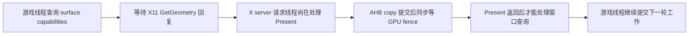

# MHW 场景 profiling：窗口查询被同步 Present 阻塞

2026-09-28，在 AYN Thor 冰原据点、原存档固定视角取得两轮新样本。
**当前已定位到一处主要瓶颈：游戏最热线程查询 Vulkan surface capabilities 时，
等待 X server 回复 GetGeometry；X server 的单个请求线程同时在同步等待 AHB copy
的 GPU fence。** 这把原本很轻的窗口查询拖到图像完成之后，使游戏线程和 GPU
交替等待。不能将低总 CPU 利用率理解为游戏线程一直有可用计算时间。

本轮只采集和分析，没有改运行时、画质、亲和性、频率或温控，没有声称优化提速。

后续改造与同包 A/B/A 已单独记录在 [异步 Present 验证](mhw-present-async-20260928.md)，
不能把后续改善倒填为本轮采样时的既有能力。

## 场景与测量

- DX12 / VKD3D、1280×720、60 FPS 上限、V-Sync Off；应用 Present 限帧为 0。
  分辨率缩放为 Variable(Prioritize Resolution)，CAS On；没有清缓存。
- 保存的 power profile：power control、adaptive FPS、auto tuning、pinning 均关闭。
  实际频率与调度另行采样，不能只用配置文件证明运行状态。
- 第一轮 60 秒：每秒批量读取 `/proc`/KGSL；Present 日志覆盖全程；中间 8 秒
  simpleperf `cpu-clock:u -f 99 --trace-offcpu --call-graph fp`。
- 第二轮 30 秒：关闭逐帧 Present 日志，重复相同视角和 8 秒采样；另读 20 秒
  SurfaceFlinger latency history。没有使用游戏菜单或加载画面作为场景样本。

| 指标 | 第一轮 | 第二轮 |
| --- | ---: | ---: |
| X11 Present 请求速率 | 18.41/s，60 秒日志 | 18.56/s，约 30 秒 PROF |
| 最热游戏 TID 17195 的单核运行占比 | 44.52% | 45.27% |
| 同线程 runnable 排队占比 | 2.07% | 2.18% |
| KGSL 区间 busy 读数均值 | 73.06% | 73.88% |
| GPU 可见 max_freq | 全部 680 MHz | 全部 680 MHz |
| 约 8 秒样本：surface capabilities 查询 off-CPU | 2.828 秒 | 2.883 秒 |
| 同窗口：该线程 `NtWaitForSingleObject` off-CPU | 1.109 秒 | 1.213 秒 |
| 同窗口：该线程 ntsync region mutex off-CPU | 32.90 ms | 24.73 ms |

该线程用户 CPU 采样估计分别为 3.515/3.141 秒，大部分执行样本位于 FEXMemJIT。
这表示翻译后的 guest 代码在执行，不表示正在编译代码。尚未把这些 PC 解析成
具体 guest 函数；用户 CPU 是采样估计，不能与 off-CPU 相加当成精确时长守恒。
off-CPU 包含睡眠和被调度出去后的排队，不等于锁的 CPU 开销或精确 API 调用时长。

本轮没有重现上次“仅三个小核忙、GPU 上限 348 MHz”的异常。第一轮系统总 CPU
约 41.8%，最热线程在 CPU 3/4/5/7 执行，CPU 0–7 均有工作；不能把本轮解释成
全部计算被限制在小核。正常调频仍存在，GPU current 平均约 626 MHz，不能据此
排除所有功耗/温控影响。

第二轮 SurfaceFlinger 在剔除第一份历史快照之前的数据后，取得 371 个相邻间隔、
20.04 秒覆盖：均值 **54.01 ms（18.52 次/秒）**，p95 **100.28 ms**、p99 **116.99 ms**。
191 个间隔约一刷新周期，165 个间隔约五至六周期，显示节奏明显不均匀。
这是 host surface 实际 present 的间隔，不是 guest simulation 或 GPU pass 时间；
与同期 X11 请求速率接近，但不能把每条记录直接一一映射成游戏帧。

## 等待链的证据

最热游戏线程的原生 off-CPU 栈反复出现：

```text
winevulkan!thunk64_vkGetPhysicalDeviceSurfaceCapabilitiesKHR
  → win32u!win32u_vkGetPhysicalDeviceSurfaceCapabilitiesKHR
  → Turnip!wsi_GetPhysicalDeviceSurfaceCapabilitiesKHR
  → Turnip!x11_surface_get_capabilities2
  → libxcb!xcb_wait_for_reply / _xcb_conn_wait
  → pthread_cond_wait 或 ppoll
```

同窗 Android 请求线程 TID 17024 则在：

```text
VulkanRenderer.nativeCopyWindowContentAHB
  → host Vulkan driver!vkWaitForFences
  → gsl_syncobj_wait → sync_wait → ppoll
```

第一轮 291 段查询 off-CPU 区间中，73 段超过 1 ms，最长 45.02 ms。
其总计 2.828 秒中的 **2.671 秒（94.44%）** 与原生 Present trace 的
`submitted_ns → fence_done_ns` 区间重叠。两者均用 CLOCK_MONOTONIC 对齐。
重叠本身不证明锁所有者；以下源码给出实际依赖：

1. Mesa `src/vulkan/wsi/wsi_common_x11.c:x11_surface_get_capabilities` 每次发送
   `xcb_get_geometry` 并同步等待 reply。
2. `XServerComponent.start()` 使用默认单线程 `XConnectorEpoll`。
   `handleExistingConnection()` 在该线程内直接处理请求，没有把 Present 放到异步队列。
3. `PresentExtension.handleRequest()` 持 WINDOW_MANAGER 锁调用 `presentPixmap()`；
   后者还持 content/render 锁，同步进入 `copyHardwarePixmap()`。
4. `VulkanRendererContext::copyWindowContentAHB()` 在 frameMutex/renderMutex 内
   提交 copy 并 `WaitForFences(UINT64_MAX)`，完成后才能返回 X 请求循环。
   `GET_GEOMETRY` 又需要 WINDOW_MANAGER/DRAWABLE_MANAGER 锁。



第一轮 1105 对 copy 的 fence 等待均值 19.72 ms，p50 33.39 ms、p90 40.96 ms；
整个 copy 调用均值 21.26 ms。native 锁获取均值仅 0.008 ms，但**持锁/占用请求线程
等待 GPU**仍会阻塞后续工作。这里的 fence 等待含前序 GPU 工作、队列依赖和 host
唤醒；没有 GPU timestamp，不能称为“拷贝本身消耗 19.72 ms”，也不能从帧长直接
减去等待均值预测收益。

## 优化优先级

1. **先使 Present 的 fence 等待离开 X 请求线程和全局窗口锁。** 使用有界提交队列、
   AHB/纹理生命周期引用和完成回调；GetGeometry 应能及时答复。只释放一个 Java
   锁或开启多客户端线程并不足够，还要避免 renderer 锁继续把工作串行化。
   Complete/Idle 的既有完成与归还语义必须保留，不能在仅入队时提前释放 guest buffer。
2. 增加 copy/composite GPU timestamps、请求入队/完成与窗口查询计时，再对相同场景
   做 A/B/A。当前直接采样模式同样有同步 barrier fence，不能假定删掉 copy 就消除等待。
3. 然后处理 guest 串行计算与 ntsync。当前最热线程 ntsync mutex 直接等待远小于
   X11 查询等待；`NtWaitForSingleObject` 可能在等任务完成，不能一律当作锁实现低效。
   六个 Job Thread 各有约 1 秒/8 秒的 region mutex off-CPU 候选，但这些时间并行且
   含调度等待，不能相加或直接认定为帧关键路径。不得禁用 SIGUSR1 保护来换性能。

本次证据支持以上排序；尚未证明完整 CPU/GPU 关键路径，没有预估提速百分比。
前一份 [优化复核](mhw-optimization-review-20260928.md) 的呈现异步化建议，
现在新增了“窗口查询被阻塞”的实测依据。

## 身份、开销与保留的失败

- AYN Thor，Android 13/API 33，4 KiB，app targetSdk 36。
- Build：`qti/kalama/kalama:13/TKQ1.231222.001/eng.Thor.20260206.163241:user/release-keys`。
- Boot：`8bb14501-5800-4b9b-a9ab-7173603812f7`。
- Android PID `16033`，start ticks `138005761`；MHW PID `17174`，start ticks
  `138007182`；wineserver PID `17061`。两轮在同一进程世代内完成。
- 安装 APK SHA-256：`02a6a78418336e1f6cab182a0b40b806986c08967887db5a1fcf7397f4cbe598`。
- Catalog SHA-256：`e8619cda78b93fbde4e3f509157476f08db3ecb04749215e1fa4eb885984f353`。
- 实际 host ELF Build IDs：winlator `e120a35c35b69960ed4fe4c8993045bddffe4c1b`；
  renderer `36421bccc5e74ef19b0ff30b47b21ea071507eab`；
  evshim `5d357cd7a9756016f8b6eb3d1bfc9cc23edb262d`；
  debugbus `30a9c69fe7e2e2c13006718a8591f3d8619cdc23`。
  libgndownload 未在此次 host module 查询中出现，不把包内存在等同于实际加载。
- 60/30 秒批量采样器分别消耗 0.858/0.400 秒 CPU（约 1.43%/1.33% 单核）。
  第一轮 simpleperf 采样前/中/后窗口分别约 17.96 / 18.57 / 18.51 Present/s；
  第二轮约 19.47 / 17.42 / 18.58。第二轮采样窗口有下降，不能声称零观察开销；
  两轮仍重复观察到约 2.8 秒窗口查询等待。
- 第一轮 PROF 因手工参数顺序误用仅录了 32 秒，60 秒后半段速率使用完整 Present
  日志，不将缺少 FrameMark 当作零 FPS。第二轮参数已改正、PROF 覆盖采样窗口。
  两份用匹配 SDK `0b467a861569345a64fd88cb2e5daa8ff542c14f` 解码，均无 truncated、
  skipped chunks 或 diagnostics。
- 两轮 simpleperf 原始记录报告 105351/100785 samples、0 lost；FP 栈不能完整跨越
  FEX/PE 和 ART，分析只使用可识别的原生调用链，不采用可疑 Java JIT 符号命名。
- 5 秒 Perfetto 探针仍为 0 sched slices；未获得 KGSL batch/GPU pass 时间。
  保留失败探针、命令报错、配置路径探测和原始日志，不把这些当作有效测量。
- KGSL busy 是设备区间读数，且会被其他读者读取/重置；没有按应用隔离，保留为
  上下文，不据它推导拷贝 GPU 时长。所有采样均未暂停目标。

原始数据与脚本在仓库外 `xrgame-native-evidence/mhw/20260928/profiling/`。
`evidence-sha256.json` 记录原始和派生文件哈希；账号/存档、APK 与日志不入仓。
两轮 PROF SHA-256：

- `604d4a99644a6e82ca4bd87ed89bae78ae1273e4c2c41a00573ba02eb35041b0`
- `092140d12207161baf938da82cdd8d39ed442cc2a22e56a7b9f9e16dbfc94022`

采集结束：Present trace 余量 0，profiler recording/capture_active 均为 0，采样进程
已退出；没有建立 debugger。停止本轮 DebugBusService，游戏保留在场景中。
