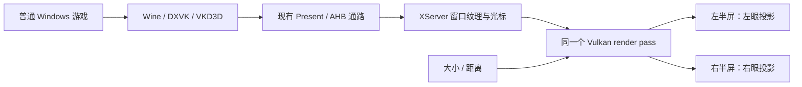

# 普通游戏 SBS 影院（AYN，2026-10-02）

已接通普通 Windows 游戏的大屏预览，安装到 AYN，并用 MHW ICEBORNE 的标题场景和主菜单验证。
入口是「游戏 → 编辑容器 → 图形 → 显示模式（实验性） → SBS 影院 — 非 VR 游戏」。
运行中右上角「影院设置」可调大小、距离、重置，以及临时切换平面/SBS；大小和距离按游戏保存。
结束时已退出到游戏库，MHW 保留影院模式，大小 1 倍、距离 2 米。

## 接线与边界

复用现有头显大屏的 `immersiveQuadScale` / `immersiveQuadDistance` 设置和范围，
为普通 Android 增加固定视点的 Vulkan 合成路径。它没有启动 Windows OpenXR runtime，
也没有把普通游戏变成独立双眼渲染的 VR 游戏。

- 固定平行双眼，IPD 64 mm、每眼水平 FOV 60°。游戏画面比例保持一致，视差只体现屏幕平面的距离。
- 窗口纹理上传和转换仍执行一次，合成时绘制两次；影院本身不增加中间图像、CPU 读回或 AHB 拷贝。
  原有 Present 的 GPU copy 仍存在，不能据此宣称整条显示链零拷贝，也没有测出性能收益。
- 影院会话使用 Vulkan compositor，关闭绕过合成的 native scanout 和 LSFG；原容器后端设置不被覆盖。
  `virgl` 不启用影院。旧容器默认平面，影院与 Windows VR 模式互斥。
- 保留原游戏手柄、键盘和音频通路；触屏使用相对触控板，避免直接触摸坐标与两个投影区域不一致。
  Android HUD、影院设置和快捷菜单仍是单份平面 UI，方便普通 Android 上操作。
- Java 缓存参数，在 native 初始化和 Surface 重新挂接时重放；native 在渲染锁内保存参数，按帧取快照。

## 实测

| 检查 | 结果与范围 |
| --- | --- |
| 配置入口 | 显示模式四选项可见；影院保存后 `windowsVrEnabled=false` |
| 首包 MHW | 两眼显示 ICEBORNE 标题场景和主菜单；大小/距离实时变化，平面/SBS 可切换 |
| 后台恢复 | 首包 Home 后返回，出现手动恢复按钮；恢复后同一 guest PID 继续显示菜单 |
| 冷启动恢复 | 最终包启动恢复大小 `1.3197074`、距离 `3.0`；native 日志为宽 `2.112 m`、距离 `3.000 m` |
| 最终包交互 | 右上角设置可打开；重置恢复 1 倍/2 米；平面→SBS 与键盘 F 推进菜单通过 |
| 退出 | 两次均通过快捷菜单退出到游戏库；最终 guest PID 已消失 |
| 自动检查 | Kotlin/Robolectric 8 项通过、0 跳过；native 投影测试通过；APK 审计 124 项、0 错误 |

首包 app PID `9612`，guest PID `13871`，start ticks `172382417`，
到最后观察的 guest 生命周期 **492.42 秒**。最终包 app PID `17540`，guest PID `19972`，
start ticks `172466022`，观察 **144.59 秒**。`CLK_TCK=100`，时长由设备 uptime 减进程 start ticks 计算。
这些时长包含启动、对话框、设置和菜单停留，不是首帧耗时、持续游玩时间或性能测试。

后台测试没有证明 Surface 一定销毁重建；不将其记作 Surface 重建验收。
本轮没有物理手柄、可听音频、关卡长玩、Swan、头部追踪或摘戴验收。

## 版本身份

- 主仓基线 `6193851f6ceb1f126839bc0ed2e2e7c5a68c9f1f`，分支 `feature/malos/sbs-theater` 的工作区修改；未提交/推送。
- 最终 APK SHA-256：`8f9b7d02e220626efc6536a63ab78a586995b03d14190b5bc3423a69495fa4f2`。
- 首包 SHA-256：`bcc22a26517181d05acc75df2bc627d1c4c12ad7b3e1010a08fef92f32dbc422`。
  最终包将控件移至右上角，补充跨线程会话标记，并保持关闭影院时原投影计算路径。
- 最终 `libvulkan_renderer.so` Build ID：`1a114382cd8bf29af6b1e8b054f09e48fd349497`。
- 组件 catalog SHA：`dbf85e43cfb5e1f604507a5cb466cd4ffb71e57560a4830b33f02a6fadb8935f`。
- AYN Thor，Android 13 / API 33 / 4 KiB；app versionCode 23 / versionName 1.2.1 / targetSdk 36。
- boot ID：`8bb14501-5800-4b9b-a9ab-7173603812f7`。
- fingerprint：`qti/kalama/kalama:13/TKQ1.231222.001/eng.Thor.20260206.163241:user/release-keys`。

全部 ELF Build ID、源文件哈希、测试结果和私有证据哈希见[同名 JSON](sbs-theater-20261002.json)。
APK、截图、原始日志和容器快照保存在仓库外 `xrgame-native-evidence/sbs-theater/20261002`。

## 干扰项与清理

首次通过已有容器编辑器保存时，其原有逻辑将 `dxwrapperConfig.async=1` 规范化为 `0`，
并添加 `vkd3dFeatureLevel`。最终包重放前已恢复整个原始 `dxwrapperConfig`，读取核对一致。
结束前与原配置相比，业务设置仅新增/改变影院标记、显示模式和屏幕大小/距离；会话元数据另由原流程管理。
本轮未替换游戏文件或清理 shader cache，不以两包的 HUD 读数进行性能比较。

初始 UIAutomator 两次无法取得 root；初始黑帧、过渡帧及输入未奏效的截图均保留。
默认 ADB 键盘事件和模拟手柄 A 未推进 MHW；带虚拟键盘 device ID 的 F 事件可关闭离线提示并进入菜单，
不能由此声称物理手柄已通过。未发送游戏反馈。
临时输入 dex 已移除，拥有的 scrcpy 会话已正常停止，未留下 debugger 或 ADB forward。

相关规划：[VR/SBS spec 的普通影院增量](../specs/xrgame-native-vr-sbs-v1.md)；
系统接线：[系统设计 §13.2](../architecture/xrgame-native-system-design.md#132-xr-与普通游戏的-sbs-影院2026-10-02-更新)。
