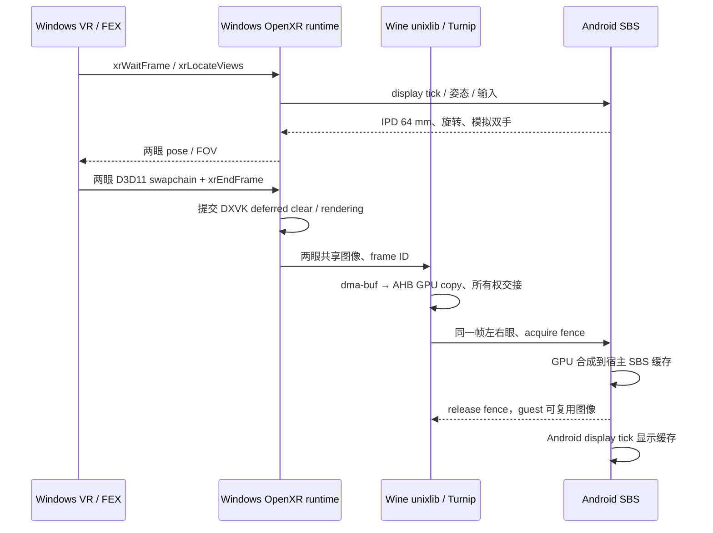

# 普通 Android SBS / Swan VR 接线验证（2026-10-02）

当前在 AYN / Adreno 上完成 Android SBS 的 Windows D3D11 OpenXR 双眼链路；**Alyx 已进入 SBS 主菜单及其 3D 场景；完整游玩、物理手柄和 Swan 尚未验收**。
本轮使用 AYN Thor，没有操作 Swan。规划见 [SBS v1](../specs/xrgame-native-vr-sbs-v1.md)。

## 已接通的链路

- 每游戏「图形 → VR 输出（实验性）」可选关闭、SBS 模拟追踪、OpenXR 头显；OpenVR 游戏另开 OpenComposite。
- SBS 从独立左右眼提交生成画面；没有把普通 2D 画面复制成“VR”。
- 参考 shadPS4 `85a39824d9c7062233032a1edc370ad38eb42d20` 的陀螺仪积分和翻盖设备重力中立坐标；移植保留 GPL-2.0-or-later 声明。
- 固定身高 1.65 m、IPD 64 mm；双手 grip/aim 固定在参考空间 X=±0.22 m、Y=1.35 m、Z=−0.40 m、单位四元数。触屏左右区只派发扳机，头部旋转不带动控制器。按钮/摇杆已经通过 Android 注入事件→Windows OpenXR action API 验证；真实物理按键、陀螺仪方向和双手游戏操作尚未人工验收。
- 模拟姿态只报告 valid flags=3，不宣称真实 position/orientation tracked。无物理空间定位、眼动、触觉或房间安全边界。
- SBS 和头显共用 `WindowsVrFrameSource`、Windows runtime、unixlib 和双眼传输；Swan 由真实 OpenXR frame/view/action 数据替换模拟源。

## 构建与设备身份

- 当前 build22 APK SHA-256：`4607aeda2dd6dfb209c3e512a98d2f242ecc579b8afe4c975c9f5859049ed397`。build18–22 的逐轮身份及失败记录见 JSON；native 文件与 build16 字节一致。
- 当前 runtime catalog SHA-256：`dbf85e43cfb5e1f604507a5cb466cd4ffb71e57560a4830b33f02a6fadb8935f`；build10–21 使用的旧 catalog SHA 保留在各轮 JSON 中。
- `libxrimmersive.so` Build ID：`b22095d0b7a4ee1002cda6cb2a88c63ae52a448f`；unix bridge：`7f8828628f088bbdc9124d99b8c301d82fa9a1cf`。全部 native Build IDs 见 JSON。
- AYN Thor / Android 13 API 33 / 4096 B pages / app targetSdk 36；build `qti/kalama/kalama:13/TKQ1.231222.001/eng.Thor.20260206.163241:user/release-keys`。
- boot ID `8bb14501-5800-4b9b-a9ab-7173603812f7`；序列号、原始日志及账户相关配置仅在私有证据中。

## 关键修复

1. picoXr 使用默认 Proton 内的源码版 Wine XR builtin，同时打包 PE runtime、unixlib 和固定哈希 OpenComposite。
2. 纯 clear 的 D3D11 帧原来未及时落到共享图像：在提交前通过 DXVK interop 的同布局 transition 结束延迟 render pass，再 flush。最终呈现路径没有逐帧 CPU readback。
3. GPU relay 显式处理 EXTERNAL / FOREIGN queue-family ownership；宿主配对相同 frame ID 的两眼，先复制到自有缓存再释放 guest fence，避免显示缓存期间采样被覆写的图像。
4. 前后台重建 EGL/transport 后，guest 清除旧注册状态，重新注册两眼 AHB。
5. Wine 默认高完整性令牌使 Khronos loader 忽略 `XR_RUNTIME_JSON`。同时设置游戏 prefix 的 32/64 位 `HKLM ActiveRuntime`；只修改目标值，不回滚整个注册表覆盖游戏配置。
6. `DXVK_NO_VR=1` 关闭 DXVK 初始化时的 SteamVR 扩展探测，避免 OpenComposite → D3D11/DXGI → OpenComposite 的重入。VR 提交仍走本实现的 OpenXR interop。
7. TextureView SBS 画面让出菜单及手动暂停 UI；仅关闭菜单不能恢复 guest 时，必须显示原有“恢复”按钮，并保持模拟输入失焦。
8. 独立 VR Activity 不承载 PluviaMain 的反馈事件消费者。退出时保留云存档同步，但跳过向无人接收的 rendezvous channel 发送反馈/推广事件，防止 `onComplete` 和 DLL 恢复一直等不到执行。原普通页面行为不变。

## 探针证据与范围

源码：[`openxr-stereo.cpp`](../../tools/xrgame/probes/openxr-stereo.cpp)。x64 Windows 程序直接加载本项目 PE runtime，
创建两眼独立 D3D11 swapchain，每眼四张 480×540 图像，左红右绿，Android 输出 1920×1080。
这是跨 Wine/FEX 的真实双眼提交测试，但直接加载 runtime **不验证第三方 OpenXR loader 发现**；后者由 Alyx 的会话初始化提供有限证据。

- build10：3600 帧、63,348 ms、`clean_stop=1`；包含 Home → Recents → 恢复，重新建立传输及注册两眼 AHB，恢复后仍是左右不同颜色。
- build10：触屏扳机 `0 → 1000000 → 0`，瞄准四元数随触摸改变，valid flags=3。没有据此认定物理手柄/头部方向验收通过。
- build16：3600 帧、60,986 ms、`clean_stop=1`；菜单 → 手动恢复按钮 → 恢复双眼画面通过，控制协议 state `4 → 5`。app PID `6337`、Android guest PID `7416`、Wine PID `248`。
- build17：Alyx 创建会话并到 FOCUSED 后，经菜单主动退出返回游戏库；app PID `9922`、guest PID `11040`，观察窗口 29.528 秒（包含启动/退出，不是游戏运行时长）。原 `openvr_api.dll` 自动恢复为 819,664 B，SHA-256 `263ef76f3b00687e041fc0f995128b62cc9f21ba7a93906f5cadac1c07ef76d8`，无遗留 owner/backup。
- build17 UI：关闭 → 保存 → 重新打开 → SBS → 保存，字段持久化通过。保留 Alyx SBS/50% 测试设置；恢复测试探针原配置、Wine 日志设置以及编辑器归一化影响的原 DXVK 配置字段，移除 owned forward。
- build20 输入探针：3600 帧、62,839 ms、`clean_stop=1`；app PID `32165`、Android guest PID `1094`、Wine PID `248`。注入 Android 摇杆与按键事件，Windows OpenXR 读到左/右扳机 0.4/0.8、摇杆 (0.5,0.6)/(−0.25,−0.75)、抓取、主按钮、摇杆按压及释放；头部旋转期间双手 pose 恒定，valid flags=3。此结果不替代 AYN 物理按键验收。
- 四项 tracking/frame-source 单元测试通过；APK 审计 124 项、0 错误。构建与逐轮证据见[同名 JSON](vr-sbs-20261002.json)。

保留的失败/中断：早期 SurfaceView 遮挡、透明 alpha、延迟 clear、图像所有权/重连试验均保留截图/日志；
build10 的一次 Recents 停留超过探针截止时间，2016 帧、201,763 ms、`clean_stop=0`，列为中断。
build14 菜单关闭后 SBS 盖住手动恢复按钮，停在约 2700 帧；已保存失败截图/协议/日志，不能算正常退出。
build16 第一轮修复后恢复按钮有效，但操作员在暂停界面停留约 65 秒，触发 120 秒总截止（3516 帧、120,034 ms、clean_stop=0）；之后的有界重放通过。

## Alyx 新接口与加载修复

Windows 构建机恢复后，OpenComposite 已以 MSVC 19.44 / Windows SDK 10.0.26100.0
完整编译、链接并随 picoXr 打包。构建配方 `tencentmalos/opencomposite` 基线
`7fd3276ac0ffda518a7f5a9157620f292e2032e6`，本轮修改保存为 gitlink
`96a2388c5f9911273321dc731cd5bcc54232d751`；OpenOVR 源码
`a27e7e6a64bdcd1eff6b7fba1ea2ea34bcf1273d`。当前 DLL SHA-256
`12eee85027294bb5444be9a326c32d1478846611dcc656984b30d399636508d5`。
完整工具链、嵌套依赖和补丁哈希见 `tools/xrgame/opencomposite-pin.json`。

维护分支 `feature/malos/xrgame-sbs-openvr26` 提供 System 026、Applications 008、
Compositor 029、Overlay 028、Input 011 的正确 vtable；不支持的能力返回明确错误，
没有把新接口强转为旧表。Valve OpenVR 2.15.6 头文件固定
`0924064316de3effbcd1acf1e309182a2deb1c05`，已 fork 到 `tencentmalos/openvr`。
Vulkan-Headers 与构建 import library 使用的 Vulkan-Loader `.def` 也都有 owned fork。
两份补丁从干净基线重放后，与实际构建的 24 个修改文件逐字节一致；header ABI
检查具体类非 abstract、event=64 B、pose=80 B。picoXr 打包验证 DLL 与配方文件哈希。

| 轮次 | 观察 | 处理 |
|---|---|---|
| 初期 | loader 忽略环境变量、DXVK 初始化重入 | prefix ActiveRuntime、DXVK_NO_VR |
| build16–17 | `IVRSystem_026` 缺失 | 新版完整 vtable，MSVC 重建 |
| build18 | 查询私有 `IVRIPCResourceManagerClient_004` 时终止 | 版本发现准确报告不支持；Alyx 日志确认回退 copies |
| build19–20 | Wine 报 `VRControlPanel` 未实现并退出 | 补 ControlPanel 006 / HeadsetView 001 直接导出 |
| build21 | 地图服务 `ss_active`，本地 client→server 一直返回错误 2 | 定位 GBE 关闭网络时也禁用了进程内通信 |
| build22 | loopback 握手、signon 成功，`end_loading`；两眼投影与主菜单显示 | 离线本地 IPC 修复实际越过阻塞 |

GBE 改动位于 `feature/malos/xrgame-local-sockets`；重建仍使用原 runtime 基线
`7a319f0bedad260f952b0fb367b27f255fd952c5` 加
`tools/xrgame/patches/gbe-offline-local-ipc.patch`。保留本地身份/消息队列并在离线时处理
本地回调，**仍保持 `offline=1`、`disable_networking=1`，不打开远端网络或广播**。
新 `steamclient64.dll` SHA-256：
`8e5ab95cd1462f558594b7bd603707c04944895fafd7340c156756367a102595`。
源码版 loader/extra 未改。组件 archive SHA：
`ff9ce93a5ff447e90c84853f031c52cf145f28a36734b7a368307960eac46b7c`。
Windows API 对照探针验证 socket pair、poll group、0/23/65536 字节、序号、双向传输、
关闭传播；旧 DLL 5 项失败，新 DLL 0 项失败，日志保留。

build22 app PID `7844`、guest PID `8966`、start ticks `171963420`；从启动到最后场景
采样共 **245.537 秒**（含加载，不能当作纯场景时长）。OpenComposite 创建独立双眼
swapchain，Windows runtime 记录 `batched image transport accepted both eyes`。
AYN 截图确认主菜单、城市 3D 背景、左右虚拟手；重置朝向后标题和菜单可见。
此阶段未完成新游戏菜单选择、移动/抓取/战斗，也没有测量可靠的实际 VR FPS。

**重启没有通过**：正常退出后同一 app PID `7844`、新 guest PID `10498` 再次启动，
在 220.313 秒观察内停留在双眼 Valve 片头，未再次看到菜单。
该轮已移除 `-condebug -conclearlog`，因此不能仅凭两轮差异认定宿主生命周期是根因。
之后同一 guest 在补充 UI/启动 intent 操作后最终显示菜单（观察累计 330.667 秒）；
尝试冷启动的前置检查失败，未执行 force-stop，因此 `alyx-22-cold` 仅是原进程的后续
捕获，不能另算一次冷启动成功。失败截图/日志保留；菜单成功记录不代表可稳定重复启动。

第二轮菜单退出操作未结束 guest，只观察到菜单关闭/恢复，原因尚未确认；最终使用
Android force-stop 清理，不能算正常退出通过。确认 app UID 已无进程后，核验目标 DLL
为本次 OpenComposite、备份为上述原版 SHA，再手动原子恢复 `openvr_api.dll`，移除
owner/backup。最终复核：探针配置、临时启动参数和 Wine 日志设置均恢复，owned
38477/41731 forward、输入注入 dex 和本轮 WineDbg PE 已移除。保留 Alyx SBS/50%
设置与 build22 安装；原始证据及 `cleanup-final22.json` 保存在仓库外。

额外失败记录：build21 调试尝试中，WineDbg 验证 Wine PID 308→Android PID 3527 后，
MCP 握手报 `rsp_xfer_invalid`，guest 随之退出；没有获得有效调用栈。代理已退出、
41731 forward 已移除。这不构成本轮 guest debugger 成功证据。

## Swan / 完整 VR 仍需完成

| 项目 | 当前状态 | 下一验收 |
|---|---|---|
| Android SBS D3D11 双眼 | 探针与 Alyx 主菜单/背景场景可见 | 实际关卡、连续交互、稳定性 |
| 模拟输入 | 固定双手；Android 注入到 OpenXR action 端到端通过 | 物理按键、菜单选取、位移/抓取/双手组合 |
| OpenVR / Alyx | 新 ABI、直接导出、离线 loopback 已修复 | 实际关卡与控制器交互；OpenXR quad layer 仍未合成 |
| Android OpenXR loader | 已补 runtime broker queries/permissions | Swan 可发现运行时与 extension/capability 清单 |
| Swan graphics binding | 现有 GLES host | 实机支持及双眼 swapchain；若仅支持 Vulkan，新增 host presenter |
| Swan 真正 6DoF / 控制器 | 未实测 | view/action space、Pico profile、stage/recenter、触觉 |
| 稳定性/性能 | 短探针 | 十分钟、摘戴、前后台、重启、frame-time 分布 |
| D3D12 / Vulkan VR | 未验收 | 分 API 探针及真实游戏 |

未接入 Foundation XR、音频或手柄模块。APK 没有提交、推送或发布；所有原始捕获保存在仓库外的私有证据目录。
源码阶段性提交与子仓引用见 [2026-10-02 检查点](stage-20261002.md)。

其他 Android GPU、设备方向、屏幕比例及厂商驱动尚未覆盖，不能由 AYN 一机推断普遍兼容性。
